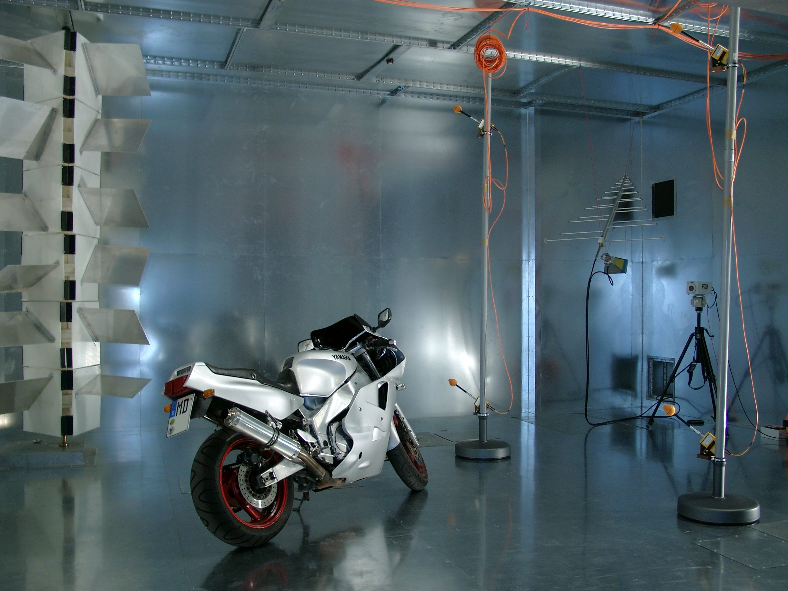
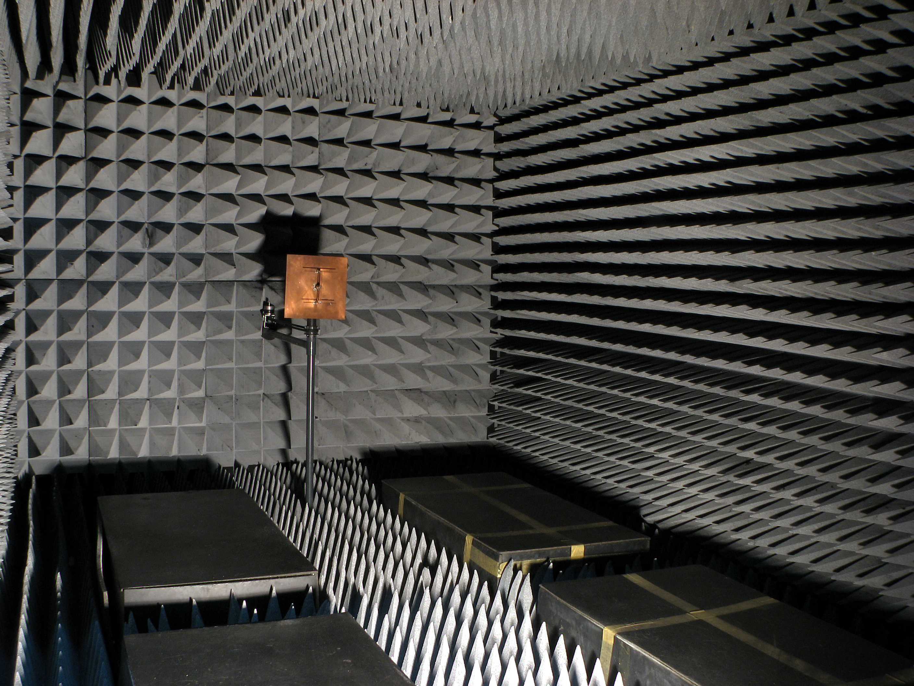

Boundary Conditions
=====================

In openEMS, all physical phenomena occur in a small simulation box, so
we must decide what happens to the electromagnetic fields at its edges.
These are known as the *boundary conditions* of Partial Differential
Equations (PDEs). To create an effective simulation, we must select the
appropriate boundary conditions. There are six in total, located at
the six faces of the box: ``x_min``, ``x_max``, ``y_min``, ``y_max``,
``z_min``, ``z_max``. Each is independently adjustable.

Set Boundary Conditions
------------------------

To set the boundary conditions of the simulator, use
:meth:`openEMS.openEMS.SetBoundaryCond()` of the ``openEMS`` class. Its syntax is:
``SetBoundaryCond(bc)`` where ``bc`` is a list with 6 elements with the order
of ``[x_min, x_max, y_min, y_max, z_min, z_max]``. Each element is a string or
integer according to the following table. Note that the use of integers is
discouraged due to poor readability, but one may encounter them in older examples.

+-----------------------------+-----------+----+-------------------------------------------------+
|      Boundary Condition     | String    | ID |                   Notes                         |
+=============================+===========+====+=================================================+
|  Perfect Electric Conductor | ``PEC``   | 0  | Reflective. Fast.                               |
+-----------------------------+-----------+----+-------------------------------------------------+
|  Perfect Magnetic Conductor | ``PMC``   | 1  | Reflective. Fast.                               |
+-----------------------------+-----------+----+-------------------------------------------------+
|  Mur's Absorbing Boundary   | ``MUR``   | 2  | Absorbing. Slow.                                |
|                             |           |    |                                                 |
|                             |           |    | Only absorbs waves orthogonal to the boundary.  |
|                             |           |    |                                                 |
|                             |           |    | Named after Gerrit Mur.                         |
+-----------------------------+-----------+----+-------------------------------------------------+
|  Perfectly Matched Layer    | ``PML_8`` | 3  | Absorbing. Slowest.                             |
|                             |           |    |                                                 |
|                             | ``PML_x`` |    | ``x`` has a range [6, 20], 8 by default.        |
|                             |           |    |                                                 |
|                             |           |    | Occupies ``x`` mesh lines near the boundary.    |
|                             |           |    |                                                 |
|                             |           |    |                                                 |
|                             |           |    | Keep structures ``x`` cells away from boundary. |
|                             |           |    |                                                 |
|                             |           |    | For radiating structures, λ / 4 away.           |
+-----------------------------+-----------+----+-------------------------------------------------+

Matlab/Octave example::

    FDTD = InitFDTD();
    BC = {'PML_8' 'PML_8' 'PML_8' 'PML_8' 'PML_8' 'PML_8'};
    FDTD = SetBoundaryCond(FDTD, BC);

Python example::

    fdtd = openEMS.openEMS()
    bc = ["PML_8", "PML_8", "PML_8", "PML_8", "PML_8", "PML_8"]
    fdtd.SetBoundaryCond(bc)

Reflecting (Dirichlet) Boundary Conditions
--------------------------------------------

If the finite nature of the simulation box and the reflection of EM waves at
the boundaries are acceptable, reflecting boundary conditions offer a simple
zero-overhead solution. They efficiently model structures inside metal
enclosures, above a ground plane, or with an electric or magnetic field
symmetry across a plane. No explicit modeling is necessary; the boundary
conditions implicitly enforce these behaviors.

   A simulation box with PEC at all boundaries acts like a shielded enclosure.
   EMC test labs use room-sized metal enclosures to create reverberation
   chambers. Taking advantage of the standing waves due to reflections,
   one can create strong electric fields at localized regions to generate
   electromagnetic interference for testing.
   Image by Dr. Hans Georg Krauthäuser (Hgk at English Wikipedia),
   licensed under CC BY-SA 3.0.

**Perfect Electric Conductor (PEC)**: The simplest treatment sets
the (tangential) electric field at the boundary to 0.
Since the electric field lines can't penetrate this boundary, it's
equivalent to a Perfect Electric Conductor (PEC) with infinite
conductivity, also known as an Electric Wall. All incoming waves are
fully reflected back, analogous to a 1D transmission line terminated
by a short circuit.

**Perfect Magnetic Conductor (PMC)**: By duality, it sets the magnetic
field to 0 at the boundary. It acts as a boundary at which
the magnetic field lines can't penetrate. It's equivalent to a Perfect
Magnetic Conductor (PMC) with infinite permeability, also known as the
Magnetic Wall. All incoming waves are fully reflected back as well,
but with a phase opposite to that of the PEC, analogous to a 1D
transmission line terminated by an open circuit. It's used mainly as
a mathematical tool to enforce field symmetry when simulating a
half-structure, as no natural material in the real world behaves like
a PMC.

Mathematically, both PEC and PMC are Dirichlet boundary conditions
that enforce fixed field values (e.g. zero).

.. note::
   For our simulation, instead of explicitly modeling metal
   plates, we can model a vacuum with nothing inside, taking advantage
   of the PEC boundary conditions at ``z_min`` and ``z_max`` for
   fast computation. However, this is out of this tutorial's scope,
   and it won't capture the fringe fields above and below. We won't use
   PEC or PMC in this example.

Absorbing Boundary Conditions (ABC)
-------------------------------------

In open-boundary problems, such as antennas or structures with radiation
loss, *Absorbing Boundary Conditions (ABC)* must be used to suppress
reflections to prevent spurious simulation results. At its boundaries, the
electromagnetic waves are absorbed and dissipated without reflecting back,
creating the illusion of an infinitely large free space. If PEC and PMC
are analogous to a shorted or opened transmission line, the ABC is analogous
to a termination resistor.

In general, these simulations should use a simulation box larger than the
structure to avoid intrusion of strong fringe fields at the boundary.
However, deliberately running a transmission line into the PML (defined
below) can be used as a perfect termination. This allows one
to terminate a transmission line without knowing its characteristic
impedance, enabling impedance measurement. In fact, openEMS's microstrip
ports don't create a lumped termination resistor by default, expecting
users to place them into the PML at boundaries.

   A simulation box with PML at all boundaries acts like an anechoic chamber
   in an EMC test lab, mimicking an infinitely large free space. Image by
   Adamantios (at English Wikipedia), licensed under CC BY-SA 3.0.

Two kinds of Absorbing Boundary Conditions are implemented in openEMS.

#. **Mur's Boundary Condition (MUR)**. This is a
   first-generation boundary condition purely defined by differential
   equations, originally invented by Gerrit Mur in the 1980s. It has
   a moderate computational overhead, but it works only if the EM wave
   is traveling at a direction orthogonal to the boundary, with a
   well-defined phase velocity. Thus, reflections may cause errors if
   strong radiation exists due to imperfect absorption, or if Mur's
   phase velocity parameter differs from the actual EM wave.

   .. seealso::

      By default, Mur's phase velocity parameter is set to the speed
      of light. It may be adjusted via :func:`SetBoundaryCond`'s optional
      argument ``MUR_PhaseVelocity``. For Python, this API is currently
      unimplemented.

#. **Perfectly Matched Layer (PML)**. This is the
   second-generation boundary condition proposed in the 1990s, modeling
   the behavior of a hypothetical EM wave-absorbing material. Unlike
   Mur's ABC, PML occupies some physical cells in the simulation box
   (the actual boundary at the true edge remains PEC).
   This mimics the wave-absorbing foam on the wall of an anechoic chamber
   in EMC test labs.

   PML is a more effective absorber and is easy to use, but it has the
   highest computational overhead (especially in openEMS, due to suboptimal
   implementation). Avoid it if efficiency is critical (e.g. only use
   PML at the simulation box's face directly hit by radiation, and use
   MUR for other boundaries). Intrusion of fringe fields and evanescent
   waves into the PML can destabilize it, causing the simulation to "blow-up".
   Radiating structures must be kept at a distance of :math:`\lambda / 4`.

   .. important::
      In openEMS, ``PML_8`` is commonly used, meaning the nearest 8 mesh lines
      of the simulation box are dedicated to the PML. This is an assumption made
      by the simulator and not visible in AppCSXCAD. Ensure your structures do not
      overlap with edge cells (unless intentionally terminating a region with
      the PML). Radiating structures must be kept at a distance of :math:`\lambda / 4`
      from PML as intrusion of evanescent waves (fringe fields) can create
      numerical instability.
