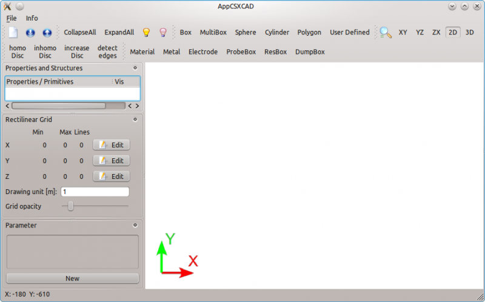

CSXCAD
=========

Initialization
---------------

An openEMS simulation always starts by creating a 3D model of the structure
using the CSXCAD library. All created entities for the simulation are stored
in the ``csx`` data structure (or Python object), which must be initialized
first. It's done by either the :func:`InitCSX` method in Matlab/Octave, or
the :class:`~CSXCAD.ContinuousStructure` class in Python:

.. tabs::

   .. code-tab:: octave

       csx = InitCSX();

   .. code-tab:: python

       import CSXCAD
       csx = CSXCAD.ContinuousStructure()

Once initialized, 3D models can be created by the functions provided by CSXCAD.
In Matlab/Octave, nearly all of them accept an old instance of the ``csx`` data
structure, and returns a modified new one. The Python binding has a more modern
coding style in comparison, which achieves this via class methods rather than
functions:

.. tabs::

   .. code-tab:: octave

       % create a property (e.g. AddMetal, AddMaterial)
       csx = AddExample(csx, arg1, arg2, arg3, ...)

   .. code-tab:: python

       # create a property (e.g. AddMetal, AddMaterial)
       prop = csx.AddExample(arg1, arg2, arg3, ...)

These CSXCAD functions can be classified into two types, *primitives*
and *properties*. They define shapes and their material properties respectively.

*Primitives* are the building blocks to create 1D, 2D, 3D shapes at given
coordinates, so that one can create a simple object at a specific position,
such as a Curve, a Polygon, a Box, or a Sphere.

*Properties* are always created before *Primitives* to give physical
meanings to the created objects. A *property* can represent
an ideal or imperfect material such as a metal, a thin conducting sheet,
a dielectric material, a magnetic material, a lumped circuit component
(resistor, capacitor, inductor), etc. Non-physical simulation entities
are also *properties*, such as excitation sources, probes, and field
dump boxes.

More complex structures can be created by combining various *primitives*.
If the same position contains overlapping *primitives*, the primitive
with the highest *priority* takes effect.
For example, a metal sheet with cylindrical holes can be achieved by
creating a *metal* (or *thin conducting sheet*) property, and deriving
a box primitive without holes. Then, create another *material*
property with :math:`\epsilon_r = \mu_r = 1.0`, and deriving several
cylinder primitives with higher *priorities*.

.. tip::
   Primitives tell the simulation where objects are, properties tell the
   simulation what objects do, priorities tell the simulation which object
   "wins."

   See :ref:`concept_properties` and :ref:`concept_primitives` for details.

Coordinate Systems
-------------------

By default, a Cartesian coordinate system is used, which is suitable for
most simulations. If the simulated structure is predominantly circular, the
Cartesian mesh may have a difficult time aligning itself with an object's
shape. Hence openEMS provides the alternative cylindrical coordinate system
to minimize staircasing errors:

.. tabs::

   .. code-tab:: octave

       csx = InitCSX('CoordSystem', '1');

   .. code-tab:: python

       import CSXCAD
       csx = CSXCAD.ContinuousStructure(CoordSystem=1)

.. note::

   This mainly affects mesh coordinates of the simulation box, not
   the coordinates of 3D model themselves. When creating 3D models,
   one can choose both Cartesian and Cylindrical coordinates independently
   from the mesh (by default, models do follow the mesh coordinate system,
   but it can always be overridden).

Saving
-----------

Once modeled, the CSXCAD data structure is usually saved to disk as an
``.xml`` file. It can be inspected by the :program:`AppCSXCAD` 3D viewer
for debugging::

    AppCSXCAD simulation.xml

   AppCSXCAD, CSXCAD's official 3D model viewer and editor.

Two forms of savings are possible: A model-only saving via CSXCAD,
or a model-and-simulation save via openEMS.

Model-Only Save
""""""""""""""""

To save only the geometry as a self-contained ``.xml`` file, use the
:func:`struct_2_xml` function in Matlab/Octave, or the
:meth:`CSXCAD.ContinuousStructure.Write2XML` method in Python:

.. tabs::

   .. code-tab:: octave

       % create and edit CSX here
       csx = InitCSX();

       path = '/tmp';
       filename = 'simulation.xml';

       % create an empty data structure "output", and assign "CSX"
       % to its CSXCAD attribute.
       output.CSXCAD = csx;
       struct_2_xml(filename, output, 'openEMS');

   .. code-tab:: python

       import pathlib
       import CSXCAD

       # create and edit CSX here
       csx = CSXCAD.ContinuousStructure()

       simdir = pathlib.Path("./")
       xmlname = pathlib.Path("simulation.xml")

       # concat two paths
       xmlpath = simdir / xmlname

       csx.Write2XML(str(xmlpath))  # convert Path object to string

One can view this ``.xml`` file via :program:`AppCSXCAD`, but this
file cannot be used as input to the :program:`openEMS` executable
in replay the simulation.

.. note::

   In the previous versions of openEMS, this was the only available
   saving method in Python.

Model-and-Simulation Save
""""""""""""""""""""""""""

To save both the geometry and simulator settings as a self-contained
``.xml`` file, the :func:`WriteOpenEMS` function in Matlab/Octave,
or the :meth:`openEMS.openEMS.Write2XML` method in Python.

This file contains both the geometry and simulation data, the former is
owned by CSXCAD, and latter is owned by openEMS. Hence, both inputs are
required:

.. tabs::

   .. code-tab:: octave

       # create and edit CSX and simulation parameters here
       csx = InitCSX();
       fdtd = InitFDTD();

       path = '/tmp';
       filename = 'simulation.xml';

       % write openEMS compatible xml-file
       WriteOpenEMS([path '/' filename], fdtd, csx);

   .. code-tab:: python

       import pathlib
       import CSXCAD
       import openEMS

       # create and edit CSX here
       csx = CSXCAD.ContinuousStructure()
       openems = openEMS.openEMS()

       # assign the CSXCAD structure to the simulator
       openems.SetCSX(csx)

       simdir = pathlib.Path("./")
       xmlname = pathlib.Path("simulation.xml")

       # concat two paths
       xmlpath = simdir / xmlname

       # write openEMS compatible xml-file
       openems.Write2XML(str(xmlpath))  # convert Path object to string

Models and Simulations Reuse
------------------------------

It's possible to serialize a CSXCAD model or a full openEMS simulation
to ``.xml`` files on disk. The simulations can then be replayed without
accessing to the original scripts.

The development of the Matlab/Octave and Python bindings took
different paths, as a result, they behave differently in terms of
reusing models and simulations.

Matlab/Octave
"""""""""""""

The Matlab/Octave binding was written as a pure "XML generator frontend"
to CSXCAD, and the openEMS executable was used as an "executable backend".
All Matlab/Octave operations (such as geometries and simulation
settings) are only wrapper to the underlying ``.xml`` file writer. Once
generated, openEMS is launched and took over the simulation independently.
As a result, the same ``.xml`` file can be directly used to replay the same
simulation via the ``openEMS`` command-line in the future, even without the
source code. For example, it can be useful for constructing a simulation on
the local machine, but running simulation on a headless server::

    openEMS simulation.xml

However, since the Matlab/Octave binding is only an ``.xml`` generator without
direct access to CSXCAD itself, the generated ``.xml`` file is "a one-way street"
that can't be reloaded as a Matlab/Octave data structure after the fact.
Source code must be kept if the generated structure or simulation needs any
future modifications. Overall, the Matlab/Octave binding works like a static
website generator. One can generate web pages, but can’t edit the HTML files
back into the source format.

Python
"""""""

In the Python binding, a decision was made to create a library-level binding to
both CSXCAD and openEMS. When geometries are created, rather than generating the
matching ``.xml`` code, it uses the actual funcions and internal data structures
within CSXCAD and openEMS.

This design decision leads to difference consequences.
Since one can start a simulation by invoking openEMS as
a library directly, there's no need to call any external command. Saving
``.xml`` files are optional.  As a result, without explicitly serializing
these data structures in disk as ``.xml`` files, no Python simulations can
be externally viewed or replayed by default. On the other hand, if ``.xml``
files are explicitly saved, it's possible to save and reload models and
simulations thanks to the library-level access.

To save or load models, use :class:`~CSXCAD.ContinuousStructure`'s
:meth:`~CSXCAD.ContinuousStructure.Write2XML` or
:meth:`~CSXCAD.ContinuousStructure.ReadFromXML`.
To save or load both models and simulation parameters, use
:class:`~openEMS.openEMS`'s own :meth:`~openEMS.openEMS.Write2XML` and
:meth:`~openEMS.openEMS.ReadFrom2XML`.

In the past, :meth:`~CSXCAD.ContinuousStructure.Write2XML` and
:meth:`~CSXCAD.ContinuousStructure.ReadFromXML` was only implemented
in CSXCAD, not openEMS. Thus, no simulation parameters could saved or
reloaded, because they were not controlled by CSXCAD. To restart a
simulation from CSXCAD-only ``.xml`` file, one must manually reconstruct
a :class:`~openEMS.openEMS` instance with external simulation parameters.
In the latest versions, one can save both CSXCAD and openEMS data structures
using the method described above. The saved ``.xml`` simulation file can
be replayed by :program:`openEMS` independent of the script.

.. note::
   **Replaying Simulations**. Sometimes it may be desirable to "replay" an
   existing simulation setup without access to the Matlab/Octave or Python
   source code. This is always possible in Matlab/Octave, but it's only
   supported in Python if both the models and simulation parameters are
   saved.

Post-Processing
"""""""""""""""""

In all cases, post-processing simulation results always requires source
code in order to parse and interpret the generated files on disk.
The program ``openEMS`` itself is only a field solver engine. For analysis,
we rely on Matlab/Octave or Python routines.

Interfacing CSXCAD with Third-Party Apps
"""""""""""""""""""""""""""""""""""""""""

If you're developing a non-Python third-party EDA tool based on openEMS,
it's recommended to generate a simulation ``.xml`` and to call openEMS as
an executable. Both the ``.xml`` file format and the CSXCAD library APIs are
public by design, so it's acceptable to either generate the ``.xml``
yourself, or invoke the CSXCAD library to do that.

On the other hand, although openEMS is also available as a shared library,
but its C++ APIs are presently intended only for use by the Python binding,
not public use. Breaking changes may occur at any time. Invoke openEMS as
a C++ library only if you plan to follow upstream development closely.

As a result, the recommendation is to follow a hybrid of the approaches used
by Matlab/Octave and Python bindings.

Import & Export
---------------

Several Matlab/Octave and Python functions are provided to import or
export the CSXCAD model to other format.

Matlab/Octave
"""""""""""""""

In Matlab/Octave, the following functions are available:

* :func:`ImportPLY`, :func:`ImportSTL`:

  * Especially useful for importing a 3rd-party 3D model (such as a
    connector).

* :func:`export_gerber`, :func:`export_excellon`:

  * CAM file outputs for fabrication. Useful for automated generation of
    planar circuits.

* :func:`export_empire`:

  * For comparing simulation results with proprietary, commercial
    tools.

* :func:`export_povray`:

  * For rendering fancy ray-traced 3D images.

.. figure:: images/povray-2.4ghz-planar.png
   :class: with-border
   :width: 50%

   Rendering of a 2.4 GHz planar circuit by raytracing.

Python
"""""""

Unfortunately, with the exception to STL, none of the functions
above have been implemented in Python.
To import an external STL model, one uses an alternative method
:meth:`~CSXCAD.CSProperties.CSProperties.AddPolyhedronReader`
from :class:`~CSXCAD.CSProperties.CSProperties`::

    import CSXCAD

    csx = CSXCAD.ContinuousStructure()

    # create a property (e.g. AddMetal, AddMaterial)
    material = csx.AddExample(arg1, arg2, arg3, ...)

    # create a special file-defined primitive
    enclosure = enclosure.AddPolyhedronReader('enclosure.stl')
    enclosure.ReadFile()

    # can be manipulated like any other primitives
    enclosure.AddTransform( ... )

Alternatively, one can use Matlab/Octave's :func:`ImportPLY` to
import a PTY model, export the result to ``.xml``, and load the
model in Python via :meth:`~CSXCAD.ContinuousStructure.ReadFromXML`.

For exporting, :program:`AppCSXCAD` itself can generate
POV-Ray, STL, X3D, Polydata-VTK, and PNG file formats.

.. note::

   **Importing is easy, meshing is hard.**
   Importing an external model is considered an advanced feature, beginners
   are *not recommended* to try them before familiarizing themselves with the
   CSXCAD/openEMS workflow first via basic simulations.
   Creating a
   meshing-friendly model (see :ref:`concept_mesh`) is often difficult,
   so a model and a mesh is usually co-developed. If a model comes from
   another source, yet the user is not already familiar with the meshing
   process and its pitfalls, confusing problems may arise.

Modeling via a GUI?
------------------------

In principle, it's feasible to make or tweak a 3D model using the
:program:`AppCSXCAD` GUI. Geometries and mesh lines can be added
entirely by the GUI, which are then saved and read into Python later
via :meth:`~CSXCAD.ContinuousStructure.ReadFromXML` with additional
initialization and tweaks for simulations. Likewise, saving and
reloading makes it possible to tune a script-generated 3D model in
the :program:`AppCSXCAD` GUI.

This technique circumvents programmatic modeling
(as decribed in :ref:`concept_primitives`) entirely. However,
it has not been put in use by anyone to our best knowledge, possibly
because it's not a coherent method.
On the other hand, there are numerious attempts over the years
to create models using GUI-based or high-level tools, to varying
degrees of success.

The first general idea is to create the structure first in a
general-purpose CAD like FreeCAD. This can then be exported as
a 3D model and be loaded into CSXCAD via :func:`ImportSTL` for
simulation. By editing the CSXCAD object further, ports and
probes can also be modeled as a GUI.

The second general idea, specific to planar circuits and circuit
board simulations, is to first create the circuit board using an
EDA tool such as gEDA, pcb-rnd, or KiCad. The circuit layout
can then be exported as a 2D vector image format, such as
HyperLynx, Gerber, SVG or PDF. The polygons in these images
are then extracted and imported as CSXCAD polygons.

The third general idea, is to create a high-level programming
library for defining high-level objects such as traces, vias,
circuit board layers, so that they can be created one object
at a time, rather than one polygon at a time.

A common subgoal of all tools is an automatic meshing algorithm,
which turned out to be far from straightforward. CSXCAD models
are usually designed as highly simplified test cases to check
specific design parameters. In manual modeling, geometries and
meshing are co-designed to simplify each other. However, automatic
meshing algorithms deal with arbitrary models imported by users,
a more difficult problem.

.. important::
   **Third-Party Tools.** These tools are developed by third
   parties, and not officially supported by the openEMS project.
   Most of them are highly experimental and incomplete.
   They're described here for completeness. The project forum
   is also open to the discussions of their uses.

   **Importing is easy, simulation is hard.** These tools
   should be considered advanced applications. Beginners are
   *not recommended* to try them before familiarizing themselves
   with the CSXCAD/openEMS workflow first via basic simulations,
   as described in :ref:`first_lessons`.
   Trying to import a circuit board without understanding the
   concept of ports, boundary conditions or meshing rules leads
   to failures, especially when most of these tools are highly
   experimental and incomplete.

   **Don't work in isolation.** So far there are already 7 different
   tools that attempt to automate modeling of circuit boards and
   3D objects for openEMS. Instead of creating another one from
   scratch, it's probably a good idea to have a discussion with
   the authors of these existing tools.

Examples of these tools include:

* :program:`OpenEMSH`, developed by Thomas Lepoix.

  * The next-generation automatic mesher for openEMS simulations,
    with funding from NLnet. It aims to overcome the difficulties
    encountered by all previous projects, but it's still in the
    early-development stage.

  * https://github.com/Open-RFlab/openemsh

* :program:`Qucs-RFlayout`, developed by Thomas Lepoix.

  * Convert planar microwave circuit schematics created in the Qucs RF
    circuit simulator to KiCad layouts and openEMS models.

  * https://github.com/thomaslepoix/Qucs-RFlayout

* :program:`FreeCAD-OpenEMS-Export`, developed by Lubomir Jagos.

  * FreeCAD-based model and port edits, with CSXCAD export.

  * https://github.com/LubomirJagos/FreeCAD-OpenEMS-Export

* :program:`IntuitionRF`, developed by Juleinn.

  * It allows one to mesh structures interactively via Blender.

  * https://github.com/Juleinn/IntuitionRF

* :program:`pcb2csx`, developed by Evan Foss.

  * It's a plugin to the EDA tool :program:`pcb-rnd`,
    allowing one to export an existing circuit board layout to CSXCAD.

  * http://repo.hu/cgi-bin/pool.cgi?project=pcb-rnd&cmd=show&node=s_param

  * Tutorial: `Direct Path to openEMS for S-parameters
    <http://repo.hu/cgi-bin/pool.cgi?project=pcb-rnd&cmd=show&node=s_param>`_

* :program:`gerber2ems`, developed by Antmicro.

  * It allows one to export an existing PCB layout as a Gerber file,
    which can then be converted and imported as a CSXCAD model.

  * https://github.com/antmicro/gerber2ems

* :program:`pcbmodelgen`, developed by jcyrax.

  * It converts a KiCad layout file into the CSXCAD model,
    also with experimental auto-meshing support.

  * https://github.com/jcyrax/pcbmodelgen

* :program:`pyems`, developed by Matt Huszagh.

  * It's a high-level Python interface to openEMS, which allows
    the programmatic creation of high-level structures such as
    circuit boards, traces, vias, PCB layers. It has also an
    experimental auto-mesh generation algorithm.

  * https://github.com/matthuszagh/pyems

* :program:`hyp2mat`, developed by Koen De Vleeschauwer and
  distributed officially as part of openEMS.

  * It converts a
    HyperLynx layout file (can be generated by PCB EDA tools,
    including EAGLE or KiCad 6). The geometries are extracted
    to generate an Octave script with commands to create
    the CSXCAD model.

  * In principle, it can be used with Python
    as well, by exporting the model to XML in Octave via
    :func:`WriteOpenEMS`, and importing the model via
    :meth:`~CSXCAD.ContinuousStructure.ReadFromXML`. But
    no one has tested it.

  * Currently it's retired and no longer maintained.

  * https://github.com/koendv/hyp2mat

Developer Notes
"""""""""""""""""

The old project wiki also described this following idea to
convert circuit board layouts from Gerber, PDF, DXF, or
SVG into CSXCAD models. This idea may be of interest to
developers working on automated CSXCAD model generation.

.. note::

   PCB layers in Gerber files can be converted to PDF by means of
   gerber2pdf which can be found on Sourceforge (editor's note:
   native PDF, SVG and DXF exports are available in many EDA packages).
   The PDF can be imported into Inkscape just as it is the case
   for DXF files. Within Inkscape, the usually closed paths can be
   modified (either manually or with filters) such that they result
   in a suitable list of polygon nodes for openEMS.

   Sometimes these polygons or curves have too many nodes. The number
   of nodes can be reduced with the Inkscape function "Path" > "Simplify".
   The amount of reduction is controlled by the parameter "Simplification
   Threshold" which can be found under "Preferences" > "Behavior". These
   paths are still Bézier curves which must be converted into polygons.
   This is achieved with "Extensions" > "Modify Path" > "Flatten Béziers".
   The parameter in this dialog also controls the number of resulting
   points.

   When all nodes are as required, the paths can be exported as a HTML5
   Canvas. The resulting file can then be processed with an ASCII Editor.
   The numbers after the moveTo and lineTo statements are the polygon nodes
   X- and Y- coordinates respectively. However, they still must be
   transformed ba a liner transform given in the transform statement. The
   first four numbers a matrix by which the node coordinates have to be
   multiplied and the remaining two numbers are a vector which has to
   be added.

   The result will be the node coordinates in HTML pixels with X counting
   from left to right and Y counting from top to bottom, which does not
   conform to the coordinate system of the Inkscape canvas.

   In order to have the same axes as in Inkscape (X left to right and Y
   bottom to top), the fourth an sixth number have to be multiplied by -1
   and the image height has to be added to the sixth number. Now the
   coordinates are in the usual coordinate system but still in HTML5 pixels.
   The ratio of pixels to mm or other units of length can finally be found
   under the document properties in Inkscape. This factor can be applied in
   Octave/Matlab. This finally gives polygons which can be processed by openEMS.
