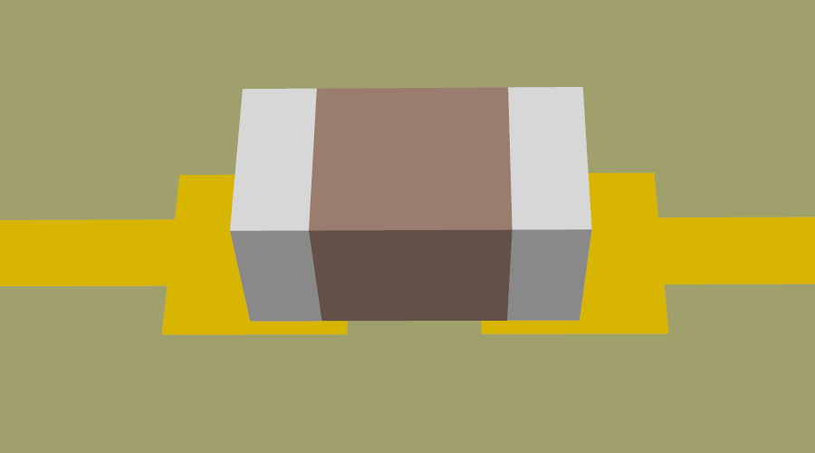

.. _concept_lumped:

Lumped Elements
===============

Lumped elements are ideal resistors, capacitors and inductors with sizes
assumed to be negligible. They're especially useful for modeling surface-mount
circuit components.

Parasitic Ambiguity
----------------------

Lumped elements are ideal throughout regions occupied by all derived primitives.
However, the intermediate connections between a lumped element to the external
circuit still introduce parasitic effects (e.g., inductance
from the overall loop area, partial inductance of terminal leads or mounting
height). Full-wave simulations inherently capture them through the electric
and magnetic fields in space.

Furthermore, the existence and modeling of parasitics effects can be
context-dependent and ambiguous. It's not always clear whether a parasitics
effect should be explicitly modeled as a lumped element (such as an LC
circuit), implicitly modeled using the geometries, or modeled as a combination
of both.

Due to these ambiguities, it's recommended to run simple test cases to
determine the best way to model a lumped component for your application.

Example: SMD Ceramic Capacitor
""""""""""""""""""""""""""""""

   A simple CSXCAD model for an SMD ceramic capacitor. The capacitor contains
   two metal terminals (created via :func:`AddMetal()` and :func:`AddBox()`),
   and a lumped capacitance (created via :func:`AddLumpedElement()` and
   :func:`AddBox()`). Little parasitic inductance exists in this model. To
   improve its fidelity, one can use a lumped series RLC circuit (``LEtype=1``)
   instead of a pure capacitance.

Consider an SMD ceramic capacitor. If the capacitor is modeled as a 3D Box
sitting on top of the circuit board, in direct contact to the mounting pads,
it almost behaves like an ideal capacitor in the simulation. In this
configuration, the lumped element between the mounting pads controls all
electromagnetic effects. As a result, the parasitic effects of a real SMD
capacitor is not correctly modeled, leading to underestimation of parasitic
inductance. For this configuration, one should model the capacitor as a lumped
LC circuit using the datasheet inductance value, rather than modeling it as
a pure lumped capacitance.

.. figure:: images/smd_cap_2.png
   :class: with-border
   :width: 50%

   A different CSXCAD model for an SMD ceramic capacitor. The capacitor contains
   two metal terminals (created via :func:`AddMetal()` and :func:`AddBox()`),
   and a lumped capacitance (created via :func:`AddLumpedElement()` and
   :func:`AddBox()`). However, the lumped capacitance is now a 2D plane in
   the middle of the terminals. This configuration implicitly models a
   partial inductance. Tip: To improve this model's visualization, one can
   create a solid box between the terminals, derived from a dummy material
   with a low priority and all physical properties identical to air.

In comparison, one can also model the same SMD ceramic capacitor body as a
horizontal 2D sheet above the circuit boards, which is connected to the circuit
board's mounting pads below using two terminals modeled as two vertical 2D
sheets (created via :func:`AddMetal`).
In this configuration, the lumped element only determines the electromagnetic
properties between the metal terminals, while the region between the terminals
and the circuit board's mounting pads still introduces a distributed loop.
As a result, the parasitic inductance of the capacitor is mostly captured by
the metal terminals' geometries.
For this configuration, it's better to model the 2D lumped capacitor sheet
as a pure capacitance: it's well-known that an SMD capacitor's parasitic
inductance originated primarily from its mounting height, not its internal
electrical characteristics.

Datasheet Specifications
"""""""""""""""""""""""""

A similar problem exists when one is trying to read circuit parasitics
from component datasheets. Their specifications are usually measured
on a particular layout and test fixture, depending on many factors:
positions of the component's leads and terminals, a component's
proximity to the ground plane, etc. Hence, internal and external effects
are difficult to separate. It's hard to isolate the "pure" lumped element
values for simulations - some may argue it isn't a well-defined concept
to begin with.
