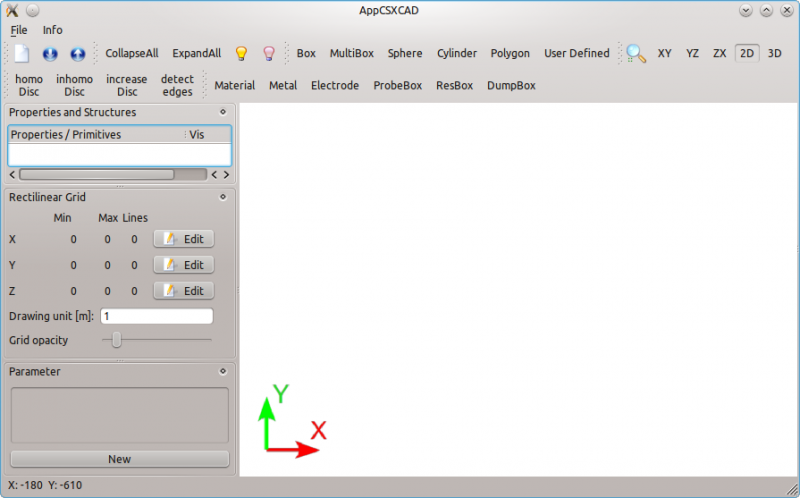
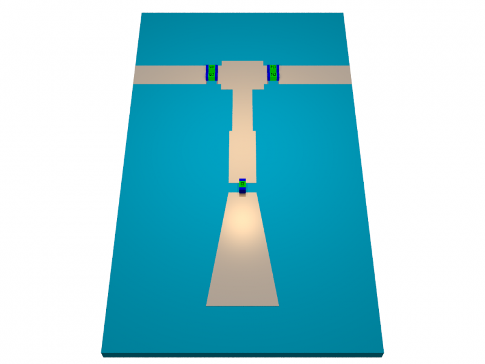

.. _concept_model_io:

Saving, Loading & Interoperability
=====================================

This page covers persisting a CSXCAD/openEMS model to disk, reloading and
replaying it, exchanging geometry with third-party tools, and the wider
ecosystem of experimental modeling tools built around CSXCAD. For creating a
model in the first place, see :ref:`concept_modeling`.

Saving
-----------

Once modeled, the CSXCAD data structure is usually saved to disk as an
``.xml`` file. It can be inspected by the :program:`AppCSXCAD` 3D viewer
for debugging::

    AppCSXCAD simulation.xml

   AppCSXCAD, CSXCAD's official 3D model viewer and editor.

Two forms of savings are possible: A model-only saving via CSXCAD,
or a model-and-simulation save via openEMS.

Model-Only Save
""""""""""""""""

To save only the geometry as a self-contained ``.xml`` file, use the
:func:`struct_2_xml` function in Matlab/Octave, or the
:meth:`CSXCAD.ContinuousStructure.Write2XML` method in Python:

.. tabs::

   .. code-tab:: octave

       % create and edit CSX here
       csx = InitCSX();

       path = '/tmp';
       filename = 'simulation.xml';

       % create an empty data structure "output", and assign "CSX"
       % to its CSXCAD attribute.
       output.CSXCAD = csx;
       struct_2_xml(filename, output, 'openEMS');

   .. code-tab:: python

       import pathlib
       import CSXCAD

       # create and edit CSX here
       csx = CSXCAD.ContinuousStructure()

       simdir = pathlib.Path("./")
       xmlname = pathlib.Path("simulation.xml")

       # concat two paths
       xmlpath = simdir / xmlname

       csx.Write2XML(str(xmlpath))  # convert Path object to string

One can view this ``.xml`` file via :program:`AppCSXCAD`, but this
file cannot be used as input to the :program:`openEMS` executable
to replay the simulation.

.. note::

   In the previous versions of openEMS, this was the only available
   saving method in Python.

Model-and-Simulation Save
""""""""""""""""""""""""""

To save both the geometry and simulator settings as a self-contained
``.xml`` file, the :func:`WriteOpenEMS` function in Matlab/Octave,
or the :meth:`openEMS.openEMS.Write2XML` method in Python.

This file contains both the geometry and simulation data, the former is
owned by CSXCAD, and the latter is owned by openEMS. Hence, both inputs are
required:

.. tabs::

   .. code-tab:: octave

       # create and edit CSX and simulation parameters here
       csx = InitCSX();
       fdtd = InitFDTD();

       path = '/tmp';
       filename = 'simulation.xml';

       % write openEMS compatible xml-file
       WriteOpenEMS([path '/' filename], fdtd, csx);

   .. code-tab:: python

       import pathlib
       import CSXCAD
       import openEMS

       # create and edit CSX here
       csx = CSXCAD.ContinuousStructure()
       openems = openEMS.openEMS()

       # assign the CSXCAD structure to the solver
       openems.SetCSX(csx)

       simdir = pathlib.Path("./")
       xmlname = pathlib.Path("simulation.xml")

       # concat two paths
       xmlpath = simdir / xmlname

       # write openEMS compatible xml-file
       openems.Write2XML(str(xmlpath))  # convert Path object to string

Models and Simulations Reuse
------------------------------

An ``.xml`` file on disk can be replayed without the script that produced it,
but how much of the setup it carries depends on the interface used, because
the two bindings were built differently. The Matlab/Octave binding is an XML
generator: every function call only writes to the file, and ``openEMS`` is
then started as an external program. The Python binding calls CSXCAD and
openEMS as libraries, so writing XML is optional and has to be asked for.

.. list-table::
   :header-rows: 1
   :widths: 40 30 30

   * -
     - Matlab/Octave
     - Python
   * - Write geometry only
     - ``struct_2_xml``
     - :meth:`CSXCAD.ContinuousStructure.Write2XML`
   * - Write geometry and simulation
     - ``WriteOpenEMS``
     - :meth:`openEMS.openEMS.Write2XML`
   * - Read a file back in
     - not possible
     - ``ReadFromXML`` on either class
   * - Replay with ``openEMS file.xml``
     - always
     - only if the file was written

Being able to replay matters for running a simulation somewhere other than
where it was built, e.g. constructing it on a laptop and running it on a
headless server::

    openEMS simulation.xml

In Matlab/Octave this is free, but one-way: the generated file cannot be
loaded back into a Matlab/Octave structure, so the script remains the only
editable form of the model. In Python both directions work, which is what
makes round-tripping through :program:`AppCSXCAD` possible.

.. note::
   Post-processing always needs code. The ``openEMS`` program is only a field
   solver; interpreting the files it writes is done by the Matlab/Octave or
   Python routines, see :ref:`postproc_src`.

Interfacing CSXCAD with Third-Party Apps
"""""""""""""""""""""""""""""""""""""""""

If you're developing a third-party EDA tool that needs to describe simulation
geometry, both the ``.xml`` file format and the CSXCAD C++ library API are
public and intended to be stable. CSXCAD is a library, so API stability is a
primary goal: external tools are explicitly welcome to link against it or to
generate ``.xml`` directly. Breaking changes are avoided and communicated when
they are unavoidable.

Import & Export
---------------

Several Matlab/Octave and Python functions are provided to import or
export the CSXCAD model to other format.

Matlab/Octave
"""""""""""""""

In Matlab/Octave, the following functions are available:

* :func:`ImportPLY`, :func:`ImportSTL`:

  * Especially useful for importing a 3rd-party 3D model (such as a
    connector).

* :func:`export_gerber`, :func:`export_excellon`:

  * CAM file outputs for fabrication. Useful for automated generation of
    planar circuits.

* :func:`export_empire`:

  * For comparing simulation results with proprietary, commercial
    tools.

* :func:`export_povray`:

  * For rendering fancy ray-traced 3D images.

   Rendering of a 2.4 GHz planar circuit by raytracing.

Python
"""""""

Unfortunately, with the exception of STL, none of the functions
above have been implemented in Python.
To import an external STL model, one uses an alternative method
:meth:`~CSXCAD.CSProperties.CSProperties.AddPolyhedronReader`
from :class:`~CSXCAD.CSProperties.CSProperties`::

    import CSXCAD

    csx = CSXCAD.ContinuousStructure()

    # create a property (e.g. AddMetal, AddMaterial)
    metal = csx.AddMetal('enclosure')

    # create a special file-defined primitive
    enclosure = metal.AddPolyhedronReader('enclosure.stl')
    enclosure.ReadFile()

    # can be manipulated like any other primitives
    enclosure.AddTransform( ... )

Alternatively, one can use Matlab/Octave's :func:`ImportPLY` to
import a PLY model, export the result to ``.xml``, and load the
model in Python via :meth:`~CSXCAD.ContinuousStructure.ReadFromXML`.

For exporting, :program:`AppCSXCAD` itself can generate
POV-Ray, STL, X3D, Polydata-VTK, and PNG file formats.

.. note::

   **Importing is easy, meshing is hard.**
   Importing an external model is considered an advanced feature, beginners
   are *not recommended* to try them before familiarizing themselves with the
   CSXCAD/openEMS workflow first via basic simulations.
   Creating a
   meshing-friendly model (see :ref:`concept_mesh`) is often difficult,
   so a model and a mesh is usually co-developed. If a model comes from
   another source, yet the user is not already familiar with the meshing
   process and its pitfalls, confusing problems may arise.

Modeling via a GUI
--------------------

A model can also be built or tweaked in the :program:`AppCSXCAD` GUI and
read back with :meth:`~CSXCAD.ContinuousStructure.ReadFromXML`, and a number
of third-party tools generate CSXCAD models from FreeCAD, KiCad, Gerber or
Blender. None of them is part of openEMS; they are listed in
:ref:`third_party_tools`.
