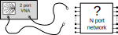

.. _concept_ports:

Ports
===========

At the start of a simulation, electric or magnetic fields are introduced
into the simulation box, helping establish initial conditions for the
system. This is done by setting the numerical values of the field at
specified Yee cells, according to the specified field type, distribution,
weighting functions, and signal waveform. This is the purpose of the
:func:`AddExcitation` (Python),
:meth:`~CSXCAD.ContinuousStructure.AddExcitation` (Matlab/Octave)
, and :func:`AddPlaneWaveExcite` functions.

Controlling these raw fields is a low-level operation and inconvenient
for circuit designs. Hence, openEMS implements a high-level concept
called ports.

.. note::
   Ports are the most-commonly used form of excitations,
   this page presents a port-based view. For a description of
   non-port excitations (including Radar Cross Section), see
   :ref:`concept_excitations`.

Ports are best understood as the virtual 3D counterpart of physical ports
on RF/microwave components, such as the standard 50 Ω input or output ports
on circuit boards, signal generators, oscilloscopes, and especially Vector
Network Analyzers (VNA). A port is treated as a lumped circuit, located
at a defined position. It acts as a voltage source or load with a
resistive impedance. It can inject a signal to the Device-Under-Test (DUT)
or measure the DUT's response, either from its own signal or from another
port.

Internally, a port is implemented by locating the Yee cells occupied
by the port, and setting the numerical values of the electric fields in
these cells based on the excitation waveform.
Thus, a
port can be understood as a source that injects electromagnetic energy
into the simulation, helping establish initial conditions for the system.
Simultaneously, a lumped resistor and a probe are also created at the
same location as the port, allowing it to provide a matched load for the
signal, or to measure the voltage or current at this region.

   The "port" in openEMS serves a purpose similar to the physical
   ports on Vector Network Analyzers and circuit boards. Both kinds of
   ports are used to inject an input signal at a particular point in the
   Device-Under-Test (DUT), and to measure what comes out at another point.
   The DUT is thus characterized as a black box, solely represented using
   its input-output relationships without an internal structure.
   Note that port implementations are fundamentally different in
   physical instruments (via circuits) and in openEMS simulations
   (by loading numerical values into Yee cells). Image by Julien Hillairet,
   from the ``scikit-rf`` project, licensed under BSD-3, modified for clarity.

Types
-------

+-----------------------------+--------------------------------+----------------------------------------+-----------------------------------+
|         Port Type           |        Matlab/Octave           |               Python                   |               Notes               |
+=============================+================================+========================================+===================================+
|        Lumped               | :func:`AddLumpedPort()`        | :meth:`~openEMS.openEMS.AddLumpedPort` |    General Purpose                |
+-----------------------------+--------------------------------+----------------------------------------+-----------------------------------+
|        Curved               | :func:`AddCurvePort()`         |                                        |                                   |
+-----------------------------+--------------------------------+----------------------------------------+-----------------------------------+
|    Microstrip               | :func:`AddMSLPort()`           | :meth:`~openEMS.ports.MSLPort`         |                                   |
+-----------------------------+--------------------------------+----------------------------------------+-----------------------------------+
|     Stripline               | :func:`AddStripLinePort()`     |                                        |                                   |
+-----------------------------+--------------------------------+----------------------------------------+-----------------------------------+
| Coplanar Waveguide          | :func:`AddCPWPort()`           |                                        |                                   |
+-----------------------------+--------------------------------+----------------------------------------+-----------------------------------+
|  Generic Waveguide          | :func:`AddWaveGuidePort()`     | :meth:`~openEMS.ports.WaveguidePort`   |                                   |
+-----------------------------+--------------------------------+----------------------------------------+-----------------------------------+
| Rectangular Waveguide       | :func:`AddRectWaveGuidePort()` | :meth:`~openEMS.ports.RectWGPort`      |                                   |
+-----------------------------+--------------------------------+----------------------------------------+-----------------------------------+
|    Circular Waveguide       | :func:`AddCircWaveGuidePort()` |                                        |                                   |
+-----------------------------+--------------------------------+----------------------------------------+-----------------------------------+

.. note::
   Some port types are not *ported* to Python yet.

Usage
"""""""

The following example adds two lumped ports to the simulation.

Matlab/Octave:

.. code-block:: matlab

    z0 = 50;

    start = [-100 0 0];
    stop  = [-100 0 50];
    [CSX port{1}] = AddLumpedPort(CSX, 5, 1, z0, start, stop, [0 0 1], true);

    start = [100 0 0];
    stop  = [100 0 50];
    [CSX port{2}] = AddLumpedPort(CSX, 5, 2, z0, start, stop, [0 0 1], false);

Python:

.. code-block:: python

    z0 = 50

    port = [None, None]

    start = [-100 0 0]
    stop  = [-100 0 50]
    port[0] = fdtd.AddLumpedPort(1, z0, start, stop, 'z', excite=1)

    start = [-100 0 0]
    stop  = [-100 0 50]
    port[1] = fdtd.AddLumpedPort(2, z0, start, stop, 'z', excite=0)

.. seealso::
   This page is incomplete. See the
   `Legacy Wiki <https://wiki.openems.de/index.php/Ports.html>`_ for more information.

Selection
-----------

In openEMS, ports are ideal sources of EM fields, but they are not ideal
*launchers* of EM waves into structures due to a discontinuity at the
boundary between the port and the structure.
If port placement is not optimized,
this region of discontinuity may introduce artifacts such
as reflections or excitation of spurious modes. Optimizing the placement
and implementation of a port reduces these artifacts. This can be done
by using smooth transitions or by shaping the electric fields initially
injected by the port.

In openEMS, the standard port is the lumped port that works with most
structures. If an optimal transition is needed, openEMS also provides
optimized implementations of curved, microstrip, stripline, coplanar
waveguide, and coax cable ports.

Most specialized ports in openEMS are signal integrity optimizations
rather than strict requirements. However, in enclosed waveguides,
specialized ports are *required* to excite those structures properly.
These waveguides only have one conductor, unlike the usual two-conductor
transmission lines. An ordinary port can't excite them correctly,
as the waveguide is essentially a DC short circuit. Special waveguide
ports must be used to excite the unique TE-mode waves. These include
general waveguide ports, rectangular waveguides ports, and circular
waveguides ports

.. note::
   Like physical ports on real devices, the virtual ports in openEMS are not
   perfect. They're ideal sources of EM fields, but they are not ideal
   *launchers* of EM waves into structures. A port creates a region of
   discontinuity, so they may introduce artifacts.
   Optimizing the placement and implementation of a port reduces artifacts.
   Alternatively, these artifacts
   can be removed through calibration or de-embedding algorithms, an
   advanced topic beyond the scope of this tutorial.

   .. figure:: images/error-box.svg
      :class: with-border
      :width: 60%

      The artifacts introduced by a two-port measurement can be viewed
      as two linear circuits (left error box, right error box) cascaded in
      series with the DUT. All three circuits are represented as three matrices,
      called their S-parameters. Measurement error can be reduced by making
      error boxes nearly transparent using optimized port transitions.
      Alternatively, by mathematically removing the port's contributions from
      the measured response using linear algebra, a process known as
      calibration or de-embedding (image by Ziad Hatab et, al., licensed
      under CC BY-SA 4.0 [1]_)

Implementation
----------------

Ports are a high-level concept in openEMS. Internally, they're
implemented by first calling :meth:`~CSXCAD.ContinuousStructure.AddExcitation`
to create a source of EM field. Later, :meth:`~CSXCAD.ContinuousStructure.AddLumpedElement`
and :meth:`~CSXCAD.ContinuousStructure.AddProbe` are used to add termination
resistances and probes. One can create new port types based on these
low-level primitives.

Post-Processing
-----------------

After the simulation is complete, a circuit's frequency response or
time-domain waveform is extracted to obtain meaningful results.

Attributes
""""""""""

+-------------------------+--------------------------+-----------------+--------------------------------------------------+
|      Matlab / Octave    |    Python                |    Domain       |  Definition                                      |
+-------------------------+--------------------------+-----------------+--------------------------------------------------+
|   ``ZL_ref``            | ``Z_ref``                | Impedance       | Reference Impedance                              |
+-------------------------+--------------------------+-----------------+--------------------------------------------------+
| ``uf_inc{n}``           | ``uf_inc[n]``            | Frequency       | Incident Voltage                                 |
+-------------------------+--------------------------+-----------------+--------------------------------------------------+
| ``uf_ref{n}``           | ``uf_ref[n]``            | Frequency       | Reflected Voltage                                |
+-------------------------+--------------------------+-----------------+--------------------------------------------------+
| ``if_tot{n}``           | ``if_tot[n]``            | Frequency       | Total Voltage                                    |
+-------------------------+--------------------------+-----------------+--------------------------------------------------+
| ``if_inc{n}``           | ``if_inc[n]``            | Frequency       | Incident Current                                 |
+-------------------------+--------------------------+-----------------+--------------------------------------------------+
| ``if_ref{n}``           | ``if_ref[n]``            | Frequency       | Reflected Current                                |
+-------------------------+--------------------------+-----------------+--------------------------------------------------+
| ``if_tot{n}``           | ``if_tot[n]``            | Frequency       | Total Current                                    |
+-------------------------+--------------------------+-----------------+--------------------------------------------------+
| ``P_inc{n}``            | ``P_inc[n]``             | Frequency       | Incident Power                                   |
+-------------------------+--------------------------+-----------------+--------------------------------------------------+
| ``P_ref{n}``            | ``P_ref[n]``             | Frequency       | Reflected Power                                  |
+-------------------------+--------------------------+-----------------+--------------------------------------------------+
| ``P_acc{n}``            | ``P_acc[n]``             | Frequency       | Accepted Power (Incident - Reflected)            |
+-------------------------+--------------------------+-----------------+--------------------------------------------------+
| N/A (see notes)         | ``ut_inc[n]``            | Time            | Incident Voltage                                 |
+-------------------------+--------------------------+-----------------+--------------------------------------------------+
| N/A (see notes)         | ``ut_ref[n]``            | Time            | Reflected Voltage                                |
+-------------------------+--------------------------+-----------------+--------------------------------------------------+
| ``ut_tot{n}``           | ``ut_tot[n]``            | Time            | Total Voltage                                    |
+-------------------------+--------------------------+-----------------+--------------------------------------------------+
| N/A (see notes)         | ``it_inc[n]``            | Time            | Incident Current                                 |
+-------------------------+--------------------------+-----------------+--------------------------------------------------+
| N/A (see notes)         | ``it_ref[n]``            | Time            | Reflected Current                                |
+-------------------------+--------------------------+-----------------+--------------------------------------------------+
| ``it_tot{n}``           | ``it_tot[n]``            | Time            | Total Current                                    |
+-------------------------+--------------------------+-----------------+--------------------------------------------------+
| ``raw.U.TD{1}.val{n}``  | ``u_data.ui_val[0][n]``  | Time            | Raw Voltage (``ut_tot`` Recommended)             |
+-------------------------+--------------------------+-----------------+--------------------------------------------------+
| ``raw.U.TD{1}.t{n}``    | ``u_data.ui_time[0][n]`` | Time            | Raw Time of Voltage Samples                      |
+-------------------------+--------------------------+-----------------+--------------------------------------------------+
| ``raw.I.TD{1}.val{n}``  | ``i_data.ui_val[0][n]``  | Time            | Raw Current (``it_tot`` Recommended)             |
+-------------------------+--------------------------+-----------------+--------------------------------------------------+
| ``raw.I.TD{1}.t{n}``    | ``i_data.ui_time[0][n]`` | Time            | Raw Time of Current Samples                      |
+-------------------------+--------------------------+-----------------+--------------------------------------------------+

.. note::

  **Voltage symbol**. ``u`` is the unambiguous symbol of voltage (:math:`U`) in ISO/IEC
  convention,
  so frequency-domain variables have the prefix ``uf``, time-domain variables have the
  prefix ``ut``. In American literature, symbols such as :math:`V`, :math:`E` and
  :math:`\mathcal{E}` are used.

  **Incident and reflected signals.** In Matlab/Octave, only total time-domain port
  voltage and current are given, while their incident, reflected components are not.
  They can be calculated using the following expressions::
  
      ut_inc = 0.5 * (ut_tot + it_tot * ZL_ref)
      ut_ref = ut_tot - ut_inc
  
      it_inc = 0.5 * (it_tot + ut_tot ./ ZL_ref)
      it_ref = it_inc - it_tot

Usage
""""""""

Matlab/Octave::

    f_min = 100e6
    f_max = 1e9
    points = 1000
    freq_list = linspace(f_min, f_max, points);

    for i = 1:numel(port)
        port{i} = calcPort(port{i}, simpath, freq_list);
    endfor

    s11_list = port{1}.uf.ref ./ port{1}.uf.inc;
    s21_list = port{2}.uf.ref ./ port{1}.uf.inc;
    z21_list = port{1}.uf.tot ./ port{1}.if_tot;

Python::

    import numpy as np
    from matplotlib import pyplot as plt

    f_min = 100e6
    f_max = 1e9
    points = 1000
    z0 = 50
    freq_list = np.linspace(f_min, f_max, points)

    # after running the simulation
    for p in port:
        p.CalcPort(simdir, freq_list, ref_impedance=z0)

    s11_list = port[0].uf_ref / port[0].uf_inc
    s21_list = port[1].uf_ref / port[0].uf_inc
    z11_list = port[0].uf_tot / port[0].if_tot

    plt.figure()
    plt.plot(port[0].u_data.ui_time[0], port[0].ut_tot, label="Input Voltage")
    plt.plot(port[1].u_data.ui_time[0], port[1].ut_tot, label="Output Voltage")
    plt.grid()
    plt.legend()
    plt.xlabel('Time (s)')
    plt.ylabel('Voltage (V)')
    plt.show()

