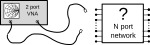

.. _concept_ports:

Ports
===========

At the start of a simulation, electric or magnetic fields are introduced
into the simulation domain, applying an initial energy and signal input to
the system. Some excitations only last one timestep, while most excitations
are gradually applied over many timesteps. For the purpose of circuit designs,
voltages and currents are also calculated to measure time-domain waveforms.

Internally, it's implemented using *excitation sources* to set numerical values
of the field at specified Yee cells. *Weighting functions* are used to further
control the field's pattern and polarization. Voltage and current are measured
by *probes*, which integrate the electric and magnetic fields along 1D lines.
Finally, *lumped resistances* often are needed to present specific
impedances at locations where voltages and currents are measured.

Controlling these low-level entities for every simulation is inconvenient for
the purpose of circuit designs. Hence, openEMS implements a high-level concept
called ports, which creates appropriate entities automatically for common port
types. This allows users to treat ports as the virtual 3D counterpart of
physical ports on RF/microwave components, such as the standard 50 Ω input or
output ports on circuit boards, signal generators, oscilloscopes, and especially
Vector Network Analyzers (VNA).

.. note::
   Ports are the most-commonly used form of excitations,
   this page presents a port-based view. For a description of
   non-port excitations (including Radar Cross Section), see
   :ref:`concept_excitations`.

   The "port" in openEMS serves a purpose similar to the physical
   ports on Vector Network Analyzers and circuit boards. Both kinds of
   ports are used to inject an input signal at a particular point in the
   Device-Under-Test (DUT), and to measure what comes out at another point.
   The DUT is thus characterized as a black box, solely represented using
   its input-output relationships without an internal structure.
   Note that port implementations are fundamentally different in
   physical instruments (via circuits) and in openEMS simulations
   (by loading numerical values into Yee cells). Image by Julien Hillairet,
   from the ``scikit-rf`` project, licensed under BSD-3, modified for clarity.

Types
-------

One can classify ports into two types, lumped ports and distributed ports.

API Reference
~~~~~~~~~~~~~~

.. list-table::
   :header-rows: 1

   * - Port Type
     - Matlab/Octave
     - Python

   * - Lumped
     - :func:`AddLumpedPort()`
     - :meth:`~openEMS.openEMS.AddLumpedPort`

   * - Curved
     - :func:`AddCurvePort()`
     - :meth:`~openEMS.ports.CurvePort`

   * - Microstrip
     - :func:`AddMSLPort()`
     - :meth:`~openEMS.ports.MSLPort`

   * - Stripline
     - :func:`AddStripLinePort()`
     - :meth:`~openEMS.ports.StripLinePort`

   * - Coplanar Waveguide
     - :func:`AddCPWPort()`
     - :meth:`~openEMS.ports.CPWPort`

   * - Coaxial
     - :func:`AddCoaxialPort()`
     - :meth:`~openEMS.ports.CoaxialPort`

   * - Generic Waveguide
     - :func:`AddWaveGuidePort()`
     - :meth:`~openEMS.ports.WaveguidePort`

   * - Rectangular Waveguide
     - :func:`AddRectWaveGuidePort()`
     - :meth:`~openEMS.ports.RectWGPort`

   * - Circular Waveguide
     - :func:`AddCircWaveGuidePort()`
     - :meth:`~openEMS.ports.CircWGPort`

Lumped Ports
~~~~~~~~~~~~

A lumped port is the simplest and basic port type.
It can be understood as a source that injects electromagnetic energy
into the simulation at a defined position, providing an initial stimulus for
the system.  Simultaneously, a lumped resistor and a probe are also created
at the same location as the port, allowing it to provide a matched load
for the signal, and to measure the voltage or current at this region.

Lumped ports play a role similar to signal generators in circuit
simulators. Both kinds of sources act like a voltage source or load
with a resistive impedance, which are used to inject a signal to the
Device-Under-Test or measure the DUT's response, either from its own signal
or from another port.

Limitation of the Lumped Port
""""""""""""""""""""""""""""""

A lumped port uses a constant-value electric field as the excitation signal,
its physical size must be much smaller than the simulated structure to ensure
the validity of the lumped-circuit approximation. If a significant distance
exists between the end-points of a lumped port, simulation artifacts may
occur.

A lumped port is a small 2D surface or 3D cube filled by an electric field,
it can only be used to excite a two-conductor TEM transmission line, it cannot
be used to excite hollow waveguides, and will perform poorly if the transmission
lines requires an excitation field with a specific shape, polarization or
contains multiple conductors, such as striplines, coplanar waveguides,
differential pairs, or coaxial cables.

To avoid signal reflections, the lumped port must also have a lumped resistance
matched to the characteristic impedance of the transmission line, which is
problematic if the characteristic impedance of the transmission line is unknown.

Transmission Line Ports
~~~~~~~~~~~~~~~~~~~~~~~~

Transmission line ports are designed for structures where the field distribution
of the propagating mode is known: microstrip lines (MSL), striplines, coplanar
waveguides (CPW), coaxial cables, and hollow metallic waveguides.

The key distinction from a lumped port is how the characteristic impedance and
wave quantities are determined. A lumped port uses a user-specified Z₀ and a
uniform electric field. Transmission line ports instead measure voltage and
current at multiple positions along the line to directly separate the
forward-traveling (incident) and backward-traveling (reflected) waves. The
characteristic impedance is then extracted from the ratio of these wave
quantities — consistent with the actual fields in the simulation, rather than
depending on a user-provided value.

As a result, transmission line ports do not require a matched lumped termination
resistance at the port plane. However, the far end of the transmission line still
needs a proper termination, typically an absorbing boundary condition (PML or MUR)
placed close to the line's end, or a separate lumped resistance element.

*Planar ports (MSL, Stripline, CPW, Coaxial)*

These ports create the excitation at the port plane and place probes at multiple
positions along the propagation direction. From the recorded voltages and currents
the incident and reflected voltage waves are computed and S-parameters are derived,
referenced to the extracted Z₀.

For a coaxial port, the excitation uses a radial electric field profile matching
the TEM mode of the coaxial geometry.

*Waveguide ports*

Hollow metallic waveguides support only TE and TM propagation modes, not TEM. A
lumped port cannot excite these correctly: it would see the waveguide as a DC short
circuit and fail to launch energy above the cutoff frequency.

Waveguide ports in openEMS excite the desired mode (typically TE₁₀ for a
rectangular waveguide) by applying a spatially-varying electric field profile
matching the mode's field distribution. The wave impedance is calculated
analytically from the waveguide dimensions and the operating frequency.
S-parameters are normalized to this wave impedance.

Feature Reference
-------------------

.. list-table::
   :header-rows: 1

   * - Port Type
     - Field Profile
     - How many?
     - Impedance Extraction

   * - Lumped
     - Constant
     - 1
     - No

   * - Curved
     - Constant
     - 1
     - No

   * - Microstrip
     - Constant
     - 1
     - Yes

   * - Stripline
     - Constant
     - 2
     - Yes

   * - Coplanar Waveguide
     - Constant
     - 2
     - Yes

   * - Coaxial
     - Radial
     - 1
     - Yes

   * - Generic Waveguide
     - Manual Weighting Function
     - 1
     - No - Formula Only

   * - Rectangular Waveguide
     - TE/TM Mode
     - 1
     - No - Formula Only

   * - Circular Waveguide
     - TE/TM Mode
     - 1
     - No - Formula Only

Usage
------

All port functions share a few arguments:

* **Port number**: an integer that must be unique within the simulation.
* **Priority**: the priority of the primitives the port creates
  (``prio`` in Matlab/Octave, the ``priority`` keyword in Python).
* **Excitation**: whether the port is active. Matlab/Octave takes ``true`` or
  ``false`` for the lumped and curve ports and the ``'ExcitePort'`` key for the
  microstrip, stripline and CPW ports, but an amplitude for the coaxial
  (``'ExciteAmp'``) and waveguide ports. Python always takes an amplitude,
  where ``0`` is a passive port and a negative value flips the direction of the
  excited field.

Each call returns a port object (a struct in Matlab/Octave), which is later
passed to :func:`calcPort` or the ``CalcPort()`` method in Python. With more
than one port, keep them in a cell array or list.

.. important::
   Excite only one port per simulation. The reflection and transmission
   parameters are all relative to the one active port, e.g. with port 1
   active the results are :math:`S_{11}` and :math:`S_{21}`. A full
   S-parameter matrix needs one simulation per port.

Lumped Port Setup
~~~~~~~~~~~~~~~~~

The following example adds two 50 Ω lumped ports in z-direction, the first
one active, the second one passive.

.. tabs::

   .. code-tab:: octave

      z0 = 50;

      start = [-100 0 0];
      stop  = [-100 0 50];
      [CSX port{1}] = AddLumpedPort(CSX, 5, 1, z0, start, stop, [0 0 1], true);

      start = [100 0 0];
      stop  = [100 0 50];
      [CSX port{2}] = AddLumpedPort(CSX, 5, 2, z0, start, stop, [0 0 1], false);

   .. code-tab:: python

      z0 = 50

      port = [None, None]

      start = [-100, 0, 0]
      stop  = [-100, 0, 50]
      port[0] = fdtd.AddLumpedPort(1, z0, start, stop, 'z', excite=1, priority=5)

      start = [100, 0, 0]
      stop  = [100, 0, 50]
      port[1] = fdtd.AddLumpedPort(2, z0, start, stop, 'z', excite=0, priority=5)

Transmission Line Port Setup
~~~~~~~~~~~~~~~~~~~~~~~~~~~~

Microstrip, stripline, coplanar waveguide and coaxial ports place their
excitation and probes on the mesh lines, so **the mesh must be defined before
the port is created**.

The port spans a piece of the transmission line, as a box or, for the coaxial
port, as the end points of the cable axis. The order of ``start`` and
``stop`` matters: the wave is assumed to travel from ``start`` to ``stop``, so
``start`` is the outer end of the line and ``stop`` points towards the device
under test, for the passive port as well. For a microstrip port, the
coordinate of ``start`` in the excitation direction is the height of the strip,
the one of ``stop`` the ground plane.

The optional parameters are the same in Matlab/Octave (key/value pairs) and
Python (keywords):

``FeedShift``
   Shift the excitation from ``start`` towards ``stop`` by the given distance in
   drawing units. Default is 0. Only used for an active port.
``Feed_R``
   Place a lumped feeding resistance at the excitation. By default there is
   none, and ``start`` must lie inside an absorbing boundary (e.g. a PML), which
   then absorbs the wave that the excitation launches away from the structure.
``MeasPlaneShift``
   Position of the measurement plane, as a distance from ``start`` in drawing
   units. Default is the middle of the port box. The resulting voltages and
   currents are referenced to this plane.

The following example, taken from the MSL notch filter tutorial, adds two
microstrip ports in x-direction, with the metal strip at
``substrate_thickness`` and the ground plane at z = 0. Both ports start at
the outer end of the line, inside a PML.

.. tabs::

   .. code-tab:: octave

      CSX = AddMetal(CSX, 'PEC');

      portstart = [-MSL_length, -MSL_width/2, substrate_thickness];
      portstop  = [          0,  MSL_width/2, 0];
      [CSX, port{1}] = AddMSLPort(CSX, 999, 1, 'PEC', portstart, portstop, 0, [0 0 -1], ...
                                  'ExcitePort', true, 'FeedShift', 10*resolution, ...
                                  'MeasPlaneShift', MSL_length/3);

      portstart = [MSL_length, -MSL_width/2, substrate_thickness];
      portstop  = [         0,  MSL_width/2, 0];
      [CSX, port{2}] = AddMSLPort(CSX, 999, 2, 'PEC', portstart, portstop, 0, [0 0 -1], ...
                                  'MeasPlaneShift', MSL_length/3);

   .. code-tab:: python

      pec = CSX.AddMetal('PEC')

      port = [None, None]

      portstart = [-MSL_length, -MSL_width/2, substrate_thickness]
      portstop  = [          0,  MSL_width/2, 0]
      port[0] = fdtd.AddMSLPort(1, pec, portstart, portstop, 'x', 'z', excite=-1,
                                FeedShift=10*resolution, MeasPlaneShift=MSL_length/3,
                                priority=10)

      portstart = [MSL_length, -MSL_width/2, substrate_thickness]
      portstop  = [         0,  MSL_width/2, 0]
      port[1] = fdtd.AddMSLPort(2, pec, portstart, portstop, 'x', 'z',
                                MeasPlaneShift=MSL_length/3, priority=10)

Waveguide Port Setup
~~~~~~~~~~~~~~~~~~~~

Waveguide ports also need the mesh to be defined first. The port box spans a
short piece of the waveguide in propagation direction: the excitation is placed
at ``start``, the voltage and current probes at ``stop``. The ``stop``
coordinate thus defines the reference plane of the port. As for the
transmission line ports, ``start`` is the outer end and ``stop`` points towards
the device under test.

The rectangular waveguide port takes the waveguide width and height in meters
and a mode name such as ``'TE10'``; the circular waveguide port takes the
radius and a mode name such as ``'TE11'``. For other cross-sections,
:func:`AddWaveGuidePort` accepts the mode profile as field functions.

.. tabs::

   .. code-tab:: octave

      start = [0 0 10*mesh_res];
      stop  = [a b 15*mesh_res];
      [CSX, port{1}] = AddRectWaveGuidePort(CSX, 0, 1, start, stop, 'z', a*unit, b*unit, 'TE10', 1);

      start = [0 0 length-10*mesh_res];
      stop  = [a b length-15*mesh_res];
      [CSX, port{2}] = AddRectWaveGuidePort(CSX, 0, 2, start, stop, 'z', a*unit, b*unit, 'TE10');

   .. code-tab:: python

      start = [0, 0, 10*mesh_res]
      stop  = [a, b, 15*mesh_res]
      port[0] = fdtd.AddRectWaveGuidePort(0, start, stop, 'z', a*unit, b*unit, 'TE10', 1)

      start = [0, 0, length-10*mesh_res]
      stop  = [a, b, length-15*mesh_res]
      port[1] = fdtd.AddRectWaveGuidePort(1, start, stop, 'z', a*unit, b*unit, 'TE10')

Selection
-----------

In openEMS, ports are ideal sources of EM fields, but they are not ideal
*launchers* of EM waves into structures due to a discontinuity at the
boundary between the port and the structure.
If port placement is not optimized,
this region of discontinuity may introduce artifacts such
as reflections or excitation of spurious modes. Optimizing the placement
and implementation of a port reduces these artifacts. This can be done
by using smooth transitions or by shaping the electric fields initially
injected by the port.

In openEMS, the standard port is the lumped port that works with most
structures. If an optimal transition is needed, openEMS also provides
optimized implementations of curved, microstrip, stripline, coplanar
waveguide, and coax cable ports.

Most specialized ports in openEMS are signal integrity optimizations
rather than strict requirements. However, in enclosed waveguides,
specialized ports are *required* to excite those structures properly.
These waveguides only have one conductor, unlike the usual two-conductor
transmission lines. An ordinary port can't excite them correctly,
as the waveguide is essentially a DC short circuit. Special waveguide
ports must be used to excite the unique TE-mode waves. These include
general waveguide ports, rectangular waveguide ports, and circular
waveguide ports

.. note::
   Like physical ports on real devices, the virtual ports in openEMS are not
   perfect. They're ideal sources of EM fields, but they are not ideal
   *launchers* of EM waves into structures. A port creates a region of
   discontinuity, so they may introduce artifacts.
   Optimizing the placement and implementation of a port reduces artifacts.
   Alternatively, these artifacts
   can be removed through calibration or de-embedding algorithms, an
   advanced topic beyond the scope of this tutorial.

   .. figure:: images/error-box.svg
      :class: with-border
      :width: 60%

      The artifacts introduced by a two-port measurement can be viewed
      as two linear circuits (left error box, right error box) cascaded in
      series with the DUT. All three circuits are represented as three matrices,
      called their S-parameters. Measurement error can be reduced by making
      error boxes nearly transparent using optimized port transitions.
      Alternatively, by mathematically removing the port's contributions from
      the measured response using linear algebra, a process known as
      calibration or de-embedding (image by Ziad Hatab et al., licensed
      under CC BY-SA 4.0)

Implementation
----------------

Ports are a high-level concept in openEMS. Internally, they're
implemented by first calling :meth:`~CSXCAD.ContinuousStructure.AddExcitation`
to create a source of EM field. Later, :meth:`~CSXCAD.ContinuousStructure.AddLumpedElement`
and :meth:`~CSXCAD.ContinuousStructure.AddProbe` are used to add termination
resistances and probes. One can create new port types based on these
low-level primitives.

Post-Processing
-----------------

After the simulation is complete, a circuit's frequency response or
time-domain waveform is extracted to obtain meaningful results.

Attributes
~~~~~~~~~~

After :func:`calcPort` or the ``CalcPort()`` method in Python, each port
object provides the following results:

.. list-table::
   :header-rows: 1

   * - Matlab/Octave
     - Python
     - Domain
     - Definition
   * - ``ZL_ref``
     - ``Z_ref``
     - Impedance
     - Reference impedance
   * - ``ZL``
     - ``ZL`` (waveguide), ``Z_ref`` (see below)
     - Impedance
     - Characteristic line impedance (transmission line and waveguide ports)
   * - ``beta``
     - ``beta``
     - Frequency
     - Propagation constant (transmission line and waveguide ports)
   * - ``uf.inc``
     - ``uf_inc``
     - Frequency
     - Incident voltage
   * - ``uf.ref``
     - ``uf_ref``
     - Frequency
     - Reflected voltage
   * - ``uf.tot``
     - ``uf_tot``
     - Frequency
     - Total voltage
   * - ``if.inc``
     - ``if_inc``
     - Frequency
     - Incident current
   * - ``if.ref``
     - ``if_ref``
     - Frequency
     - Reflected current
   * - ``if.tot``
     - ``if_tot``
     - Frequency
     - Total current
   * - ``P_inc``
     - ``P_inc``
     - Frequency
     - Incident power
   * - ``P_ref``
     - ``P_ref``
     - Frequency
     - Reflected power
   * - ``P_acc``
     - ``P_acc``
     - Frequency
     - Accepted power (incident - reflected)
   * - ``ut.time``
     - ``u_data.ui_time[0]``
     - Time
     - Time of the voltage samples
   * - ``ut.tot``
     - ``ut_tot``
     - Time
     - Total voltage
   * - N/A (see notes)
     - ``ut_inc``
     - Time
     - Incident voltage
   * - N/A (see notes)
     - ``ut_ref``
     - Time
     - Reflected voltage
   * - ``it.time``
     - ``i_data.ui_time[0]``
     - Time
     - Time of the current samples
   * - ``it.tot``
     - ``it_tot``
     - Time
     - Total current
   * - N/A (see notes)
     - ``it_inc``
     - Time
     - Incident current
   * - N/A (see notes)
     - ``it_ref``
     - Time
     - Reflected current

In Python, a transmission line port stores the extracted line impedance in
``Z_ref``, unless ``ref_impedance`` is given.

.. note::

  **Voltage symbol**. ``u`` is the unambiguous symbol of voltage (:math:`U`) in ISO/IEC
  convention,
  so frequency-domain variables have the prefix ``uf``, time-domain variables have the
  prefix ``ut``. In American literature, symbols such as :math:`V`, :math:`E` and
  :math:`\mathcal{E}` are used.

  **Incident and reflected signals.** In Matlab/Octave, only the total time-domain port
  voltage and current are given, while their incident and reflected components are not.
  Python only provides them for a scalar reference impedance. For a scalar
  reference impedance, they can be calculated using the following expressions::

      ut_inc = 0.5 * (port.ut.tot + port.it.tot * port.ZL_ref);
      ut_ref = port.ut.tot - ut_inc;

      it_inc = 0.5 * (port.it.tot + port.ut.tot ./ port.ZL_ref);
      it_ref = it_inc - port.it.tot;

Usage
~~~~~

The S-parameters follow from the incident and reflected voltages. For the
transmission, divide the *reflected* voltage of the passive port by the
incident voltage of the active port: the reflected wave of a port is the wave
leaving the structure through it.

By default the reference impedance is the port resistance of a lumped port, or
the extracted line impedance of a transmission line or waveguide port. Pass a
reference impedance to normalize all ports to the same value, e.g. 50 Ω. The
measurement plane of a transmission line port can be moved afterwards with
``'RefPlaneShift'`` (Matlab/Octave) or ``ref_plane_shift`` (Python).

.. tabs::

   .. code-tab:: octave

      f_min = 100e6;
      f_max = 1e9;
      freq_list = linspace(f_min, f_max, 1000);

      % after running the simulation, calcPort also accepts a cell array of ports
      port = calcPort(port, Sim_Path, freq_list, 'RefImpedance', 50);

      s11 = port{1}.uf.ref ./ port{1}.uf.inc;
      s21 = port{2}.uf.ref ./ port{1}.uf.inc;
      zin = port{1}.uf.tot ./ port{1}.if.tot;

      figure
      plot(port{1}.ut.time, port{1}.ut.tot, 'k-');
      hold on
      plot(port{2}.ut.time, port{2}.ut.tot, 'r--');
      grid on
      legend('input voltage', 'output voltage');
      xlabel('time (s)');
      ylabel('voltage (V)');

   .. code-tab:: python

      import numpy as np
      from matplotlib import pyplot as plt

      f_min = 100e6
      f_max = 1e9
      freq_list = np.linspace(f_min, f_max, 1000)

      # after running the simulation
      for p in port:
          p.CalcPort(Sim_Path, freq_list, ref_impedance=50)

      s11 = port[0].uf_ref / port[0].uf_inc
      s21 = port[1].uf_ref / port[0].uf_inc
      zin = port[0].uf_tot / port[0].if_tot

      plt.figure()
      plt.plot(port[0].u_data.ui_time[0], port[0].ut_tot, 'k-', label='input voltage')
      plt.plot(port[1].u_data.ui_time[0], port[1].ut_tot, 'r--', label='output voltage')
      plt.grid()
      plt.legend()
      plt.xlabel('time (s)')
      plt.ylabel('voltage (V)')
      plt.show()

.. seealso::
   * :ref:`tutorial_msl_notchfilter` — microstrip port setup and S-parameters.
   * :ref:`tutorial_rect_waveguide` — waveguide port with mode profile excitation.

