Field Dumps Analysis via ParaView
"""""""""""""""""""""""""""""""""

ParaView is a visualization program commonly used in the High-Performance
Computing (HPC) and scientific computing world. One can install it using
the operating system's package manager.

In openEMS, we rely on ParaView to visualize raw electromagnetic fields
created during the simulation. For troubleshooting malfunctioning simulations
or understanding the physical behavior of a structure, this is especially helpful
as one can identify the problematic region directly by visualization.

We continue our total current density visualization example, introduced
as an optional step in :ref:`fielddump`. If the simulation finishes with
field dump enabled, a series of `vtr` files (which is a type of the VTK
file format) is created under the simulation directory.

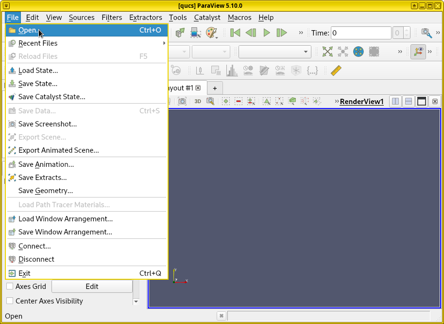

**Open ParaView.** To visualize these results, open ParaView first.
Click :menuselection:`Files --> Open`. Navigate to the simulation
data directory, open the `vtr` file series.

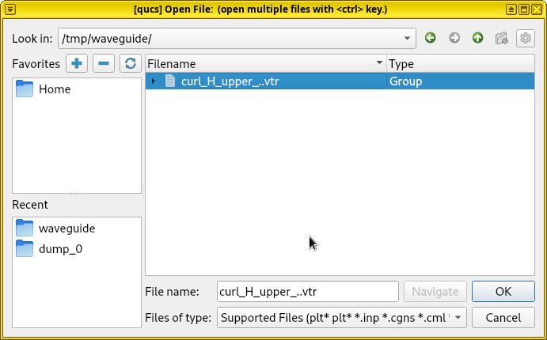

**Apply cell/point array for visualization.** Make sure ``RotH-Field``
appears in the :guilabel:`Cell/Point Array` list on the bottom left
of the ParaView window, and is checked. Click :guilabel:`Apply`. By
default, the visualization shows an empty rectangle because the displayed
physical quantity is set to :guilabel:`Solid Color` without any data.
Click :guilabel:`Solid Color` and change it to :guilabel:`RotH-Field`.

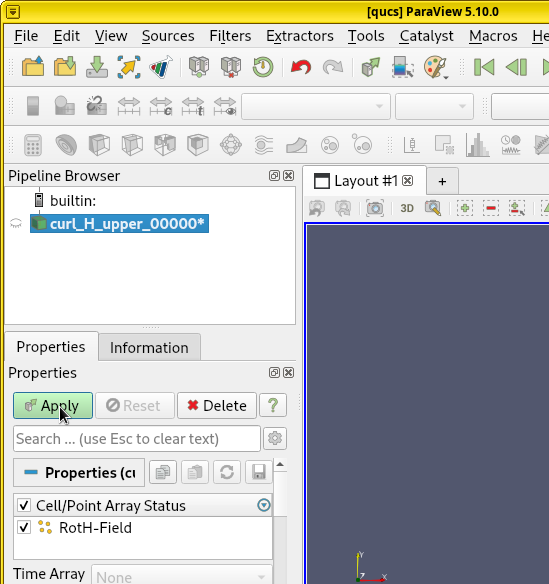

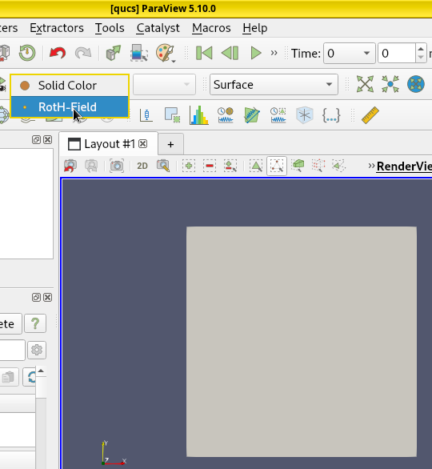

**Play animated visualization.** Now it's possible to see the
current density by clicking the :guilabel:`Play` button to see an
animated visualization of electromagnetic wave propagation.

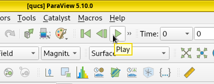

**Rescale the color-grading.** However, ParaView can still render
this field dump incorrectly due to a problem in color-grading. If
ParaView's color-grading scale uses a small values for reference
(as the field at t = 0 is zero), all fields (or current) injected
by the excitation source in later timesteps can be rendered as a deep
red as the color saturates, making them indistinguishable. This
happens by default, as shown in the following diagram. We can
solve this problem by clicking :guilabel:`Rescale to Visible Data Range`.

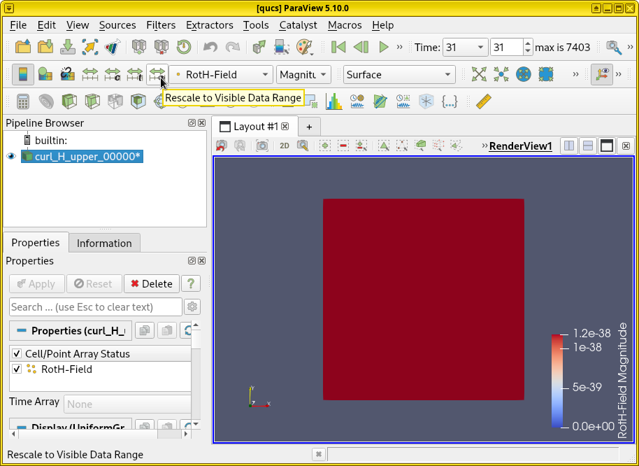
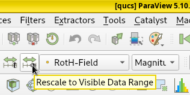
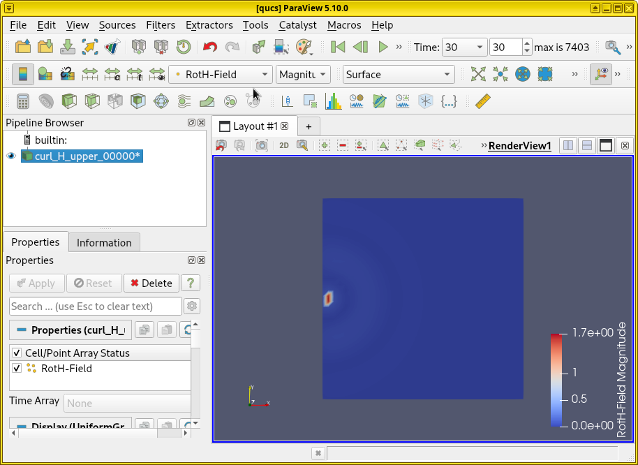

**Color scale sensitivity to timestep.** On the other hand, if large
values are used for references, the beginning of the visualization
works okay. But in later timesteps, colors will be very shallow and
difficult to see. Thus the color-grading scale is quite sensitive to
the timestep at which the :guilabel:`Rescale to Visible Data Range`
button is pressed.

**Manual color scale.** Another problem is that the excitation port
always have strong fields and currents, so as long as ParaView's
color-grading is normalized to the magnitudes around a port, all currents
and fields
at other locations may appear dark and weak. Thus, manually overriding
the color-grading may be necessary. To do so, press :guilabel:`Rescale
to Custom Data Range`, enter a new value (such as `0.001`) and press
:guilabel:`Rescale and disable automatic rescaling`.

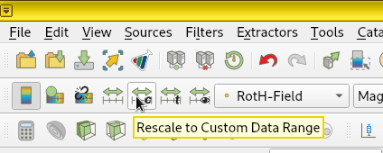
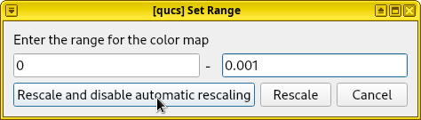

**Logarithmical color scale.** For good visualization, an alternative
solution is to color-grade the values logarithmically. It can be done
by clicking :guilabel:`Edit Color Map`. In the :guilabel:`Color Map
Editor` on the right, check :guilabel:`Use log scale when mapping data
to colors`. A warning message may immediately appear, as the log of 0
is undefined, but it's safe to ignore.

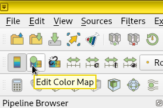
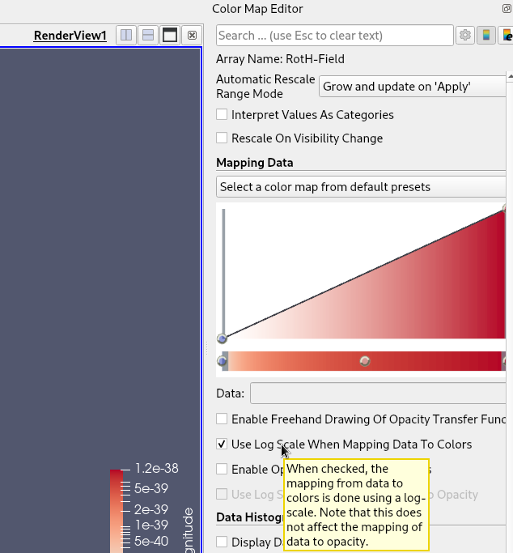

**Result.** In this simulation, we find that rescaling at timestep
55 and enabling logarithmical color map allow us to obtain a
satisfactory video below.

.. video:: images/curlH.webm

.. important::

   To correctly visualize the fields in ParaView, one must apply
   the corresponding Cell/Point Array, select the variable that
   represents the physical quantity, rescale the color-grading
   (and optionally enable logarithmical scale) to match the data
   range. Otherwise, an empty box appears when the array is not
   selected. A solid color appears when the color map's data range
   is saturated.

   Also, 3D dump boxs are tricky to visualize. By default it's
   rendered as an empty box. It's possible to render a 2D slice
   of the data, or possibly a 3D vector field. But it's beyond
   the scope of this tutorial.

.. seealso::
   ParaView is a large program used in many scientific applications,
   it's impossible to cover all of its aspects here. See the full
   manual [13]_ for usage.
