S-Parameters Analysis via Qucs-S
""""""""""""""""""""""""""""""""

Qucs is a free and open source circuit simulator for RF/microwave
engineering, it's capable of simulating circuits in both time and
frequency domains.

Install
''''''''

Qucs has a somewhat confusing development history, three different
spinoffs exist.

#. :program:`Qucs`. Development of the original :program:`Qucs` started
   in the early 2000s, but was slowed down over time. Finally in ~2019,
   its underlying GUI framework Qt4 has been discontinued, making it
   uninstallable on most operating systems. Its :program:`Qucsator`` engine
   has good RF simulation features, but limited time-domain capabilities
   with performance and convergence issues.

#. :program:`QucsStudio` is a free-of-charge spinoff of Qucs with
   additional features, but it's **not** free and open source software.

#. :program:`Qucs-S`. The project :program:`Qucs-S` is a fork of
   :program:`Qucs` with a modernized codebase, aiming to support
   multiple SPICE backends for improved time-domain simulations,
   such as `Ngspice`. RF simulations still use the original
   :program:`Qucsator` engine externally before Qucs-S 24.2.0
   (meaning that an installation of the now-unavailable Qucs is
   still needed). After Qucs-S 24.2.0, :program:`Qucsator` is
   now a builtin option.

.. warning::
   For this tutorial, we use Qucs-S 25.1.0. Other Qucs spinoffs
   or older Qucs-S versions have features and user interface
   changes that are in conflict with this tutorial, so one should
   use Qucs-S 25.1.0 or newer when following this tutorial.

The Qucs-S packages in most operating systems are outdated, thus,
Debian, Ubuntu, Fedora and openSUSE users should use the third-party
maintained by Qucs-S projcet developers. It's hosted on Open Build
Service (OBS), installation instructions can be found in the following
link.

* https://software.opensuse.org/download.html?project=home%3Ara3xdh&package=qucs-s

Alternatively, if no package is available, a self-contained AppImage
version is also available as a stop-gap measure before it's packaged.

* https://github.com/ra3xdh/qucs_s/releases/tag/25.1.0

Download ``Qucs-S-25.1.0-linux-x86_64.AppImage``, and grant it
execution permission::

    chmod +x Qucs-S-25.1.0-linux-x86_64.AppImage

.. _qucsator:

Enable Qucsator
'''''''''''''''''''

As previously mentioned, Qucs-S uses Ngspice for simulation by default,
but it lacks some features required for RF/microwave applications that
we need. Hence, we must switch Qucs-S's engine from Ngspice to Qucsator.

**Switch the engine.** Press the drop-down list at the top-right of
the Qucs-S window. By default, it should show `Ngspice`, click
it and change it to `Qucsator`.

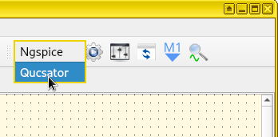

.. important::

   If the option :guilabel:`Qucsator` does not exist (it usually
   disappears when one quits and restarts the application), it
   means you're affected by a bug in the AppImage version of
   Qucs-S. See :ref:`qucsator_bug` for the solution.

S-Parameter Simulation Skeleton
''''''''''''''''''''''''''''''''

To perform frequency-domain analysis in Qucs (Qucs-S), we
need to add several components in multiple steps: adding two
power sources, entering two equations for calculating scalar
S-parameters :math:`S_{11}` and :math:`S_{21}`, adding an
"S-parameter simulation" block with parameters, and inserting
the DUT in the middle between the two ports.

.. important::

   *Before* a filter is synthesized, Qucs-S must be switched to
   use Qucsator as its engine as described in :ref:`qucsator`.
   Otherwise a broken schematic would be synthesized with non-functional
   equations - S-parameter simulations won't work correctly.

**Open the filter wizard.** A trick allows us to quickly setting up a
skeleton - "borrowing" the setup generated by Qucs's filter synthesis
wizard. Click :menuselection:`Tools --> Filter synthesis`.

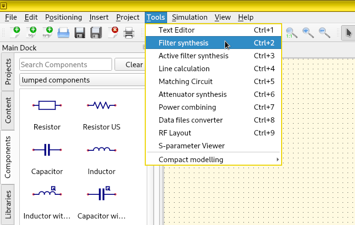

**Synthesize a filter.** In the opened dialog, generate the default
low-pass LC filter by pressing :guilabel:`Calculate and put into Clipboard`,
without changing any parameters.

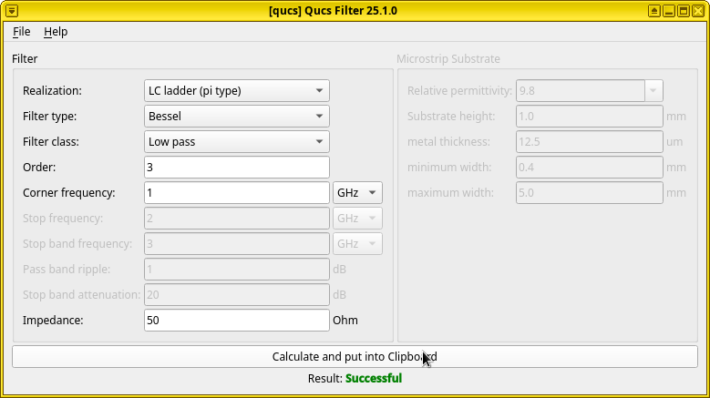

**Paste it into schematic**. Do *not* close the filter dialog yet.
Now right-click the schematic, click :guilabel:`Paste`. Paste the
synthesized filter circuit onto the page by left-clicking. After
pasting, it's free to close the filter dialog.

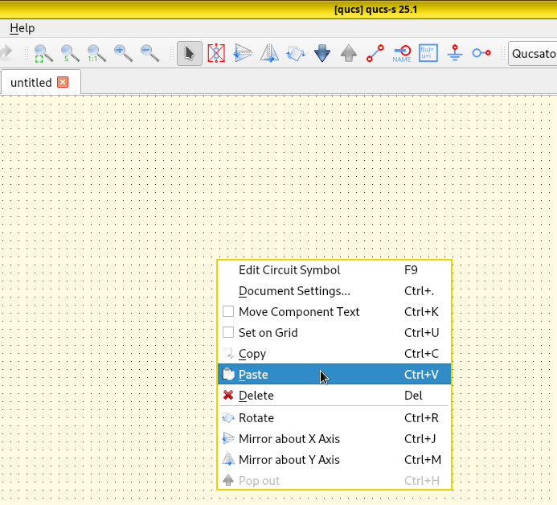
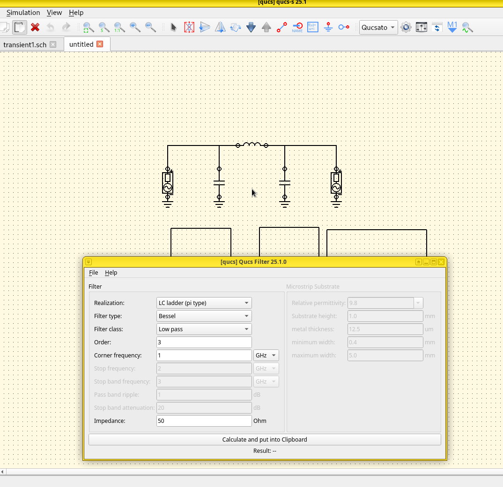
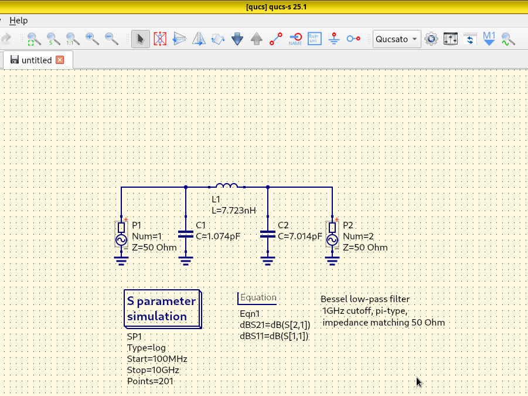

**Save the schematic to disk.** Press the :guilabel:`💾` (floppy
disk) button, and choose a path. This is required before starting a
simulation.

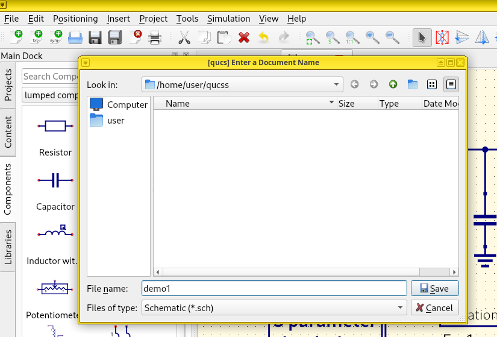

**Run simulation.** Select :menuselection:`Simulation --> Simulate`.
A dialog should pop up without warnings or errors.

.. image:: images/qucs-filter-7.png
   :width: 30%

**Add a Cartesian plot.** On the :guilabel:`Main Dock` on the left,
switch from :guilabel:`lumped components` to :guilabel:`diagrams`.
Click the :guilabel:`Cartesian` component.

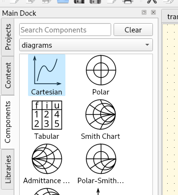

**Plot dbS11.** Click the schematic to place the component. In
the dialog, double-click the scalar ``dbS11`` to add it into the
:guilabel:`Graph` item list, then press :guilabel:`OK`.

.. important::

   The scalars ``dBS11`` and ``dbS21`` are not to be confused with the
   complex S-parameters ``S[1,1]`` and ``S[2,1]``. In particular, the
   Smith chart won't work with a scalar value.

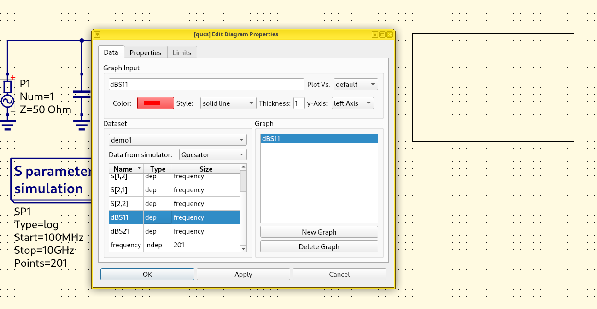

**Plot dbS21**. Repeat the same steps above, add another
:guilabel:`Cartesian` component to the schematic. Click the schematic to
place it. In the dialog, double-click the scalar ``dBS21`` (not the
complex ``S[2,1]``) to add this array into the :guilabel:`Graph` item
list. Click :guilabel:`OK`.

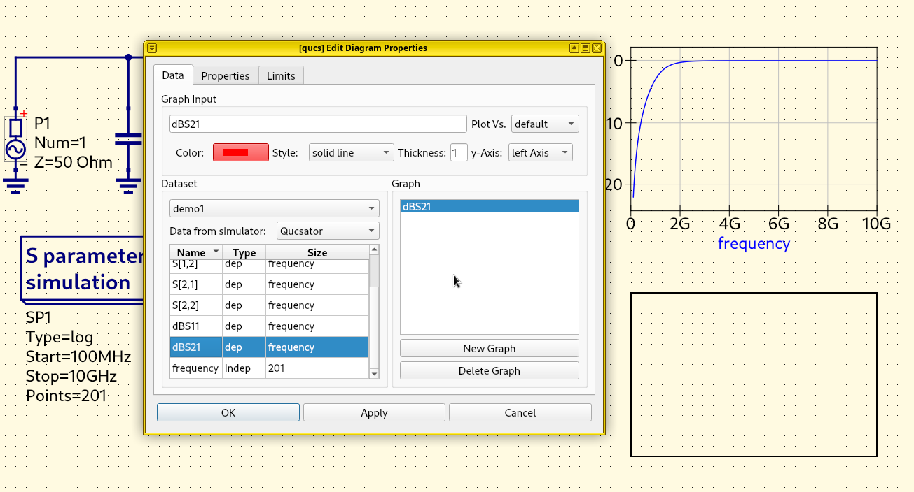

**Add a Smith chart.** Click the :guilabel:`Smith Chart` component on the
:guilabel:`Main Dock`.

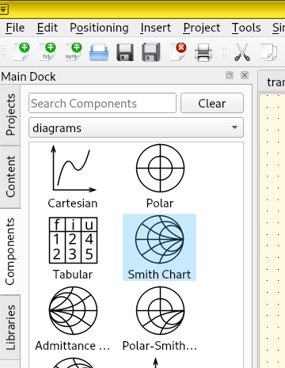

**Plot S[1,1].** Click the schematic to place the component. In the
dialog, double-click ``S[1,1]`` (not dBS11) to add this array into the
:guilabel:`Graph` item list. Click "OK".

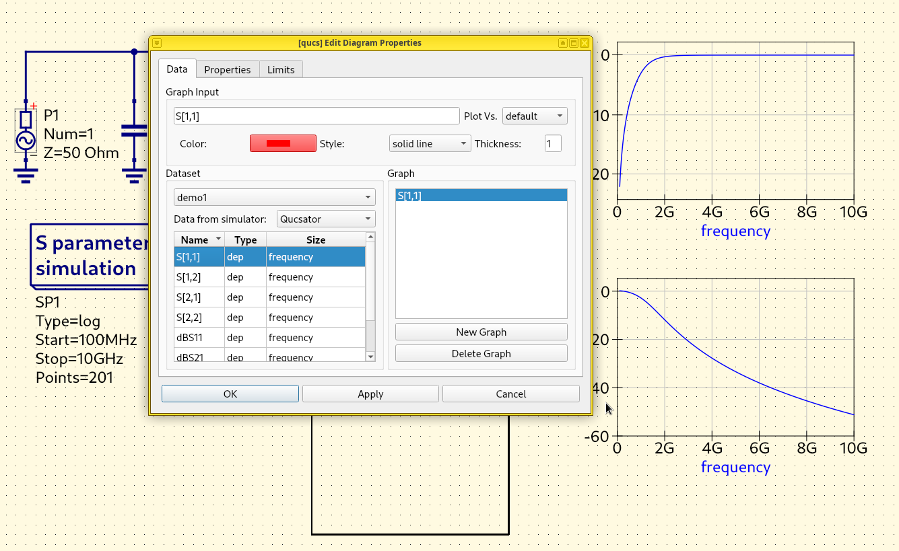

.. hint::
   All subsequent mouse clicks will keep adding components to the schematic.
   To stop, press :kbd:`Esc` or click the :guilabel:`Select` button (cursor
   icon) on the menu bar.

   .. image:: images/qucs-filter-13.png
      :width: 30%

**Plotting.** Now we have a fully-functional S-parameter simulation skeleton
with S-parameters on two line chart and a Smith chart.

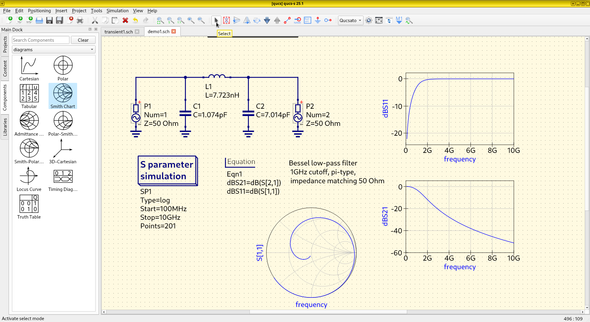

**Delete the text label.** The next step is to delete the filter, leaving
only the simulation skeleton. First, select the text label :guilabel:`Bessel
low-pass filter 1 GHz cutoff, ...` by left-clicking it and pressing the
:kbd:`Delete` key on the keyboard (or by right-cilking it and pressing
the :guilabel:`Delete` option).  This text label would be useless and
misleading if it's left here.

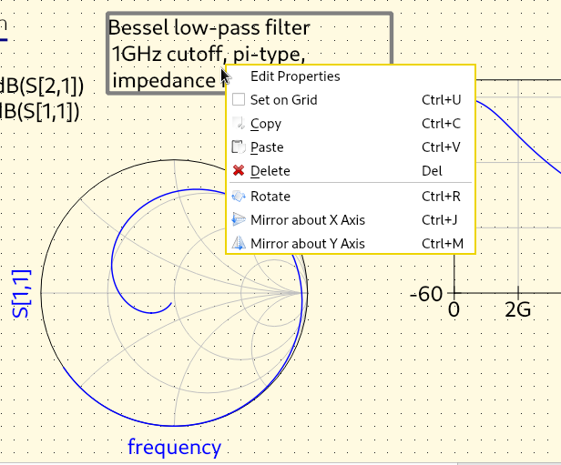

**Delete the inductor, capacitors, and wire segments.** Select the
inductor and delete it by pressing the :kbd:`Delete` key on the keyboard.
Delete the capacitors using the same procedure.

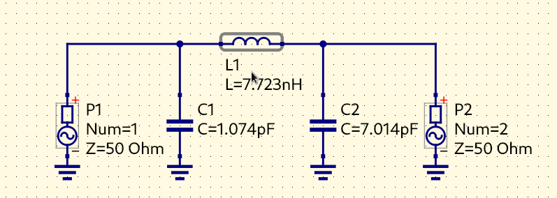

.. hint::
   It's difficult to delete a wire segment without highlighting the
   entire wire.  If you have trouble selecting a segment, try dragging
   the mouse to highlight a rectangle that contains only that segment.

   .. image:: images/qucs-filter-17.png
      :width: 30%
   .. image:: images/qucs-filter-18.png
      :width: 30%

**Clean Skeleton Obtained.** After all useless components are wires have
been deleted, the simulation skeleton is clean to use.

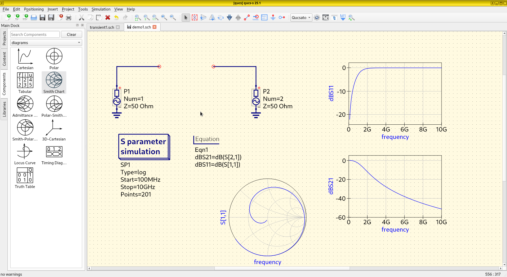

Two-Port S-Parameter Analysis
''''''''''''''''''''''''''''''

**Add an S-parameter-defined component.** On the left :guilabel:`Main Dock`,
switch from :guilabel:`diagram` (or :guilabel:`lumped components`) to
:guilabel:`file components`. Click :guilabel:`2-port S-parameters`, place
it on the schematic.

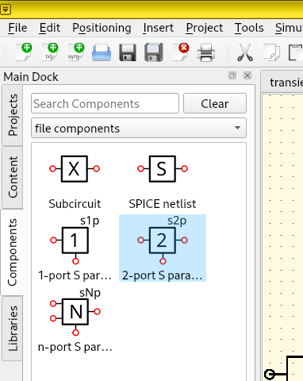
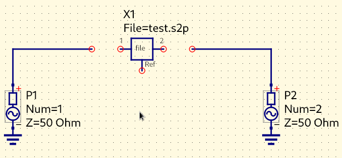

**Wire component together.** Click the :guilabel:`Wire` icon on the menu
bar. Connect the DUT's Port 1 to the left, connect Port 2 to the right,
and wire the Reference Port downwards.

.. image:: images/qucs-filter-22.png
   :width: 30%
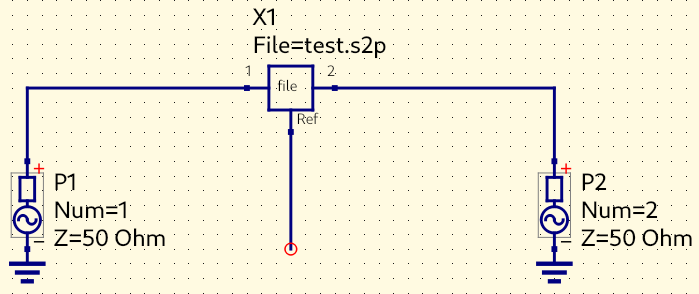

**Add a ground.** Click :guilabel:`Ground Node` on the menu bar, add a
ground below wire to the reference port.

.. hint::
   Don't forget to press :kbd:`Esc` to exit from insert mode, otherwise
   every mouse click results in more :guilabel:`Ground Nodes` on the
   schematic.

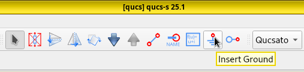
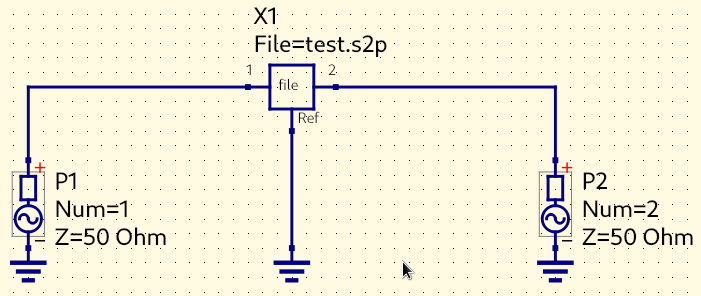

**Set S-parameter path.** Double click the file component :guilabel:`X1`.
In the opened dialog, press the :guilabel:`...` button to change the
path of the Touchstone file that backs this parameter-defined component.
Pick the Touchstone file created by the openEMS simulation. Also, uncheck
the :guilabel:`Show` option, since the file path is extremely long and
visually cluttering. Press :guilabel:`OK`.

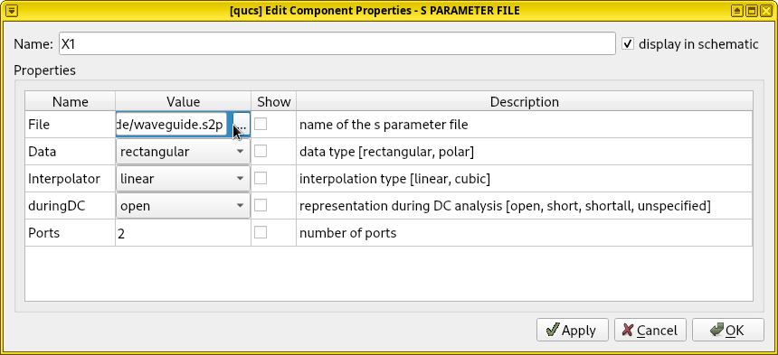

**Move Component Text.** One may also want to adjust the position of
the text label :guilabel:`X1` to be directly above the component box
(since the space occupied by the file path has gone) to improve readability.
This can be done by right-clicking the component, select :guilabel:`Move
Component Text`, then drag the text to a new position.

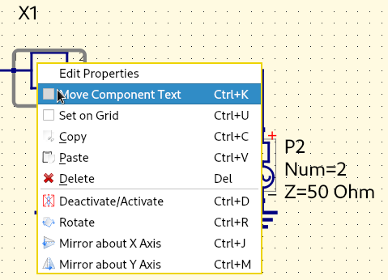

**Run simulation**. Select :guilabel:`Simulation` and click
:guilabel:`Simulate`. A dialog should pop up without warnings or errors.

.. image:: images/qucs-filter-7.png
   :width: 30%

**Results**. Now the S-parameters from our simulation should appear on
the Smith and line charts.

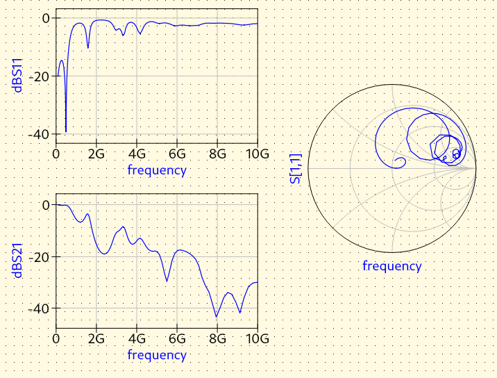

Comparison with Microstrip
'''''''''''''''''''''''''''

In the analysis of RF/microwave devices, We often need to compare the
behavior of different circuits. Using the microstrip as an example (as
the limiting case of a parallel-plate waveguide when the lower plate has
an infinite size), we perform a simple comparison here.

**Select and move the existing circuit.** Drag the mouse and select the
entire circuit, move it upwards to free up some space. Press :kbd:`Control-C`
to copy this circuit, then press :kbd:`Control-V` to paste a new instance
and place it below the original.

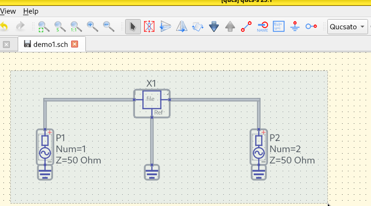
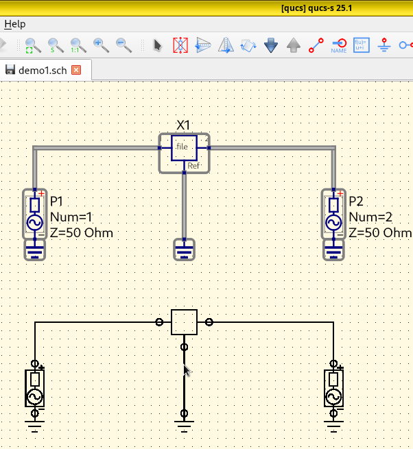
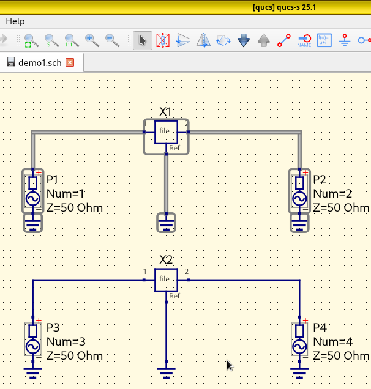

**Delete the extra file-defined component**. Delete X2 and its ground
connect.

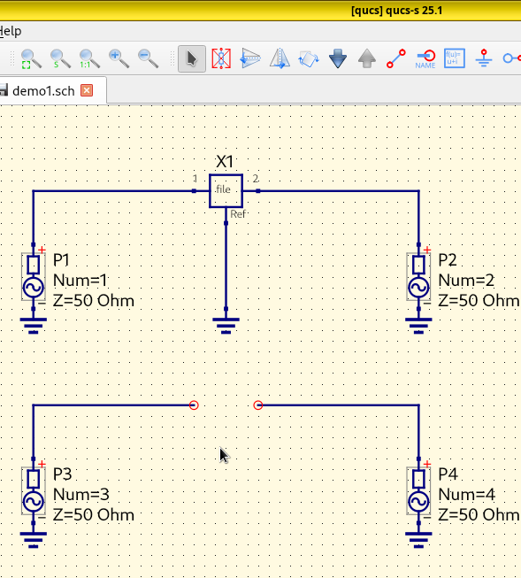

**Add a microstrip.**  On the left :guilabel:`Main Dock`, switch to
:guilabel:`transmission lines`. Click :guilabel:`Microstrip Line`,
and place it between Port 3 and Port 4.
Change its :guilabel:`W` (width) and :guilabel:`L` to ``100 mm``. Apply the
numer change by pressing :kbd:`Enter`.

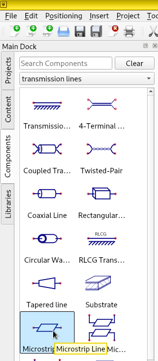
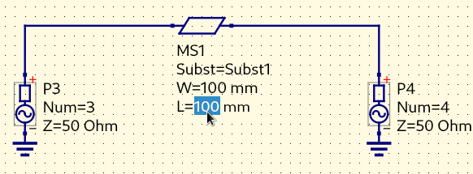

**Add a substrate that supports the microstrip.** On the left
:guilabel:`Main Dock`, click :guilabel:`Substrate`, and place it
at the bottom of the schematic. Change parameter :guilabel:`er` to ``1.001``
(don't use ``1.0``, the Qucs-S's internal formula is singular here).
Change parameter :guilabel:`h` (height) to ``16 mm``.

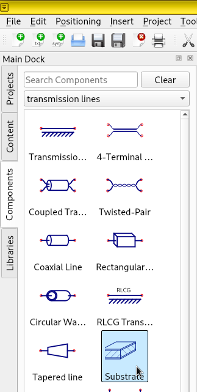
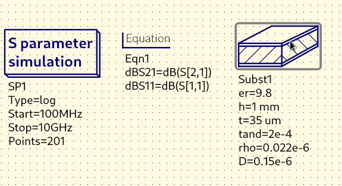
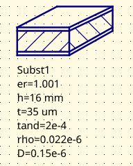

**Add new equations for scalar S33 and S43**. Double-click the
:guilabel:`Equation` component.

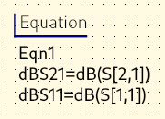
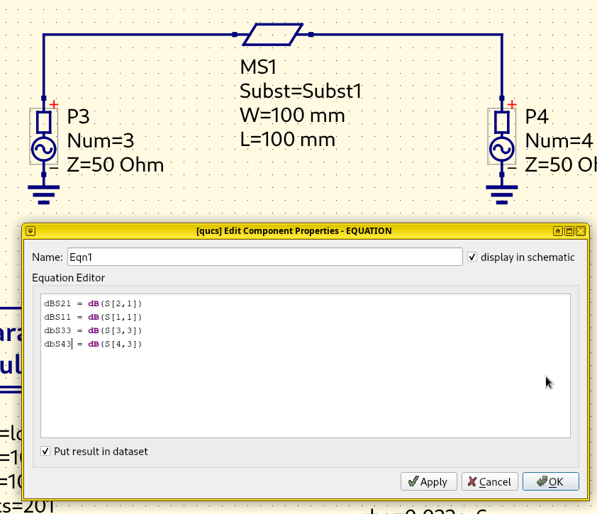

Change its formulas to the following::

    dBS21 = dB(S[2,1])
    dBS11 = dB(S[1,1])
    dBS33 = dB(S[3,3])
    dBS43 = dB(S[4,3])

.. important::
   Make sure ``S[3,3]`` and ``S[4,3]`` matches the actual port numbers
   on the schematics. If ports have been repeatedly deleted and inserted
   into the schematic, they could be renumbered. If so, change the
   port numbers back to ``3`` and ``4``.

**Run simulation.** Select :guilabel:`Simulation` and click :guilabel:`Simulate`.
A dialog should pop up without warnings or errors.

.. image:: images/qucs-filter-7.png
   :width: 30%

**Plots.** Double-click the original :math:`S_{11}` chart, add
:guilabel:`dBS33` to the graph by double-clicking this item. Similarly,
do the same to add :guilabel:`dbS41` to the original `S_{21}` chart, and
finally add :guilabel:`S[3,3]` to the Smith chart.

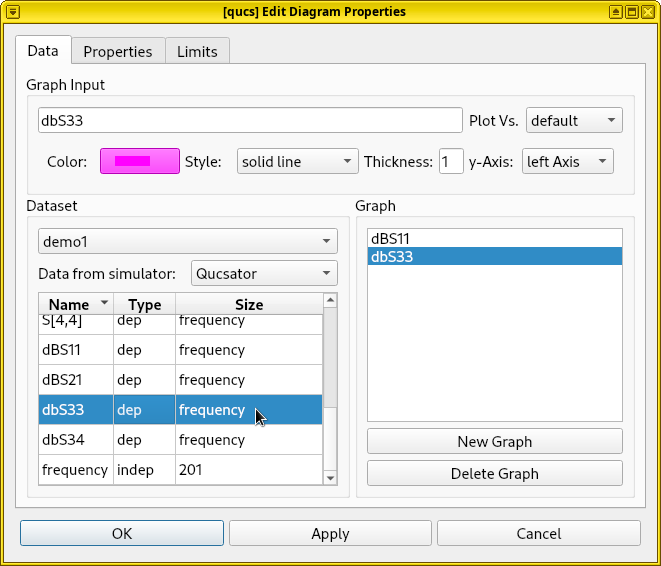
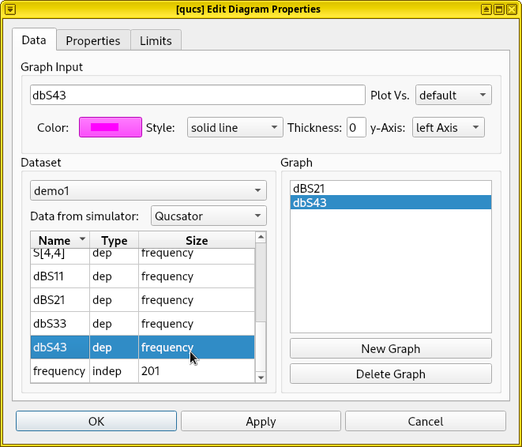
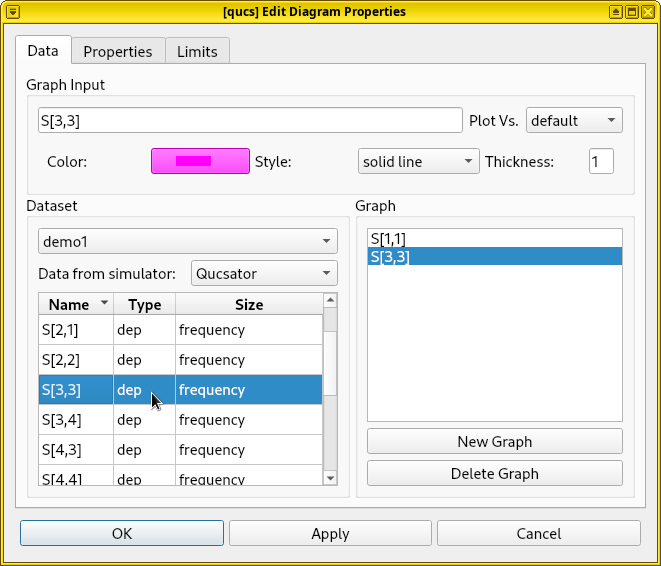

**Results.** By setting this Qucs-S simulation, we can compare the frequency
response of a parallel-plate waveguide against a microstrip transmission line.
From the simulation result, we find that their behaviors are significantly
different. Both transmission lines have a resonance at 1.5 GHz, but their
similarity ends here. At high frequencies, this parallel-plate waveguide has
extremely high losses, while the microstrip transmission line is lossless.

.. image:: images/qucs-microstrip-15.png
   :width: 60%

We will discuss the significance of this result at the end of this tutorial.
