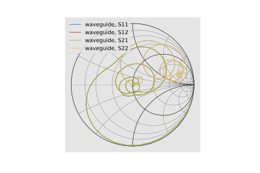
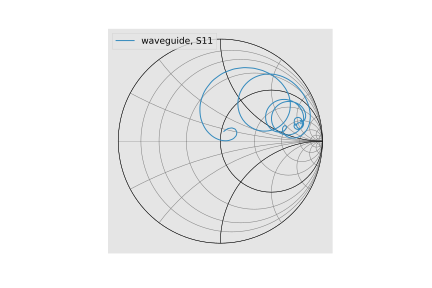
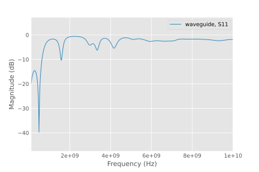
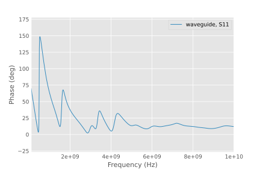
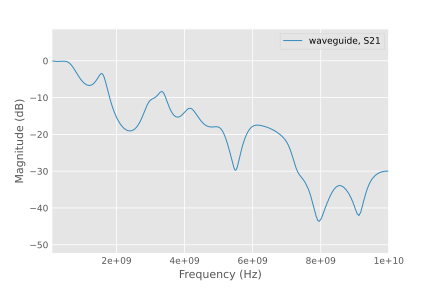
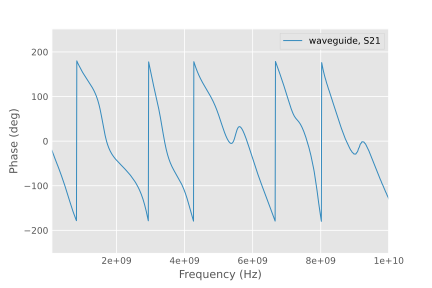
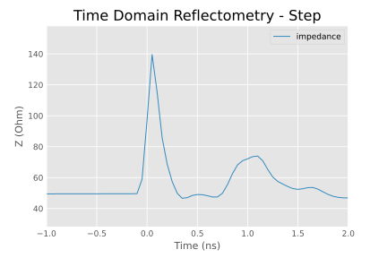
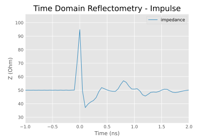

S-parameters Analysis via ``scikit-rf``
"""""""""""""""""""""""""""""""""""""""

The library ``scikit-rf`` is an open source Python package for RF/microwave
engineering, including a powerful set of features for plotting, circuit
analysis, calibration, reading and writing data.

Install and Import
'''''''''''''''''''
One can install it via ``pip3`` in your home directory (or another ``venv``
environment you prefer)::

    pip3 install scikit-rf

Once installed, import the library::

    import skrf

``scikit-rf`` comes with a matplotlib chart theme with a modern look-and-feel.
Before using the library to do anything, one may call `stylely()` to
globally apply this theme. This affects all matplotlib charts, so you may
want to borrow it in other unrelated projects::

    skrf.stylely()

Plot Smith Charts
''''''''''''''''''

The basic entity in ``scikit-rf`` is a ``skrf.Network``, representing an
n-port network defined by an S-parameter. This object can be constructed
directly via the path to a Touchstone file::

    network = skrf.Network(s2ppath)

Now let's plot the complex reflections coefficient :math:`S_{11}` on
the Smith chart, the most important chart ever invented in RF/microwave
engineering. This chart makes it easier to interpret the phase angle in
the reflection coefficient and impedance by visually showing whether the
the DUT is resistive, capacitive, or inductive. To do so in ``scikit-rf``,
use the `plot_s_smith()` method of the `Network` object::

    network.plot_s_smith()
    plt.show()

By default, all S-parameters are plotted.

But it makes little sense to plot non-reflection parameters, so we specify
two optional parameters ``m`` and ``n``. To plot :math:`S_{11}` only, use::

    network.plot_s_smith(m=0, n=0)
    plt.show()

As we can see from the chart, the input impedence of the DUT is inductive.
This is likely due to the mismatches of both the electrical impedance
and the physical geometry of the excitation and termination ports at the
abrupt transition from the port to the waveguide.

An alternative way to plot :math:`S_{11}` is to create a 1-port network
by extracting it from a multi-port network, using the ``s11`` attribute
(or ``s21``, ``s22``, etc). But note that doing this would create a new 1-port
network, so all charts will be labeled ``S11`` regardless of the parameter
plotted. Hence plotting a sliced network is not recommended::

    network.s11.plot_s_smith()
    plt.show()

Plot Magnitude-Phase Charts
''''''''''''''''''''''''''''''''

We can also plot other familiar charts via ``scikit-rf`` automatically, such
as the scalar :math:`S_{11}` plot in decibels and phase angles. This is
much faster than the manual method using only two lines of code for each chart::

    network.plot_s_db(m=0, n=0)
    plt.show()

    network.plot_s_deg(m=0, n=0)
    plt.show()

The data is identical to manual plotting, but without the need to do any
calculations. All is derived from S-parameters by scikit-rf automatically.

Likewise, to plot :math:`S_{21}` using the same method::

    network.plot_s_db(m=1, n=0)
    plt.show()

    network.plot_s_deg(m=1, n=0)
    plt.show()

Plot Impedance Chart
'''''''''''''''''''''

`scikit-rf` also provides several routines to plot Z-parameters charts, such
as the scalar impedance::

    network.plot_z_mag(m=0, n=0)
    plt.show()

.. image:: images/z11_mag_sim_skrf.svg
   :width: 49%

.. _skrf_tdr:

Time Domain Reflectometry
''''''''''''''''''''''''''

And now for something completely different: going from the frequency
domain back to the time domain. By applying an inverse Fourier transform
to the existing S-parameters (without needing to run new FDTD simulations),
``scikit-rf`` can directly calculate the DUT's equivalent transient
impulse and step impedance from :math:`S_{11}`. This enables capturing
impedance discontinuities that are difficult if not impossible to
identify using the Smith chart alone::

    # TDR requires the DC component to be physical
    network_dc = network.extrapolate_to_dc(kind='linear')

    plt.figure()
    plt.title("Time Domain Reflectometry - Step")
    network_dc.s11.plot_z_time_step(window='hamming', label="impedance")
    plt.xlim([-1, 2])  # look at the first two nanoseconds
    plt.show()

    plt.figure()
    plt.title("Time Domain Reflectometry - Impulse")
    network_dc.s11.plot_z_time_impulse(window='hamming', label="impedance")
    plt.xlim([-1, 2])  # look at the first two nanoseconds
    plt.show()

The calculated TDR plot with step excitation shows a strong reflection
at an instantaneous impedance of 140 Ω, followed by another reflection
of 70 Ω one nanoseconds later (the impulse excitation TDR plot is also
included here for completeness).

This clearly indicates both ports exhibit discontinuities due to
impedance and geometry mismatches, as the lumped port impedance
differs from the waveguide's characteristic impedance.

In transmission line characterization, one should address such
mismatches by improving the simulation setup via better port
transitions. However, in this simulation, the mismatches are
intentionally introduced to demonstrate openEMS's ability to
accurately model real-world effects.

.. seealso::
   The features introduced in this manual are only the tip of the
   iceberg, it's not possible to cover all of its aspects here. See
   the full manual [12]_ for usage. Here we mention three important
   use cases.

   **Calibration and de-embedding.** If a port mismatch is unavoidable,
   post-processing techniques commonly used in Vector Network Analyzers
   can be applied to openEMS simulations as well, such as the SOLT
   calibration algorithm, or the newer IEEE P370 de-embedding algorithm.
   This involves making additional measurements (simulations) with known
   loads or structures at the port, so that the port or the test fixture's
   influence can be solved and removed. See [15]_ [16]_.

   **Time-gating.** An alternative possibility is working in the time
   domain using the equivalent TDR responses. If we transform the
   measured S-parameters into a TDR plot, a *time gate* can be applied
   that focuses on the response of only the DUT without the early and
   late reflections by the ports. This gated waveform can then be transformed
   back to the frequency domain to "clean" our S-parameters. This is
   not a rigorous solution in comparison to applying proper calibration
   algorithms, but is a quick-and-dirty solution. See [17]_.

   **Passivity and causality.** For time-domain simulations using
   S-parameters, the measured data must satisfy two criteria. The
   DUT itself must not amplify the input signal, violating energy
   conservation (passivity). The DUT must also not generate an output
   signal before an input signal arrives, violating the arrow of time
   (causality). Unfortunately, apparent perpetual motion machines and
   time machines are often created when S-parameters from measurements
   or simulations contain artifacts and noise, resulting in unphysical
   time-domain responses. This necessitates data quality checks and
   post-processing if violations are found. See [18]_ [19]_ [20]_.
