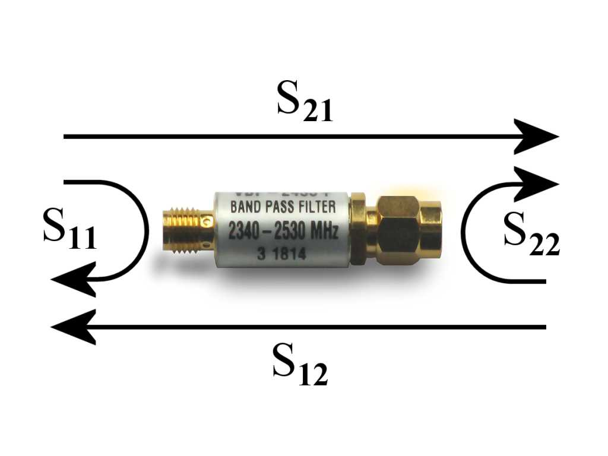
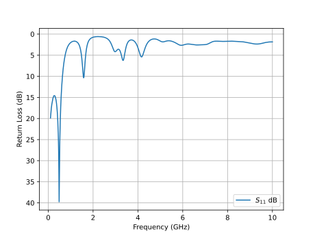
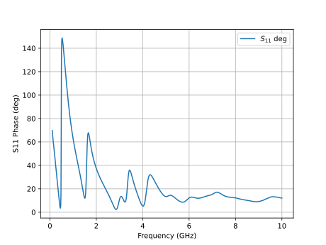
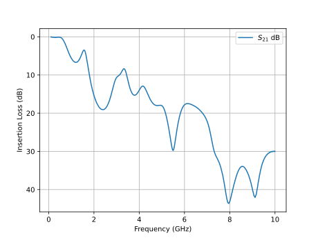
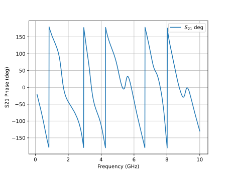
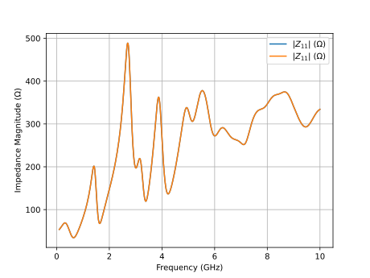
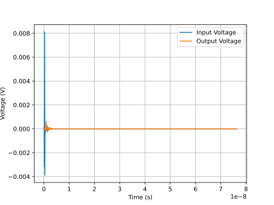
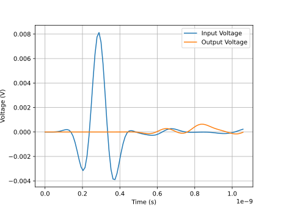

Calculate S-parameters
------------------------

Introduction to S-parameters
~~~~~~~~~~~~~~~~~~~~~~~~~~~~~

In radio and high-speed digital electronics engineering, the *S-parameters*
are the universal language to express the characteristics of a linear circuit,
allowing one to treat the circuit as a black box with several *ports*, defined
by their input-output relationships.

For a two-port measurement, the circuit is modeled by a 2x2 matrix with 4
complex numbers at each frequency of interest. These parameters can be interpreted
as the transmission and reflection of voltage waves in a transmission line.

.. table::
  :widths: 50 50
  :align: center

  +--------------------------------------+-----------------------------------------------------------------+
  | .. math::                            |                                                                 |
  |                                      |                                                                 |
  |   \large{                            |                                                                 |
  |   \begin{bmatrix}                    |                                                                 |
  |   b_1 \\ b_2 \end{bmatrix} =         |                                                                 |
  |   \begin{bmatrix} S_{11} & S_{12} \\ |     |s_param_filter|                                            |
  |   S_{21} & S_{22} \end{bmatrix}      |                                                                 |
  |   \begin{bmatrix} a_1 \\ a_2         |                                                                 |
  |   \end{bmatrix}                      |                                                                 |
  |   }                                  |                                                                 |
  |                                      |                                                                 |
  +--------------------------------------+-----------------------------------------------------------------+
  | S-parameters can be understood as the transmitted and reflected signals (voltage waves) at the         |
  |                                                                                                        |
  | port of a DUT. The DUT itself is seen as a black box, defined only by their input-output relationship  |
  |                                                                                                        |
  | Image by Charly Whisky, licensed under CC BY-SA 4.0.                                                   |
  +--------------------------------------------------------------------------------------------------------+

At Port 1, its total voltage can be seen as a superposition of two parts:
an incident voltage wave entering Port 1, and a reflected wave leaving from
Port 1. Their ratio :math:`V_\mathrm{ref} / V_\mathrm{inc}` is the parameter
:math:`S_{11}`. This parameter has several other names: the reflection
coefficient :math:`\Gamma = S_{11}`. When its magnitude is plotted on a log
scale, it's called the return loss :math:`-10 \cdot \log_{10}(|S_{11}|^2)`.

At Port 2, the voltage or power it receives can also be calculated as a
ratio of two quantities: an incident voltage wave entering Port 1, and a
transmitted voltage wave leaving from Port 2, called :math:`S_{21}`. This
parameter is also known as transmission coefficient  When its magnitude is
plotted on the log scale, it's called the insertion loss
:math:`-10 \cdot \log_{10}(|S_{21}|^2)`. This corresponds to the
attenuation of a cable or a filter.

Since a circuit may modify both the amplitude and the phase of a voltage
wave, all S-parameters are complex numbers.

In openEMS, after calling ``CalcPort()`` on a port object, its incident and reflected
voltages can be accessed via its ``uf_inc`` and ``uf_ref`` attributes, which are
``numpy`` lists with the same number of elements as ``freq_list`` (which we previously
passed to ``CalcPort()``).

Thus, by definition, one can calculate :math:`S_{11}` and :math:`S_{21}` as the
following::

    s11_list = port[0].uf_ref / port[0].uf_inc
    s21_list = port[1].uf_ref / port[0].uf_inc

.. hint::
  We utilize `numpy`'s broadcasting feature here. The quantities ``uf_ref`` and
  ``uf_inc`` are arrays, not scalars. Every element represents a single value at
  the a frequency point. But instead of looping over each element explicitly,
  we can work on all elements simultaneously::

      a = np.array([1, 2, 3])
      b = np.array([4, 5, 6])
      c = a + b  # [5, 7, 9]
      d = c * 2  # [10, 14, 18]

  This way, we can do element-wise arithmetic automatically on the whole
  ``numpy`` arrays. We will use this feature extensively throughout the
  rest of this tutorial.

Two S-parameters :math:`S_{12}` and :math:`S_{22}` are still missing here. The
correct way of doing so is restarting the simulation, but with port 2 as
the excitation port instead of port 1. This means that in the general case, we
must refactor our code to move the port creation and simulation logic into separate
functions.

But here, since our parallel-plate waveguide is symmetric and reciprocal, it
doesn't matter if we excite the left side and terminate the right side, or vice
versa, so we can assume :math:`S_{12} = S_{21}` and :math:`S_{11} = S_{22}`::

    # hack: assume symmetry and reciprocity
    # This only correct for passive linear reciprocal circuit!
    s22_list = s11_list
    s12_list = s21_list

Plot S-parameters via matplotlib
~~~~~~~~~~~~~~~~~~~~~~~~~~~~~~~~~~

After going through the long exercise, it's now a good time to take a
quick look at the S-parameters we've obtained, using `matplotlib`::

    from matplotlib import pyplot as plt

Here, we're interested in two types of graphs that all RF/microwave
engineers care about (Smith charts and more sophisticated analysis
will be introduced later, using third-party software).

The scalar return loss (magnitude of :math:`S_{11}` in decibels) on
a line chart shows how much power is reflected by the DUT back to
the input port at each frequency. A high loss like 20 dB implies no
reflection, indicating a good impedance match or a resonance frequency::

    s11_db_list = -10 * np.log10(np.abs(s11_list) ** 2)

    plt.figure()
    plt.plot(freq_list / 1e9, s11_db_list, label='$S_{11}$ dB')
    plt.grid()
    plt.legend()
    plt.xlabel('Frequency (GHz)')
    plt.ylabel('Return Loss (dB)')

    # By convention, return loss values increase downward on the Y axis.
    # This is consistent with the plot shapes on spectrum analyzers, and
    # perhaps explains why the customary "wrong" sign convention is used.
    plt.gca().invert_yaxis()
    plt.show()

Since :math:`S_{11}` is a vector (complex number), we can also plot its
phase angle for completeness. But note that the phase is difficult to
interpret, so the Smith chart (covered later) is a better tool for this
job::

    s11_deg_list = np.angle(s11_list, deg=True)

    plt.figure()
    plt.plot(freq_list / 1e9, s11_deg_list, label='$S_{11}$ deg')
    plt.grid()
    plt.legend()
    plt.xlabel('Frequency (GHz)')
    plt.ylabel('S11 Phase (deg)')

    plt.show()

As we can see from the plot, there's a sharp 40 dB notch at 500 MHz,
indicating almost all power is delivered into the load with almost no
reflection. This is usually the sign that the DUT is resonating. Above
2 GHz, the reflection becomes extremely strong, as the return loss is
only between 0 dB to 6 dB, suggesting a serious physical discontinuity
or electrical impedance mismatch.

The scalar insertion loss (magnitude of :math:`S_{21}` in decibels)
on a line chart shows how much power is transmitted into the second port,
which shows the attenuation of signals at each frequency::

    s21_db_list = -10 * np.log10(np.abs(s21_list) ** 2)

    plt.figure()
    plt.plot(freq_list / 1e9, s21_db_list, label='$S_{21}$ dB')
    plt.grid()
    plt.legend()
    plt.xlabel('Frequency (GHz)')
    plt.ylabel('Insertion Loss (dB)')

    # By convention, insertion loss values increase downward on the Y axis.
    # This is consistent with the plot shapes on spectrum analyzers, and
    # perhaps explains why the customary "wrong" sign convention is used.
    plt.gca().invert_yaxis()
    plt.show()

    s21_deg_list = np.angle(s21_list, deg=True)

    plt.figure()
    plt.plot(freq_list / 1e9, s21_deg_list, label='$S_{21}$ deg')
    plt.grid()
    plt.legend()
    plt.xlabel('Frequency (GHz)')
    plt.ylabel('S21 Phase (deg)')

    plt.show()

From the simulation data, we can see that this parallel-plate waveguide's
insertion loss is anomalously high, around 20 dB at 2 GHz.
This behavior contradicts expectations, as both lumped capacitors and
transmission lines are typically lossless.
Unusual results like
this one may indicate a modeling mistake that either causes unphysical
behavior or shows theoretically-possible but unrealistic physical effects.
Alternatively, it may reveal actual physics rarely discussed in circuit
textbooks, so it can be "new" to us. We will discuss this issue later.

On the other hand, the phase angle runs between -180° and 180°. This is
the expected behavior consistent with real-world measurements.

.. note::
   **Loss or Gain?**
   There's a technicality to nitpick. The term "loss" and "gain" are often
   used interchangeably in the RF/microwave industry. One may say a device
   has a return loss of -20 dB, but strictly speaking a negative loss implies
   a gain. This convention is technically incorrect but usually tolerated and
   widely used. On the other hand, its critics insist on inverting the sign
   (by multiplying all values by a factor of -1) when one is speaking of "loss".
   Otherwise, the proper term to speak of is "reflection coefficient", not
   "return loss".

   This issue can sometimes be quite controversial. For example, *IEEE Antennas
   and Propagation Magazine* started rejecting the former convention to promote
   rigor as of 2009. While the author of this tutorial has no particular opinion,
   to satisfy the potential nitpickers while following the tradition, here we use
   a compromise. Plots are labeled as "Return loss" and use the positive sign
   convention, but also with the Y axis inverted, so that resonances appear
   as familiar valleys.

   For more information, see [1]_ [2]_.

Plot Z-parameters (Impedances) via matplotlib
~~~~~~~~~~~~~~~~~~~~~~~~~~~~~~~~~~~~~~~~~~~~~~

It's straightforward to transform S-parameters to Z-parameters (impedances) using
well-known formulas, so saving a redundant set of Z-parameters is unnecessary.
If :math:`Z_0` is the port impedance, :math:`S_{11}` (also known as the
reflection coefficient :math:`\Gamma`) is related to the load impedance
seen at the port via:

.. math::

   Z = Z_0 \frac{1 + \Gamma }{1 - \Gamma}

Nevertheless, it's possible to directly calculate the impedance seen by
a port via the total voltage ``uf_tot`` and total current ``if_tot`` attributes
as well.
The following example plots the impedance seen by port 1. Like S-parameters,
all impedances are also complex numbers, so we are only looking at their
magnitude (absolute value) here::

    # direct impedance calculation
    z11_list = np.abs(port[0].uf_tot / port[0].if_tot)

    # derive impedance from S11
    z11_from_s11_list = np.abs(z0 * (1 + s11_list) / (1 - s11_list))

    plt.figure()
    plt.plot(freq_list / 1e9, z11_list, label='$|Z_{11}|$ (Ω)')
    plt.plot(freq_list / 1e9, z11_from_s11_list, label='$|Z_{11}|$ (Ω)')
    plt.grid()
    plt.legend()
    plt.xlabel('Frequency (GHz)')
    plt.ylabel('Impedance Magnitude (Ω)')

    plt.show()

We find that the impedances derived from :math:`S_{11}` and from direct calculations
are indistinguishable.

.. important::
   We repeat the warning that was already given in the :ref:`port`
   section. Beware that the impedance :math:`Z_{11}` is not the actual impedance
   of the DUT, such as this parallel-plate waveguide. It's only the total impedance
   seen by the port, including the contribution of both the DUT and port
   imperfections, which can lead to frequency-dependent artifacts. The DUT impedance
   can't be read from :math:`Z_{11}` without removing measurement artifacts. This
   can be achieved by eliminating port discontinuities or separating the contributions
   from the ports via de-embedding, calibration, or time gating. These are
   advanced topics not discussed here.

   Futhermore, even after de-embedding, it's not meaningful to associate this DUT's
   impedance with a pure capacitance, since this DUT is not a lumped capacitor but
   a parallel-plate waveguide. Only the RLCG transmission line is be the correct
   model here.

Code Checkpoint: Eliminate Repetitions in ``matplotlib``
~~~~~~~~~~~~~~~~~~~~~~~~~~~~~~~~~~~~~~~~~~~~~~~~~~~~~~~~~~~~~

The matplotlib examples shown above are meant to be instructional. In
an actual program, we should avoid unproductive repetitions when we see
them. We can write a separate plotting function to avoid repeating the
same steps::

    def plot_param(x_list, y_list, linelabel, xlabel, ylabel, invert_y=True):
        plt.figure()
        plt.plot(x_list, y_list, label=linelabel)
        plt.grid()
        plt.legend()
        plt.xlabel(xlabel)
        plt.ylabel(ylabel)

        # By convention, loss values increase downward on the Y axis.
        # This is consistent with the plot shapes on spectrum analyzers, and
        # perhaps explains why the customary "wrong" sign convention is used.
        if invert_y:
            plt.gca().invert_yaxis()

        plt.show()

    def postproc(port):
        """
        Process the data generated by a complete simulation. Only knowledge of ports
        are necessary. This function is agnostic about the structure and simulator
        parameters.
        """
        for p in port:
            p.CalcPort(simdir, freq_list, ref_impedance=z0)

        s11_list = port[0].uf_ref / port[0].uf_inc
        s21_list = port[1].uf_ref / port[0].uf_inc

        # hack: assume symmetry and reciprocity
        # This only correct for passive linear reciprocal circuit!
        s22_list = s11_list
        s12_list = s21_list

        s11_db_list = -10 * np.log10(np.abs(s11_list) ** 2)
        s21_db_list = -10 * np.log10(np.abs(s21_list) ** 2)
        plot_param(freq_list / 1e9, s11_db_list, '$S_{11}$ dB', 'Frequency (GHz)', 'Return Loss (dB)')
        plot_param(freq_list / 1e9, s21_db_list, '$S_{21}$ dB', 'Frequency (GHz)', 'Insertion Loss (dB)')

        s11_deg_list = np.angle(s11_list, deg=True)
        s21_deg_list = np.angle(s21_list, deg=True)
        plot_param(freq_list / 1e9, s11_deg_list, '$S_{11}$ deg', 'Frequency (GHz)', 'S11 Phase')
        plot_param(freq_list / 1e9, s21_deg_list, '$S_{21}$ deg', 'Frequency (GHz)', 'S21 Phase')

        # direct impedance calculation
        z11_list = np.abs(port[0].uf_tot / port[0].if_tot)
        plot_param(freq_list / 1e9, z11_list, '$|Z_{11}|$ (Ω)', 'Frequency (GHz)', 'Impedance Magnitude (Ω)', invert_y=False)

Plot Time-Domain Waveforms via matplotlib
~~~~~~~~~~~~~~~~~~~~~~~~~~~~~~~~~~~~~~~~~~

FDTD is fundamentally a time-domain field solver. In some cases it's
desirable to create custom excitations and observe transient responses
directly. For example, it allows one to truncate a simulation early
without waiting for convergence. It may help improving data quality
by preserving the DC term, or by avoiding violations of passivity and
causality in S-parameters due to numerical artifacts. Both may be
problematic if the frequency-domain data is used in transient simulations.

To obtain the time-domain waveforms at a port, we can use these port
attributes: ``u_data.ut_tot`` (total voltage), ``u_data.ui_time[0]`` (time
of voltage samples), ``i_data.it_tot`` (total current), ``i_data.ui_time[0]``
(time of current samples).

For the first try, let's plot the voltages at port 1 and port 2::

    plt.figure()
    plt.plot(port[0].u_data.ui_time[0], port[0].ut_tot, label="Input Voltage")
    plt.plot(port[1].u_data.ui_time[0], port[1].ut_tot, label="Output Voltage")
    plt.grid()
    plt.legend()
    plt.xlabel('Time (s)')
    plt.ylabel('Voltage (V)')
    plt.show()

The excitation signal is a sinusoid at the center frequency, with its amplitude
modulated by a Gaussian function. This is difficult to make sense of, since the
Gaussian function decays rapidly, but the simulator continues running until the
total energy has decayed below 60 dB. As a result, the waveform is a spike followed
by a flatline near 0. The tail of the waveform is almost invisible, because its
amplitude is many orders of magnitude smaller than the leading edge.

Let's try again, focusing only on the first 100 samples to improve
clarity::

    plt.figure()
    plt.plot(port[0].u_data.ui_time[0][0:100], port[0].ut_tot[0:100], label="Input Voltage")
    plt.plot(port[1].u_data.ui_time[0][0:100], port[1].ut_tot[0:100], label="Output Voltage")
    plt.grid()
    plt.legend()
    plt.xlabel('Time (s)')
    plt.ylabel('Voltage (V)')
    plt.show()

This is much better. The Gaussian modulation of the input signal is
evident. There's also a noticeable time delay before it reaches
the output, with an attenuation of one or two orders of magnitude. Both
are expected.

Time-domain usage of openEMS is most useful for custom excitation signals.
For example, one use case is to study the Time-Domain Transmission and
Time-Domain Reflection (TDT/TDR) characteristics of the DUT directly in the
time domain, which is beyond the scope of this tutorial. Hence, this tutorial
advocates relying on mature frequency-domain analysis tools based on
S-parameters (which can also be used in time-domain transient simulations
as well), as FDTD typically uses wideband Gaussian excitation signals that
are difficult to interpret in the time domain anyway.

.. hint::

   The raw time-domain voltages and currents at all ports are also available
   in the simulation directory as ``port_ut_1``, ``port_ut_2``, ``port_it_1``
   and ``port_it_2``, which can be analyzed by external programs.

Export S-parameters to Touchstone
~~~~~~~~~~~~~~~~~~~~~~~~~~~~~~~~~

At this point, we have nearly reached the limit of the built-in
post-processing capabilities of openEMS.
To bring our analysis further, it's now necessary to use third-party
software. Therefore we must save our S-parameters to an external file
to be used in other tools. In the RF/microwave industry, S-parameters
are encoded in a de facto standard file format called a *Touchstone*
file.

A 2-port Touchstone file has the file extension ``.s2p``, the first line
is its metadata.

The hash (``#``) symbol denotes a metadata line, not a comment line.
This line is mandatory (the real comment line begins with ``!``).
Letter ``S`` means the file contains S-parameters, keyword
``RI`` means the complex S-parameters are in the real-imaginary format,
and the final ``R 50`` means the port impedance for this measurement
is 50 Ω::

    # Hz S RI R 50

``.s2p`` file
""""""""""""""""

In an ``.s2p`` file, each additional line defines the S-parameters at a new frequency
point, with the
order of ``frequency``, ``s11_real``, ``s11_imag``, ``s21_real``, ``s21_imag``, ``s12_real``,
``s12_imag``, ``s22_real``, ``s22_imag``.  All variables are floating-point numbers.

Thus we can write the simulation result as a Touchstone file using the following
code::

    # determine a file name
    s2pname = filepath.with_suffix(".s2p").name

    # concat two paths
    s2ppath = simdir / s2pname

    # write 2-port S-parameters
    with open(s2ppath, "w") as touchstone:
        touchstone.write("# Hz S RI R %f\n" % z0)  # Touchstone metadata, not comment!

        for idx, freq in enumerate(freq_list):
            s11 = s11_list[idx]
            s21 = s21_list[idx]
            s12 = s12_list[idx]
            s22 = s22_list[idx]
            entry = (freq, s11.real, s11.imag, s21.real, s21.imag, s12.real, s12.imag, s22.real, s22.imag)
            touchstone.write("%f %f %f %f %f %f %f %f %f\n" % entry)

``.s1p`` file
""""""""""""""""

The ``.s2p`` file already contains the S-parameter :math:`S_{11}`, so
there's no need to create a separate 1-port Touchstone file. It's only
used for 1-port measurement data. For completeness, the Touchstone file
for 1-port measurements has the
suffix ``.s1p``. Its format is similar: at each frequency point, one
writes a new line with parameter order of ``frequency``, ``s11_real``,
``s11_imag``::

    # determine a file name
    s1pname = filepath.with_suffix(".s1p").name

    # concat two paths
    s1ppath = simdir / s1pname

    # write 1-port S-parameters
    with open(s1ppath, "w") as touchstone:
        touchstone.write("# Hz S RI R %f\n" % z0)  # Touchstone metadata, not comment!

        for idx, freq in enumerate(freq_list):
            s11 = s11_list[idx]
            entry = (freq, s11.real, s11.imag)
            touchstone.write("%f %f %f\n" % entry)

``.snp`` file
"""""""""""""""

Finally, beware that for 3-port, 4-port, or more ports, the parameters order is
different. The website Microwaves101 contains useful information here. [3]_
