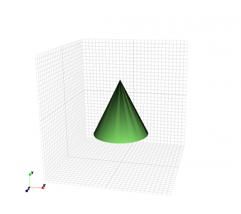
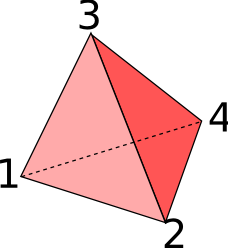
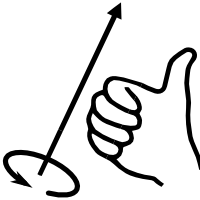
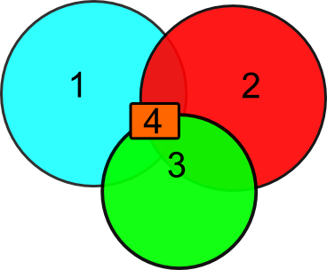
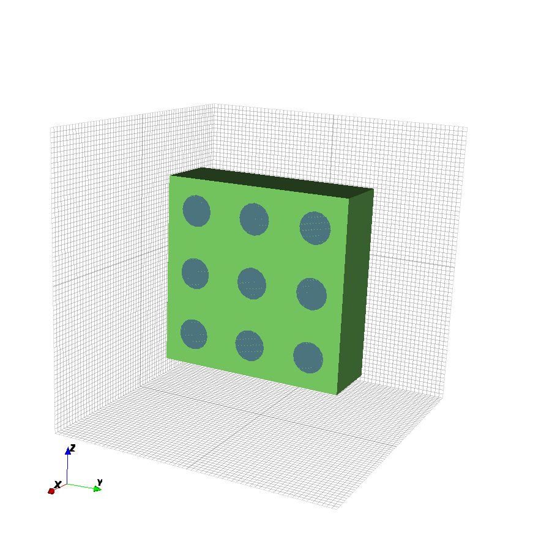
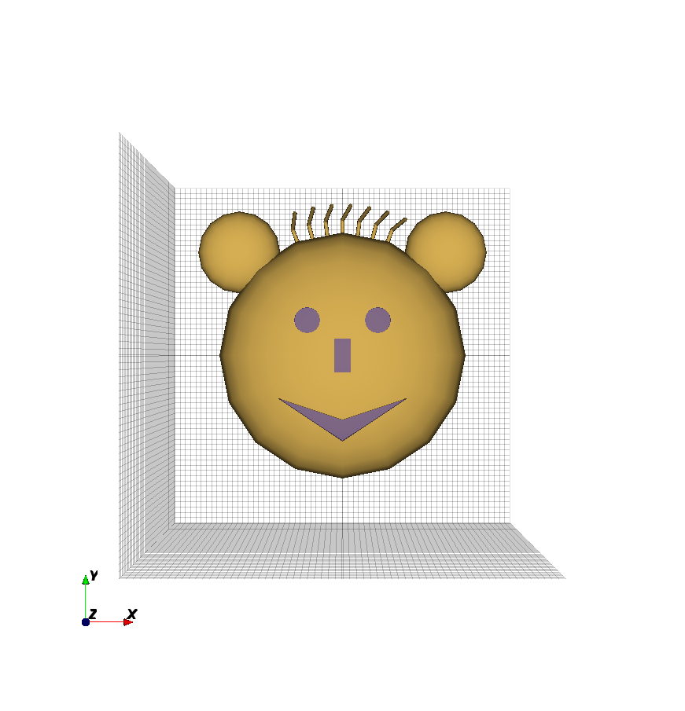
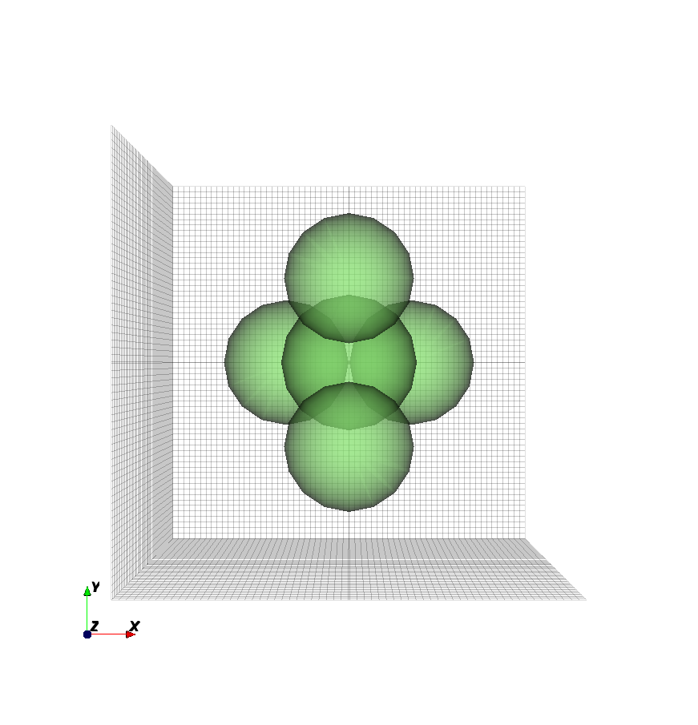

.. _concept_primitives:

Primitives
==============

*Primitives* are the building blocks to create 1D, 2D, 3D shapes, so that one
can create simple object such as a ``Curve``, a ``Polygon``, a ``Box``, or a
``Sphere``. More complex structures can be created by combining various
primitives. For example, a metal sheet with cylindrical holes can be achieved
by combining a metal box with several air cylinders.

Each shape created by a *Primitive* function is associated with a *Property*,
representing its material or computational properties independent of its geometry.
For example, by associating the same ``Box`` primitive to different properties,
the same box can be a metal box, a plastic box, a glass box, or a virtual
box for injecting or logging the electromagnetic field.

Relationship to Properties
---------------------------

A *primitive* is a geometrical shape, which is always derived from
a physical or non-physical material known as a *property*.
Together, they form physical and non-physical objects in the CSXCAD model.
In principle, any *properties* can derive any *primitives*. For example,
an excitation source is added to the model by creating a property
via :func:`AddExcitation`, and deriving a Box primitive from it via
:func:`AddBox`.

.. important::

   To create a meaningful object, remember to always create at least one
   :ref:`property <concept_properties>` (such as a Metal) before creating
   any primitives.

Shapes
-------

Box
""""

The Box is the most simple primitive in CSXCAD. It is as well the most used primitive
since it usually matches the given Cartesian or cylindrical FDTD mesh. Furthermore this
primitive is the only one which shape depends on the chosen coordinate system it is defined
with.

.. tabs::

   .. tab:: Octave

      :func:`AddBox` function definition::

          CSX = AddBox(CSX, 'propName', 1, start, stop, varargin);

      * ``CSX``: The original CSX structure.
      * ``propName``: Name of the assigned property.
      * ``prio``: Priority of the primitive, see :ref:`concept_priority`.
      * ``start``: ``[x y z]`` First (start) coordinate.
      * ``stop``: ``[x y z]`` Second (stop) coordinate.
      * ``varargin``: A key/value list of primitives variable arguments.

        * ``CoordSystem``: See :ref:`concept_coordinate_systems`.
        * ``Transform, {array}``: See :ref:`concept_transformation`.

   .. tab:: Python

      :meth:`~CSXCAD.CSProperties.CSProperties.AddBox` method
      definition::

          box = material.AddBox(CSX, start, stop, **kw);

      * ``box``: An instance of :class:`~CSXCAD.CSPrimitives.CSPrimBox`.
      * ``material``: An instance of :class:`~CSXCAD.CSProperties.CSPropMaterial`.
      * ``start``: ``[x y z]`` First (start) coordinate.
      * ``stop``: ``[x y z]`` Second (stop) coordinate.
      * ``**kw``: Optional keyword arguments:

        * ``priority``: priority of the primitive, see :ref:`concept_priority`.

Examples
''''''''

1. Create a Cartesian box from ``x=[-100 to +100]``, ``y=[-50 to 0]``
   and ``z=[-50 to 10]``:

   .. tabs::

      .. code-tab:: octave

         % create properties AddConductingSheet(), AddMaterial(), etc.
         csx = AddMetal(csx, 'metal'); % create PEC with propName 'metal'
         csx = AddBox(csx, 'metal', 1, [-100 -50 -50], [100 0 10]);

      .. code-tab:: python

         # create properties via csx.AddConductingSheet(), csx.AddMaterial(), etc.
         material = csx.AddMetal('metal')
         material.AddBox([-100, -50, -50], [100, 0, 10])

   .. figure:: images/box.png
      :class: with-border
      :width: 50%

      Certesian Box example.

2. In case of a cylindrical system, create a cylindrical box from
   ``r=[50 to 70]``, ``alpha=[pi/2 to 3*pi/2]`` and ``z=[-50 to 10]``:

   .. tabs::

      .. code-tab:: octave

         % create properties AddConductingSheet(), AddMaterial(), etc.
         csx = AddMetal(csx, 'metal'); % create PEC with propName 'metal'
         csx = AddBox(csx, 'metal', 1, [50 pi/2 -50], [70 3*pi/2 10]);

      .. code-tab:: python

         from math import pi

         # create properties via csx.AddConductingSheet(), csx.AddMaterial(), etc.
         material = csx.AddMetal('metal')
         material.AddBox([50, pi / 2, -50], [70, 3 * pi/ 2, 10])

   .. note::
      Although :func:`AddCylindricalShell` may appear to be the appropriate function
      to define a cylinder when using a cylindrical coordinate system, :func:`AddBox`
      is actually better suited because the structure will be meshed correctly. If
      :func:`AddCylindricalShell` is used, it is possible that the meshed cylinder
      will not be meshed correctly, as shown in the example below.

3. In case of a Cartesian FDTD setup, define a cylindrically shaped box from
   ``r=[50 to 70]``, ``alpha=[pi/2 to 3*pi/2]`` and ``z=[-50 to 10]``:

   .. tabs::

      .. code-tab:: octave

         % create properties AddConductingSheet(), AddMaterial(), etc.
         csx = AddMetal(csx, 'metal'); % create PEC with propName 'metal'

         % use 'CoordSystem' to enable Cylindrical coordinates even in a
         % Cartesian mesh.
         csx = AddBox(csx, 'metal', 1, [50 pi/2 -50], [70 3*pi/2 10], 'CoordSystem', 1);

      .. code-tab:: python

         from math import pi

         # create properties via csx.AddConductingSheet(), csx.AddMaterial(), etc.
         material = csx.AddMetal('metal')
         box = material.AddBox([50, pi / 2, -50], [70, 3 * pi / 2, 10])

         # enable Cylindrical coordinates even in a Cartesian mesh
         box.SetCoordinateSystem(1)

   .. |cyl-box| image:: images/cyl-box.png
   .. |cyl-mesh| image:: images/meshing-cylinders.png

   .. table::
     :widths: 50 50
     :align: center

     +--------------------------------------+-----------------------------------------------------------------+
     |                                      |                                                                 |
     |  |cyl-box|                           |     |cyl-mesh|                                                  |
     |                                      |                                                                 |
     +--------------------------------------+-----------------------------------------------------------------+
     | Left: Cylindrical Box example.                                                                         |
     |                                                                                                        |
     | Right: Comparison of cylinders defined via :func:`AddCylindricalShell` (outer) and :func:`AddBox`      |
     | (inner)                                                                                                |
     +--------------------------------------------------------------------------------------------------------+

Sphere
"""""""

The sphere primitive is defined by its central point and radius.

.. tabs::

   .. tab:: Octave

      :func:`AddSphere` function definition::

          CSX = AddSphere(CSX, propName, prio, center, rad, varargin)

      * ``CSX``: The original CSX structure.
      * ``propName``: Name of the assigned property.
      * ``prio``: Priority of the primitive, see :ref:`concept_priority`.
      * ``center``: Coordinate of the center point of the sphere.
      * ``rad``: Radius of the sphere.
      * ``varargin``: A key/value list of primitives variable arguments.

        * ``CoordSystem``: See :ref:`concept_coordinate_systems`.
        * ``Transform, {array}``: See :ref:`concept_transformation`.

   .. tab:: Python

      :meth:`~CSXCAD.CSProperties.CSProperties.AddSphere` method
      definition::

          sphere = material.AddSphere(center, radius, **kw)

      * ``box``: An instance of :class:`~CSXCAD.CSPrimitives.CSPrimSphere`.
      * ``material``: An instance of :class:`~CSXCAD.CSProperties.CSPropMaterial`.
      * ``center``: Coordinate of the center point of the sphere.
      * ``rad``: Radius of the sphere.
      * ``**kw``: Optional keyword arguments:

        * ``priority``: priority of the primitive, see :ref:`concept_priority`.

Example
'''''''''

1. Create a sphere at ``(0, 0, 0)`` with radius ``200``:

   .. tabs::

      .. code-tab:: octave

         % create properties AddConductingSheet(), AddMaterial(), etc.
         csx = AddMetal(csx, 'metal'); % create PEC with propName 'metal'
         csx = AddSphere(csx, 'material', 1, [0 0 0], 200);

      .. code-tab:: python

         # create properties via csx.AddConductingSheet(), csx.AddMaterial(), etc.
         material = csx.AddMetal('metal')
         material.AddSphere([0, 0, 0], 200)

   .. figure:: images/sphere.png
      :class: with-border
      :width: 50%

      Sphere example.

Spherical Shell
"""""""""""""""

The spherical shell primitive is defined by its central point, radius
and shell thickness.

.. tabs::

   .. tab:: Octave

      :func:`AddSphericalShell` function definition::

          CSX = AddSphericalShell(CSX, propName, prio, center, rad, shell_width, varargin)

      * ``CSX``: The original CSX structure.
      * ``propName``: Name of the assigned property.
      * ``prio``: Priority of the primitive, see :ref:`concept_priority`.
      * ``center``: Coordinate of the center point of the sphere.
      * ``rad``: Radius of the spherical shell.
      * ``shell_width``: Thickness of the shell.

        * The inner radius of this shell is ``rad - shell_width / 2``.
        * The outer radius of this shell is ``rad + shell_width / 2``.

      * ``varargin``: A key/value list of primitives variable arguments

        * ``CoordSystem``: See :ref:`concept_coordinate_systems`.
        * ``Transform, {array}``: See :ref:`concept_transformation`.

   .. tab:: Python

      :meth:`~CSXCAD.CSProperties.CSProperties.AddSphericalShell` method
      definition::

          spherical_shell = material.AddSphericalShell(center, radius, shell_width, **kw)

      * ``spherical_shell``: An instance of :class:`~CSXCAD.CSPrimitives.CSPrimSphericalShell`.
      * ``material``: An instance of :class:`~CSXCAD.CSProperties.CSPropMaterial`.
      * ``center``: Coordinate of the center point of the sphere.
      * ``rad``: Radius of the sphere.
      * ``shell_width``: Thickness of the shell.

        * The inner radius of this shell is ``rad - shell_width / 2``.
        * The outer radius of this shell is ``rad + shell_width / 2``.

      * ``**kw``: Optional keyword arguments:

        * ``priority``: priority of the primitive, see :ref:`concept_priority`.

Example
'''''''''

1. Create a hollow metal sphere at ``(0, 0, 0)`` with radius ``50`` and
   thickness ``10``:

   .. tabs::

      .. code-tab:: octave

         % create properties AddConductingSheet(), AddMaterial(), etc.
         csx = AddMetal(csx, 'metal'); % create PEC with propName 'metal'
         csx = AddSphericalShell(csx, 'metal', 10, [0 0 0], 50, 10);

      .. code-tab:: python

         # create properties via csx.AddConductingSheet(), csx.AddMaterial(), etc.
         material = csx.AddMetal('metal')
         material.AddSphericalShell([0, 0, 0], 50, 10)

   .. figure:: images/sphere.png
      :class: with-border
      :width: 50%

      Spherical shell example.

Cylinder
"""""""""

A cylindrical primitive is defined by its midpoints of the first and last
faces, and the radius of the cylinder. The axis of the cylinder will be
along the start - stop points with the two cylinder faces being perpendicular
to this axis.

.. note::

   If the mesh already uses the Cylindrical coordinate system, use ``AddBox()``
   instead.

.. tabs::

   .. tab:: Octave

      :func:`AddCylinder` function definition::

          CSX = AddCylinder(CSX, propName, prio, start, stop, rad, varargin)

      * ``CSX``: The original CSX structure
      * ``propName``: Name of the assigned material
      * ``prio``: Priority of the primitive, see :ref:`concept_priority`.
      * ``start``: ``[x y z]`` start point of the cylinder (midpoint of the first cylinder face).
      * ``stop``: ``[x y z]`` stop point of the cylinder (midpoint of the second cylinder face).
      * ``rad``: Radius of the cylinder.
      * ``varargin``: A key/value list of primitives variable arguments.

        * ``CoordSystem``: See :ref:`concept_coordinate_systems`.
        * ``Transform, {array}``: See :ref:`concept_transformation`.

   .. tab:: Python
      :meth:`~CSXCAD.CSProperties.CSProperties.AddCylinder` method
      definition::

          cylinder = material.AddCylinder(start, stop, radius, **kw)

      * ``cylinder``: An instance of :class:`~CSXCAD.CSPrimitives.CSPrimCylinder`.
      * ``material``: An instance of :class:`~CSXCAD.CSProperties.CSPropMaterial`.
      * ``start``: ``[x y z]`` start point of the cylinder (midpoint of the first cylinder face).
      * ``stop``: ``[x y z]`` stop point of the cylinder (midpoint of the second cylinder face).
      * ``radius``: Radius of the cylinder.
      * ``**kw``: Optional keyword arguments:

        * ``priority``: priority of the primitive, see :ref:`concept_priority`.

Example
''''''''

1. Create a metal cylinder from ``(0, 0, -300)`` to ``(0, 200, 300)``
   with radius ``300``:

   .. tabs::

      .. code-tab:: octave

         % create properties AddConductingSheet(), AddMaterial(), etc.
         csx = AddMetal(csx, 'metal'); % create PEC with propName 'metal'
         csx = AddCylinder(csx, 'metal', 1, [0 0 -300], [0 200 300], 300);

      .. code-tab:: python

         # create properties via csx.AddConductingSheet(), csx.AddMaterial(), etc.
         material = csx.AddMetal('metal')
         material.AddCylinder([0, 0, -300], [0, 200, 300], 300)

   .. figure:: images/cylinder.png
      :class: with-border
      :width: 50%

      Cylinder example.

Cylindrical Shell
""""""""""""""""""

A cylindrical shell primitive is defined by its midpoints of the first and last
faces, the radius of the cylinder, and shell thickness.

.. note::

   If the mesh already uses the Cylindrical coordinate system, use ``AddBox()``
   instead.

.. tabs::

   .. tab:: Octave

      :func:`AddCylindricalShell` function definition::

          CSX = AddCylindricalShell(CSX, propName, prio, start, stop, rad, shell_width, varargin)

      * ``CSX``: default first argument, containing the CSXCAD data structure.
      * ``propName``: name of the (previously defined) property (e.g. a metal or material).
      * ``start``, ``stop``: ``[x y z]`` coordinates of the start and end points of the
        cylinder central axis.
      * ``rad``: radius of the cylinder.
      * ``shell_width``: width of the cylinder shell.

        * The inner radius of this shell is ``rad - shell_width / 2``.
        * The outer radius of this shell is ``rad + shell_width / 2``.

      * ``varargin``: a key/value list of primitives variable arguments.

        * ``CoordSystem``: See :ref:`concept_coordinate_systems`.
        * ``Transform, {array}``: See :ref:`concept_transformation`.

   .. tab:: Python

      :meth:`~CSXCAD.CSProperties.CSProperties.AddCylindricalShell` method
      definition::

          cylinder_shell = material.AddCylindricalShell(start, stop, radius, shell_width, **kw)

      * ``cylinder_shell``: An instance of :class:`~CSXCAD.CSPrimitives.CSPrimCylindricalShell`.
      * ``material``: An instance of :class:`~CSXCAD.CSProperties.CSPropMaterial`.
      * ``start``: ``[x y z]`` start point of the cylinder (midpoint of the first cylinder face).
      * ``stop``: ``[x y z]`` stop point of the cylinder (midpoint of the second cylinder face).
      * ``radius``: Radius of the cylinder.
      * ``shell_width``: width of the cylinder shell.

        * The inner radius of this shell is ``rad - shell_width / 2``.
        * The outer radius of this shell is ``rad + shell_width / 2``.

      * ``**kw``: Optional keyword arguments:

        * ``priority``: priority of the primitive, see :ref:`concept_priority`.

Example
''''''''

1. Create a cylindrical shell with radius 30 drawing unit and shell thickness of 5
   drawing unit, made of plexiglass:

   .. tabs::

      .. code-tab:: octave

         % create properties AddConductingSheet(), AddMaterial(), etc.
         csx = AddMaterial(csx, 'plexiglass');
         csx = SetMaterialProperty(csx, 'plexiglass', 'Epsilon', 2.22);
         start = [0 0 -40];
         stop  = [0 0  40];
         csx = AddCylindricalShell(csx, 'plexiglass', 5, start, stop, 30, 5);

      .. code-tab:: python

         # create properties via csx.AddConductingSheet(), csx.AddMaterial(), etc.
         plexiglass = csx.AddMaterial('plexiglass', epsilon=2.22)
         start = [0, 0, -40]
         stop  = [0, 0,  40]
         plexiglass.AddCylindricalShell(start, stop, 30, 5)

   .. figure:: images/cylindrical-shell.png
      :class: with-border
      :width: 50%

      Cylindrical shell example.

Curve
"""""

A 1D curve is defined by its coordinate arrays.

.. tabs::

   .. tab:: Octave

      :func:`AddCurve` function definition::

          CSX = AddCurve(CSX, propName, prio, points, varargin)

      * ``CSX``: The original CSX structure.
      * ``propName``: Name of the assigned property.
      * ``prio``: Priority of the primitive, see :ref:`concept_priority`.
      * ``points``: Two-dimensional coordinates of the base polygon.
        Array column refers to point number, array row refers to its
        ``x``, ``y``, ``z`` positions.

        * ``points(1, point_number)``: position ``x`` of ``point_number``.
        * ``points(2, point_number)``: position ``y`` of ``point_number``.
        * ``points(3, point_number)``: position ``z`` of ``point_number``.

      * ``varargin``: A key/value list of primitives variable arguments.

        * ``CoordSystem``: See :ref:`concept_coordinate_systems`.
        * ``Transform, {array}``: See :ref:`concept_transformation`.

   .. tab:: Python

      :meth:`~CSXCAD.CSProperties.CSProperties.AddCurve` method
      definition::

          curve = material.AddCurve(points, **kw)

      * ``curve``: An instance of :class:`~CSXCAD.CSPrimitives.CSPrimCurve`.
      * ``material``: An instance of :class:`~CSXCAD.CSProperties.CSPropMaterial`.
      * ``points``: Two-dimensional coordinates of the base polygon.
        Array column refers to point number, array row refers to its
        ``x``, ``y``, ``z`` positions.

        * ``points[0, point_number]``: position ``x`` of ``point_number``.
        * ``points[1, point_number]``: position ``y`` of ``point_number``.
        * ``points[2, point_number]``: position ``z`` of ``point_number``.

      * ``**kw``: Optional keyword arguments:

        * ``priority``: priority of the primitive, see :ref:`concept_priority`.

Example
''''''''

1. This example creates a Biquad antenna from thin metal on y=0, with length of each side=
   :math:`\sqrt{50}`:

   .. tabs::

      .. code-tab:: octave

         points(1, 1) =  0; points(2, 1) = 0; points(3, 1) = 0;
         points(1, 2) =  5; points(2, 2) = 0; points(3, 2) = 5;
         points(1, 3) = 10; points(2, 3) = 0; points(3, 3) = 0.5;
         points(1, 4) = 15; points(2, 4) = 0; points(3, 4) = 5;
         points(1, 5) = 20; points(2, 5) = 0; points(3, 5) = 0;
         points(1, 6) = 15; points(2, 6) = 0; points(3, 6) = -5;
         points(1, 7) = 10; points(2, 7) = 0; points(3, 7) = -0.1;
         points(1, 8) =  5; points(2, 8) = 0; points(3, 8) = -5;
         points(1, 9) =  0; points(2, 9) = 0; points(3, 9) = 0;

         % create properties AddConductingSheet(), AddMaterial(), etc.
         csx = AddMetal(csx, 'metal');
         csx = AddCurve(csx, 'metal', 10, points);

      .. code-tab:: python

         import numpy as np

         points = np.zeros([3, 9])
         points[0, 0] =  0; points[1, 0] = 0; points[2, 0] = 0;
         points[0, 1] =  5; points[1, 1] = 0; points[2, 1] = 5;
         points[0, 2] = 10; points[1, 2] = 0; points[2, 2] = 0.5;
         points[0, 3] = 15; points[1, 3] = 0; points[2, 3] = 5;
         points[0, 4] = 20; points[1, 4] = 0; points[2, 4] = 0;
         points[0, 5] = 15; points[1, 5] = 0; points[2, 5] = -5;
         points[0, 6] = 10; points[1, 6] = 0; points[2, 6] = -0.1;
         points[0, 7] =  5; points[1, 7] = 0; points[2, 7] = -5;
         points[0, 8] =  0; points[1, 8] = 0; points[2, 8] = 0;

         # create properties via csx.AddConductingSheet(), csx.AddMaterial(), etc.
         metal = csx.AddMetal('metal')
         metal.AddCurve(points)

   .. |biquad| image:: images/biquad.png
   .. |biquad-mesh| image:: images/biquad-mesh.png

   .. table::
     :widths: 50 50
     :align: center

     +--------------------------------------+-----------------------------------------------------------------+
     |                                      |                                                                 |
     |  |biquad|                            |     |biquad-mesh|                                               |
     |                                      |                                                                 |
     +--------------------------------------+-----------------------------------------------------------------+
     | Left: Biquad with points annotated.                                                                    |
     |                                                                                                        |
     | Right: Biquad model.                                                                                   |
     +--------------------------------------------------------------------------------------------------------+

Wire
"""""

Define a cylinder-like wire by its coordinate arrays and radius.

.. tabs::

   .. tab:: Octave

      :func:`AddWire` function definition::

          CSX = AddWire(CSX, propName, prio, points, wire_rad, varargin)

      * ``CSX``: The original CSX structure
      * ``propName``: Name of the assigned property.
      * ``prio``: Priority of the primitive, see :ref:`concept_priority`.
      * ``points``: Two-dimensional coordinates of the base polygon.
        Array column refers to point number, array row refers to its
        ``x``, ``y``, ``z`` positions.

        * ``points(1, point_number)``: position ``x`` of ``point_number``.
        * ``points(2, point_number)``: position ``y`` of ``point_number``.
        * ``points(3, point_number)``: position ``z`` of ``point_number``.

      * ``wire_rad``: Wire radius.
      * ``varargin``: A key/value list of primitives variable arguments.

        * ``CoordSystem``: See :ref:`concept_coordinate_systems`.
        * ``Transform, {array}``: See :ref:`concept_transformation`.

   .. tab:: Python

      :meth:`~CSXCAD.CSProperties.CSProperties.AddWire` method
      definition::

          wire = material.AddWire(points, radius, **kw)

      * ``wire``: An instance of :class:`~CSXCAD.CSPrimitives.CSPrimWire`.
      * ``material``: An instance of :class:`~CSXCAD.CSProperties.CSPropMaterial`.
      * ``points``: Two-dimensional coordinates of the base polygon.
        Array column refers to point number, array row refers to its
        ``x``, ``y``, ``z`` positions.

        * ``points(1, point_number)``: position ``x`` of ``point_number``.
        * ``points(2, point_number)``: position ``y`` of ``point_number``.
        * ``points(3, point_number)``: position ``z`` of ``point_number``.

      * ``radius``: Wire radius.
      * ``**kw``: Optional keyword arguments:

        * ``priority``: priority of the primitive, see :ref:`concept_priority`.

Example
'''''''

1. This example creates a Biquad antenna from wire of radius 0.1 on xz-plane,
with length of each side=:math:`\sqrt{50}`:

   .. tabs::

      .. code-tab:: octave

         points(1, 1) =  0; points(2, 1) = 0; points(3, 1) = 0;
         points(1, 2) =  5; points(2, 2) = 0; points(3, 2) = 5;
         points(1, 3) = 10; points(2, 3) = 0; points(3, 3) = 0.5;
         points(1, 4) = 15; points(2, 4) = 0; points(3, 4) = 5;
         points(1, 5) = 20; points(2, 5) = 0; points(3, 5) = 0;
         points(1, 6) = 15; points(2, 6) = 0; points(3, 6) = -5;
         points(1, 7) = 10; points(2, 7) = 0; points(3, 7) = -0.1;
         points(1, 8) =  5; points(2, 8) = 0; points(3, 8) = -5;
         points(1, 9) =  0; points(2, 9) = 0; points(3, 9) = 0;

         % create properties AddConductingSheet(), AddMaterial(), etc.
         csx = AddMetal(csx, 'metal');
         csx = AddWire(csx, 'metal', 10, points, 0.1);

      .. code-tab:: python

         import numpy as np

         points = np.zeros([3, 9])
         points[0, 0] =  0; points[1, 0] = 0; points[2, 0] = 0;
         points[0, 1] =  5; points[1, 1] = 0; points[2, 1] = 5;
         points[0, 2] = 10; points[1, 2] = 0; points[2, 2] = 0.5;
         points[0, 3] = 15; points[1, 3] = 0; points[2, 3] = 5;
         points[0, 4] = 20; points[1, 4] = 0; points[2, 4] = 0;
         points[0, 5] = 15; points[1, 5] = 0; points[2, 5] = -5;
         points[0, 6] = 10; points[1, 6] = 0; points[2, 6] = -0.1;
         points[0, 7] =  5; points[1, 7] = 0; points[2, 7] = -5;
         points[0, 8] =  0; points[1, 8] = 0; points[2, 8] = 0;

         # create properties via csx.AddConductingSheet(), csx.AddMaterial(), etc.
         metal = csx.AddMetal('metal')
         metal.AddWire(points, 0.1)

Polygon
"""""""

A polygon is defined by its two dimensional shape in form of a polygon,
its normal direction and elevation.

.. tabs::

   .. tab:: Octave

      :func:`AddPolygon` function definition::

          CSX = AddPolygon(CSX, propName, prio, normDir, elevation, points, varargin)

      * ``CSX``: The original CSX structure.
      * ``propName``: Name of the assigned property.
      * ``prio``: Priority of the primitive, see :ref:`concept_priority`.
      * ``normDir``: The normal direction of the polygon (0->x, 1->y, 2->z).
      * ``points``: Two-dimensional coordinates p(i,j) of the base polygon.
      * ``elevation``: Elevation in normal direction.
      * ``varargin``: A key/value list of primitives variable arguments.

        * ``CoordSystem``: See :ref:`concept_coordinate_systems`.
        * ``Transform, {array}``: See :ref:`concept_transformation`.

   .. tab:: Python

      :meth:`~CSXCAD.CSProperties.CSProperties.AddPolygon` method
      definition::

          polygon = material.AddPolygon(points, norm_dir, elevation, **kw)

      * ``polygon``: An instance of :class:`~CSXCAD.CSPrimitives.CSPrimPolygon`.
      * ``material``: An instance of :class:`~CSXCAD.CSProperties.CSPropMaterial`.
      * ``points``: Two-dimensional coordinates p(i,j) of the base polygon.
      * ``normDir``: The normal direction of the polygon (0->x, 1->y, 2->z).
      * ``elevation``: Elevation in normal direction.
      * ``**kw``: Optional keyword arguments:

        * ``priority``: priority of the primitive, see :ref:`concept_priority`.

.. note::

   1. The polygon has to be defined using Cartesian coordinates.
      For use with cylindrical mesh, set ``CoordSystem``  to ``0``
      (Matlab/Octave) or call
      :meth:`~CSXCAD.CSPrimitives.CSPrimitives.SetCoordinateSystem`
      to force Cartesian coordinates.

   2. Each column ``j`` represents a vertex in the points matrix.
      The number of columns equals the number of points.

   3. Each row represents projection of the point on the axis in the
      order of right hand rule. For example: if object is normal to ``y``
      axis (``normDir = 1``), the first and second row contain ``z``
      and ``x`` coordinates respectively. The number of rows is two.

Example
'''''''''

1. A star shaped polygon located in normal direction at z = 0:

   .. tabs::

      .. code-tab:: octave

         p(1, 1) = -100; p(2, 1) = -100;
         p(1, 2) =    0; p(2, 2) =  -50;
         p(1, 3) =  100; p(2, 3) = -100;
         p(1, 4) =   50; p(2, 4) =    0;
         p(1, 5) =  100; p(2, 5) =  100;
         p(1, 6) =    0; p(2, 6) =   50;
         p(1, 7) = -100; p(2, 7) =  100;
         p(1, 8) =  -50; p(2, 8) =    0;

         % >> p
         % p =
         %
         %   -100     0   100    50   100     0  -100   -50
         %   -100   -50  -100     0   100    50   100     0

         % create properties AddConductingSheet(), AddMaterial(), etc.
         csx = AddMetal(csx, 'metal');

         % If the mesh coordinate is cylindrical, this primitive must still be
         % in Cartesian coordinate. 'CoordSystem' optional if the mesh is Cartesian.
         csx = AddPolygon(csx, 'metal', 1, 2, 0, p, 'CoordSystem', 0)

      .. code-tab:: python

         import numpy as np

         p = np.zeros([2, 8])
         p[0, 0] = -100; p[1, 0] = -100;
         p[0, 1] =    0; p[1, 1] =  -50;
         p[0, 2] =  100; p[1, 2] = -100;
         p[0, 3] =   50; p[1, 3] =    0;
         p[0, 4] =  100; p[1, 4] =  100;
         p[0, 5] =    0; p[1, 5] =   50;
         p[0, 6] = -100; p[1, 6] =  100;
         p[0, 7] =  -50; p[1, 7] =    0;

         # create properties via csx.AddConductingSheet(), csx.AddMaterial(), etc.
         metal = csx.AddMetal('metal')
         polygon = metal.AddPolygon(p, 2, 0)

         # If the mesh coordinate is cylindrical, this primitive must still be
         # in Cartesian coordinate. Optional if the mesh is Cartesian.
         polygon.SetCoordinateSystem(0)

   .. figure:: images/polygon.png
      :class: with-border
      :width: 50%

      Polygon example.

Extruded Polygon
""""""""""""""""""

An extruded polygon is defined by its two dimensional base shape in form
of a polygon, its normal direction, elevation and thickness.

.. note::
   The polygon has to be defined using Cartesian coordinates. For use
   with cylindrical mesh, set ``CoordSystem`` to 0.

.. tabs::

   .. tab:: Octave

      :func:`AddLinPoly` function definition::

          CSX = AddLinPoly(CSX, propName, prio, normDir, elevation, points, Length, varargin)

      * ``CSX``: The original CSX structure.
      * ``propName``: Name of the assigned property.
      * ``prio``: Priority of the primitive, see :ref:`concept_priority`.
      * ``normDir``: The normal direction of the polygon (0->x, 1->y, 2->z).
      * ``points``: Two-dimensional coordinates of the base polygon; see above.
      * ``elevation``: Elevation in normal direction.
      * ``length``: Linear extrusion in normal direction, starting at elevation.
      * ``varargin``: See primitives variable arguments.

        * ``CoordSystem``: See :ref:`concept_coordinate_systems`.
        * ``Transform, {array}``: See :ref:`concept_transformation`.

      .. important::
         The polygon has to be defined using Cartesian coordinates. For use
         with cylindrical mesh, set ``CoordSystem``  to 0.

   .. tab:: Python

      :meth:`~CSXCAD.CSProperties.CSProperties.AddLinPoly` method
      definition::

          linpoly = material.AddLinPoly(points, norm_dir, elevation, length, **kw)

      * ``linpoly``: An instance of :class:`~CSXCAD.CSPrimitives.CSPrimLinPoly`.
      * ``material``: An instance of :class:`~CSXCAD.CSProperties.CSPropMaterial`.
      * ``points``: Two-dimensional coordinates of the base polygon; see above.
      * ``norm_dir``: The normal direction of the polygon (0->x, 1->y, 2->z).
      * ``elevation``: Elevation in normal direction.
      * ``length``: Linear extrusion in normal direction, starting at elevation.
      * ``**kw``: Optional keyword arguments:

        * ``priority``: priority of the primitive, see :ref:`concept_priority`.

      .. important::
         The polygon has to be defined using Cartesian coordinates. For use
         with cylindrical mesh, call :meth:`~CSXCAD.CSPrimitives.CSPrimitives.SetCoordinateSystem`

Example
''''''''

1. A star shaped polygon extruded in ``z`` direction:

   .. tabs::

      .. code-tab:: octave

         p(1, 1) = -100; p(2, 1) = -100;
         p(1, 2) = 0;    p(2, 2) = -50;
         p(1, 3) = 100;  p(2, 3) = -100;
         p(1, 4) = 50;   p(2, 4) = 0;
         p(1, 5) = 100;  p(2, 5) = 100;
         p(1, 6) = 0;    p(2, 6) = 50;
         p(1, 7) = -100; p(2, 7) = 100;
         p(1, 8) = -50;  p(2, 8) = 0;

         % create properties AddConductingSheet(), AddMaterial(), etc.
         csx = AddMetal(csx, 'metal')

         % If the mesh coordinate is cylindrical, this primitive must still be
         % in Cartesian coordinate. 'CoordSystem' optional if the mesh is Cartesian.
         csx = AddLinPoly(csx, 'metal', 1, 2, 2, p, 100, 'CoordSystem', 0)

      .. code-tab:: python

         import numpy as np

         p = np.zeros([2, 8])
         p[0, 0] = -100; p[1, 0] = -100;
         p[0, 1] = 0;    p[1, 1] = -50;
         p[0, 2] = 100;  p[1, 2] = -100;
         p[0, 3] = 50;   p[1, 3] = 0;
         p[0, 4] = 100;  p[1, 4] = 100;
         p[0, 5] = 0;    p[1, 5] = 50;
         p[0, 6] = -100; p[1, 6] = 100;
         p[0, 7] = -50;  p[1, 7] = 0;

         # create properties via csx.AddConductingSheet(), csx.AddMaterial(), etc.
         metal = csx.AddMetal('metal')
         linpoly = metal.AddLinPoly(2, 2, 100, p)

         # If the mesh coordinate is cylindrical, this primitive must still be
         # in Cartesian coordinate. Optional if the mesh is Cartesian.
         linpoly.SetCoordinateSystem(0)

   .. figure:: images/star-lin-poly.png
      :class: with-border
      :width: 50%

      LinPoly example.

Rotational Polygon
""""""""""""""""""""

An rotational polygon is defined by its two dimensional base shape in form
of a polygon, its normal direction, rotational axis and angle of rotation.

.. tabs::

   .. tab:: Octave

      :func:`AddRotPoly` function definition::

          CSX = AddRotPoly(CSX, materialname, prio, normDir, points, RotAxisDir, angle, varargin)

      * ``CSX``: The original CSX structure.
      * ``materialname``: Name of the assigned material property, created
        by :func:``AddMetal` or :func:``AddMaterial``.

      * ``prio``: Priority of the primitive, see :ref:`concept_priority`.
      * ``normDir``: The normal direction of the polygon e.g.
        ``x``, ``y`` or ``z``, or numeric (0->x, 1->y, 2->z).
      * ``RotAxisDir``: Rotational axis direction e.g.
        ``x``, ``y`` or ``z``, or numeric (0->x, 1->y, 2->z).
        * Note` it should be different to normal direction.
      * ``points``: Two-dimensional coordinates of the base polygon; see above
      * ``angle``: Rotation angle, optional, default is ``[0 2*pi]`` (e.g.
        ``[0 2*pi]`` for a full rotation).
      * ``varargin``: See primitives variable arguments.

        * ``CoordSystem``: See :ref:`concept_coordinate_systems`.
        * ``Transform, {array}``: See :ref:`concept_transformation`.

      .. important::
         The polygon has to be defined using Cartesian coordinates. For use
         with cylindrical mesh, set ``CoordSystem``  to 0.

   .. tab:: Python

      :meth:`~CSXCAD.CSProperties.CSProperties.AddRotPoly` method
      definition::

          rotpoly = AddRotPoly(points, norm_dir, elevation, rot_axis, angle, **kw)

      * ``rotpoly``: An instance of :class:`~CSXCAD.CSPrimitives.CSPrimRotPoly`.
      * ``material``: An instance of :class:`~CSXCAD.CSProperties.CSPropMaterial`.
      * ``points``: Two-dimensional coordinates of the base polygon; see above
      * ``norm_dir``: The normal direction of the polygon e.g.
        ``x``, ``y`` or ``z``, or numeric (0->x, 1->y, 2->z).
      * ``elevation``: Elevation in normal direction.
      * ``rot_axis``: Rotational axis direction e.g.
        ``x``, ``y`` or ``z``, or numeric (0->x, 1->y, 2->z).
        * Note` it should be different to normal direction.
      * ``angle``: Rotation angle, optional, default is ``[0 2*pi]`` (e.g.
        ``[0 2*pi]`` for a full rotation).
      * ``**kw``: Optional keyword arguments:

        * ``priority``: priority of the primitive, see :ref:`concept_priority`.

      .. important::
         The polygon has to be defined using Cartesian coordinates. For use
         with cylindrical mesh, call :meth:`~CSXCAD.CSPrimitives.CSPrimitives.SetCoordinateSystem`

Example
'''''''''

.. |star-rot-poly| image:: images/star-rot-poly.png

.. table::
  :widths: 50 50
  :align: center

  +--------------------------------------+-----------------------------------------------------------------+
  |                                      |                                                                 |
  |  |star-rot-poly|                     |     |cone|                                                      |
  |                                      |                                                                 |
  +--------------------------------------+-----------------------------------------------------------------+
  | Left: Rotational Polygon example.                                                                      |
  |                                                                                                        |
  | Right: Cone example.                                                                                   |
  +--------------------------------------------------------------------------------------------------------+

1. The same star shaped polygon, shifted in x-direction and rotated around
   the x-axis:

   .. tabs::

      .. code-tab:: octave

         p(1, 1) = -100; p(2, 1) = -100;
         p(1, 2) =    0; p(2, 2) = -50;
         p(1, 3) =  100; p(2, 3) = -100;
         p(1, 4) =   50; p(2, 4) =    0;
         p(1, 5) =  100; p(2, 5) =  100;
         p(1, 6) =    0; p(2, 6) =   50;
         p(1, 7) = -100; p(2, 7) =  100;
         p(1, 8) =  -50; p(2, 8) =    0;

         p(1,:) = p(1,:) + 200; % shift in x-direction by 200

         % create properties AddConductingSheet(), AddMaterial(), etc.
         csx = AddMetal(csx, 'metal')

         % If the mesh coordinate is cylindrical, this primitive must still be
         % in Cartesian coordinate. 'CoordSystem' optional if the mesh is Cartesian.
         csx = AddRotPoly(csx, 'metal', 1, 2, p, 1, [0 pi], 'CoordSystem', 0)

      .. code-tab:: python

         from math import pi

         p = np.zeros([2, 8])
         p[0, 0] = -100; p[1, 0] = -100;
         p[0, 1] =    0; p[1, 1] = -50;
         p[0, 2] =  100; p[1, 2] = -100;
         p[0, 3] =   50; p[1, 3] =    0;
         p[0, 4] =  100; p[1, 4] =  100;
         p[0, 5] =    0; p[1, 5] =   50;
         p[0, 6] = -100; p[1, 6] =  100;
         p[0, 7] =  -50; p[1, 7] =    0;

         # shift in x-direction by 200
         for idx, val in enumerate(p[0]):
             p[0, idx] = val + 200

         # create properties via csx.AddConductingSheet(), csx.AddMaterial(), etc.
         metal = csx.AddMetal('metal')
         rotpoly = metal.AddRotPoly(p, 1, 0, 2, 1, [0, pi])

         # If the mesh coordinate is cylindrical, this primitive must still be
         # in Cartesian coordinate. Optional if the mesh is Cartesian.
         rotpoly.SetCoordinateSystem(0)

2. A conical solid can be created by rotating a triangular polygon:

   .. tabs::

      .. code-tab:: octave

         p(1, 1) =   0;  p(2, 1) = -100;
         p(1, 2) = 100;  p(2, 2) = -100;
         p(1, 3) =   0;  p(2, 3) =  100;

         % create properties AddConductingSheet(), AddMaterial(), etc.
         csx = AddMetal(csx, 'metal')
         csx = AddRotPoly(csx, 'metal', 1, 2, p, [1 0 0], [0, 2*pi])

      .. code-tab:: python

         from math import pi
         import numpy as np

         p = np.zeros([2, 3])
         p[0, 0] =   0;  p[1, 0] = -100;
         p[0, 1] = 100;  p[1, 1] = -100;
         p[0, 2] =   0;  p[1, 2] =  100;

         # create properties via csx.AddConductingSheet(), csx.AddMaterial(), etc.
         metal = csx.AddMetal('metal')
         rotpoly = metal.AddRotPoly(p, 1, 0, 2, [1, 0, 0], [0, 2 * pi])

Polyhedron
""""""""""

A polyhedron is the most general 3D primitive available for openEMS. It
can be used to create a body with (nearly) any shape by defining a closed
surface using verteces and faces.

Verteces and Faces
''''''''''''''''''''

.. table::
  :widths: 50 50
  :align: center

  +--------------------------------------+-----------------------------------------------------------------+
  |                                      |                                                                 |
  |  |tetrahedron|                       |     |right-hand-rule|                                           |
  |                                      |                                                                 |
  +--------------------------------------+-----------------------------------------------------------------+
  | Left: Tetrahedron, the simplest polyhedron.                                                            |
  |                                                                                                        |
  | Right: The right hand rule. When using the right hand the thumb indicates the normal direction         |
  |                                                                                                        |
  | of the face and the fingers show the direction how to order the vertices for each face.                |
  +--------------------------------------------------------------------------------------------------------+

A polyhedron is the most general shape that can be defined in openEMS.
Polyhedrons are defined by their vertices and faces. In openEMS each
vertex is an array containing the x, y and z coordinates of the point.
All faces must contain the vertices in a right-handed order with the
normal direction for each face pointing out of the solid. In the example
of the tetrahedron the four faces would be ``{1, 2, 3}``, ``{2, 4, 3}``
and ``{1, 3, 4}``.

.. note::
   * The polyhedron must be a closed surface for 3D discretisation
   * All faces must contain the vertices in a right-handed order with
     the normal direction for each face pointing out of the solid

.. tabs::

   .. tab:: Octave

      :func:`AddPolyhedron` function definition::

          CSX = AddPolyhedron(CSX, propName, prio, vertices, faces, varargin)

      * ``CSX``: The original CSX structure.
      * ``propName``: Name of the assigned property.
      * ``prio``: Priority of the primitive, see :ref:`concept_priority`.
      * ``vertices``: Cell array of all vertices.
      * ``faces``: Cell array of all faces.
      * ``varargin``: A key/value list of primitives variable arguments.

        * ``CoordSystem``: See :ref:`concept_coordinate_systems`.
        * ``Transform, {array}``: See :ref:`concept_transformation`.

   .. tab:: Python

      :meth:`~CSXCAD.CSProperties.CSProperties.AddPolyhedron` method
      definition::

          polyhedron = AddPolyhedron(**kw)

      * ``box``: An instance of :class:`~CSXCAD.CSPrimitives.CSPrimPolyhedron`.
      * ``material``: An instance of :class:`~CSXCAD.CSProperties.CSPropMaterial`.
      * ``**kw``: Optional keyword arguments:

        * ``priority``: priority of the primitive, see :ref:`concept_priority`.

      The created :class:`~CSXCAD.CSPrimitives.CSPrimPolyhedron` instance
      has the following methods:

      * ``AddFace(verts)``: Add a face with a given list of vertices.
        The vertices have to be added already. Currently only triangle faces
        are possible.

      * ``AddVertex(x, y, z)``: Add a single 3D vertex.

Example
''''''''

.. tabs::

   .. code-tab:: octave

      % example tetrahedron
      vertices{1} = [0 0 0];
      vertices{2} = [1 0 0];
      vertices{3} = [0 1 0];
      vertices{4} = [0 0 1];
      faces{1} = [0 2 1];
      faces{2} = [0 1 3];
      faces{3} = [0 3 2];
      faces{4} = [1 2 3];

      % create properties AddConductingSheet(), AddMaterial(), etc.
      csx = AddMetal(csx, 'metal');
      csx = AddPolyhedron(csx, 'metal', 0, vertices, faces);

   .. code-tab:: python

      # create properties via csx.AddConductingSheet(), csx.AddMaterial(), etc.
      metal = csx.AddMetal('metal')
      polyhedron = metal.AddPolyhedron()

      polyhedron.AddVertex(0, 0, 0)
      polyhedron.AddVertex(1, 0, 0)
      polyhedron.AddVertex(0, 1, 0)
      polyhedron.AddVertex(0, 0, 1)

      faces = []
      polyhedron.AddFace([0, 2, 1])
      polyhedron.AddFace([0, 2, 1])
      polyhedron.AddFace([0, 1, 3])
      polyhedron.AddFace([0, 3, 2])
      polyhedron.AddFace([1, 2, 3])

.. _concept_coordinate_systems:

Coordinate Systems
-------------------

The coordinates used to define a primitive are always assumed to be given in the
coordinate system used globally (i.e. by the mesh's coordinate system). In certain
situations, it may be useful though to define a primitive in a coordinate system
specifically for this single primitive.

In Matlab/Octave, the keyword for that is ``CoordSystem``:
``0`` for Cartesian and ``1`` for a cylindrical coordinate system.
In Python, use :class:`~CSXCAD.CSPrimitives.CSPrimitives`'s
:meth:`~CSXCAD.CSPrimitives.CSPrimitives.SetCoordinateSystem` method.

Example
""""""""""

Define a box forcing a cylindrical coordinate representation:

.. tabs::

   .. code-tab:: octave

      % create properties AddConductingSheet(), AddMaterial(), etc.
      csx = AddMetal(csx, 'metal');
      csx = AddBox(csx, 'metal', 1, [50 pi/2 10], [70 3*pi/2 -50], 'CoordSystem', 1);

   .. code-tab:: python

      from math import pi

      # create properties via csx.AddConductingSheet(), csx.AddMaterial(), etc.
      material = csx.AddMetal('metal')
      box = material.AddBox([50, pi / 2, 10], [70, 3 * pi / 2, -50])
      box.SetCoordinateSystem(1)

.. _concept_transformation:

Transformation
---------------

All primitives can be translated, scaled and rotated with the ``Transform``
option. This option is added to the command which creates a primitive
(``AddBox``, ``AddSphere``, etc.).
For example, in Matlab/Octave::

    'Transform', {'Scale', '1, 1, 2', 'Rotate_X', pi / 4, 'Translate', '0, 0, 100'}

The transformations are applied in the order as given inside the {} brackets.
That means,
``{'Scale', '1, 1, 2', 'Rotate_X', pi / 4}`` and ``{'Rotate_X', 'Scale', '1, 1, 2'}``
will lead to different results.

.. tabs::

   .. tab:: Octave

      * ``{'Scale', 's'}``:

        * Scale the primitive in x, y and z-direction equally by the factors ``s``.

      * ``{'Scale', 's_x, s_y, s_z'}``:

        * Scale the primitive in x, y and z-direction by the factors ``s_x, s_y, s_z``.

      * ``{'Rotate_Origin', [ax, ay, az, angle]}``:

        * Rotate the primitive by the given angle (in radians) around the given axis
          ``[0, 0, 0] --> [ax, ay, az]``.

      * ``{'Rotate_X', angle}``:

        * Rotate the primitive by the given angle (in radians). Rotations around the
          y and z axis are done accordingly with 'Rotate_Y' and 'Rotate_Z'

      * ``{'Translate', 't_x, t_y, t_z'}``:

        * Translate the structure by the vector ``(t_x, t_y, t_z)``

      * ``{'Matrix', [4x4 matrix]}``:

        * General affine transformation given as a 4 by 4 matrix. A 1 is
          appended internally to the row vector of the primtive nodes, so it
          becomes a four-dimensional row vector. A 0 is appended to edge vectors
          (directions). This row vector multiplied by the transform matrix gives the
          new coodinates. The first three rows/columns of the matrix are rotation/shear/scaling.
          The last column is ``[0; 0; 0; 1]``. The last row is
          ``[shift_x, shift_y, shift_z, 1]``.

      These transformations can be used to create for example an ellipsoid primitive.

   .. tab:: Python

      In Python, all shape primitives are subclasses of the class
      :class:`~CSXCAD.CSPrimitives.CSPrimitives` with support
      of :meth:`~CSXCAD.CSPrimitives.CSPrimitives.AddTransform`::

          primitive.AddTransform(transform, *args, **kw)

      * ``primitive``: An instance of :class:`~CSXCAD.CSPrimitives.CSPrimitives`.
      * ``transform``: A transformation keyword.
      * ``*args, **kw``: Argument of the transformation.

      The transformation keyword is specified by the variable ``keyword``.
      All transformations applied to an object is interally tracked by the
      class :class:`~CSXCAD.CSTransform.CSTransform`. As a result, a
      transformation can be applied using both the keyword style, or
      the instance method style::

          # transform primitive via CSTransform object
          tr = primitive.GetTransform()
          tr.Translate(vec, concatenate=True)

          # transform primitive via AddTransform
          primitive.AddTransform("Translate", vec, concatenate=True)

      Multiple transformations are added on top of each other by default,
      unless the parameter ``concatenate`` is ``False``.

      There's a one-to-one match between transformation methods and
      keywords, with identical names and parameters.

      * ``RotateAxis(ny, angle, deg=True, concatenate=True)``

        * Add a rotation transformation around a cartesian axis (x,y or z),
          in degrees (``deg=True``) or radians (``deg=False``).

      * ``RotateOrigin(vec, angle, deg=True, concatenate=True)``

        * Add a rotation transformation around an arbitrary axis ``vec``
          by the given angle, in degrees (``deg=True``) or radians
          (``deg=False``).

      * ``Translate(vec, concatenate=True)``

        * Translate the structure by the vector ``[t_x, t_y, t_z]``

      * ``Scale(scale, concatenate=True)``

        * Scale the primitive in x, y and z-direction by a scalar factor
          ``s``, or by a vector the factors ``[s_x, s_y, s_z]``.

      * ``SetMatrix(mat, concatenate=True)`` (known as `Matrix` when used
        as a keyword): An affine transformation matrix as (4, 4) array.

        * General affine transformation given as a 4 by 4 matrix. A 1 is
          appended internally to the row vector of the primtive nodes, so it
          becomes a four-dimensional row vector. A 0 is appended to edge vectors
          (directions). This row vector multiplied by the transform matrix gives the
          new coodinates. The first three rows/columns of the matrix are
          rotation/shear/scaling. The last column is ``[0; 0; 0; 1]``. The
          last row is ``[shift_x, shift_y, shift_z, 1]``.

Example
"""""""""

1. Add a translation and 30° rotation around the z-axis:

   .. tabs::

      .. code-tab:: octave

         % TODO

      .. code-tab:: python

         primitive.AddTransform('Translate', [10, 4, 6])
         primitive.AddTransform('RotateAxis', 'z', 30)

2. Add a rotation around the ``axis=[1, 1, 0]`` by ``pi / 3`` (30°):

   .. tabs::

      .. code-tab:: octave

         % TODO

      .. code-tab:: python

         from math import pi

         primitive.AddTransform('RotateOrigin', [1, 1, 0], np.pi/3, deg=False)

.. warning::
   matlab documentation TBD.

.. _concept_priority:

Priority
----------

An important concept in openEMS are the priorities assigned to each primitive.
In regions where two or more primitives overlap, openEMS needs to decide which
material property to assign to these regions. Here the priorities of the
overlapping primitives become important: At each point openEMS will assign the
material of the primitive with the highest priority.
This way one can for example
carve holes in a block of solid material by adding air primitives which have a
higher priority. The diagrams below show how priorities will effect the material
distribution for the simulations. If two blocks are overlapping, the one with the
higher priority value will be chosen.

   At points where two or more primitives overlap, the properties of the
   primitive with the highest priority value will be assigned.

For the more complicated case, where three
or more blocks overlap, openEMS uses the block with the highest priority at each
point. This way it is possible to create complicated shapes from the basic
primitives by simply using primitives assigned to different materials and assign
the priorities appropriately.

Exceptions:

* Non-physical properties, such as dump boxes, probe boxes, etc.
  are not affected by the priority system.
* :ref:`concept_excitations` are not affected as well, since
  multiple (superpositioned) excitations are possible.
* The curve primitive as a 1D line element is not affected.
* Lumped elements are not affected.

Example: Metal Sheet With Cylindrical Holes
""""""""""""""""""""""""""""""""""""""""""""

A holey metal sheet is easily created by combining a metal box and several
air cylinders. Here it is important that the priority of the air cylinders
is higher than the priority of the metal box. Only 3 steps are necessary to
achieve this structure:

1. Define the materials for metal and air.
2. Add a metal box with AddBox(), set the priority to 1 (lowest priority).
3. Add air cylinders with coordinates that they are completely going through
   the metal sheet, set the priority to 2 (higher than 1).

The Matlab/Octave code for a metal sheet with 3x3 holes will be::

    % Define a material with propName 'air'. Actually a vacuum, but the
    % material property differences between air and vacuum is minimum.
    csx = AddMaterial(csx, 'Air');
    csx = SetMaterialProperty(csx, 'Air', 'Epsilon', 1, 'Mue', 1);

    % create PEC with propName 'metal'
    csx = AddMetal(csx, 'metal');

    % define structure
    csx = AddBox(csx, 'metal', 1, [-100 -300 -300], [100 300 300]);
    for y=-1:1
        for z=-1:1
            csx = AddCylinder(csx, 'Air', 2, [-100 y*200 z*200], [100 y*200 z*200], 50);
        end
    end

Complex Examples
-----------------

More complex structures can be created by combining various primitives
with specific priorities and transformations.

Mickey
""""""""

This structure was created by combining several scaled spheres, cylinders,
and a polyhedron::

    % materials
    csx = AddMaterial(csx, 'Air');
    csx = SetMaterialProperty(csx, 'Air', 'Epsilon', 1, 'Mue', 1);
    csx = AddMetal(csx, 'metal'); %create PEC with propName 'metal'

    % face
    csx = AddSphere(csx, 'metal', 1, [0 0 0], 150, 'Transform', {'Scale', '2,2,1'});

    % ears
    csx = AddSphere( ...
        csx, 'metal', 1, ...
        [ sqrt(0.7 * 150 ^ 2) sqrt(0.7 * 150 ^ 2) 0], ...
        50, ...
        'Transform', {'Scale', '2,2,1'} ...
    );
    csx = AddSphere( ...
        csx, 'metal', 1, ...
        [-sqrt(0.7 * 150 ^ 2) sqrt(0.7 * 150 ^ 2) 0], ...
        50, ...
        'Transform', {'Scale', '2,2,1'} ...
    );

    %nose
    csx = AddBox(csx, 'Air', 2, [-20 -40 -160], [20 40 160]);

    % eyes
    csx = AddCylinder(
        csx, 'Air', 2, ...
        [-sqrt(0.3 * 150 ^ 2) sqrt(0.3 * 150 ^ 2) -150], ...
        [-sqrt(0.3 * 150 ^ 2) sqrt(0.3 * 150 ^ 2) 150], ...
    30);
    csx = AddCylinder(
        csx, 'Air', 2, ...
        [ sqrt(0.3 * 150 ^ 2) sqrt(0.3 * 150 ^ 2) -150], ...
        [ sqrt(0.3 * 150 ^ 2) sqrt(0.3 * 150 ^ 2) 150], ...
    30);

    % hair
    points = zeros(3,3);
    points(:,1) = [0 290 0];
    points(:,2) = [0 330 0];
    points(:,3) = [20 360 50];
    for i=-3:3
        csx = AddWire(csx, 'metal', 10, points, 5,' Transform', {'Rotate_Z', i * pi / 25});
    end

    % mouth
    vertices{1} = [-150 -100 150];
    vertices{2} = [0 -150 150];
    vertices{3} = [150 -100 150];
    vertices{4} = [0 -200 150];
    vertices{5} = [-150 -100 -150];
    vertices{6} = [0 -150 -150];
    vertices{7} = [150 -100 -150];
    vertices{8} = [0 -200 -150];

    faces{1} = [1 2 3 0];
    faces{2} = [4 7 3 0];
    faces{3} = [4 5 1 0];
    faces{4} = [6 7 3 2];
    faces{5} = [1 5 6 2];
    faces{6} = [7 6 5 4];

    csx = AddPolyhedron(csx, 'Air', 0, vertices, faces);

Sphere Aggregation
""""""""""""""""""

An aggregation of multiple spheres can easily be achieved. In this case
there are 5 close packed spheres around the ``(0 0 0)`` point::

    csx = AddMaterial(csx, 'Diel');
    csx = SetMaterialProperty(csx, 'Diel', 'Epsilon', 5, 'Mue', 1);

    rad = 150;
    x = rad * tan(pi / 6);
    y = rad / cos(pi / 6);
    z = sqrt(x ^ 2 + y ^ 2);

    coords=[ ...
        [-rad  0 -(x+y)/2]; ...
        [ rad  0 -(x+y)/2]; ...
        [   0  0  (x+y)/2]; ...
        [   0  z        0]; ...
        [   0 -z        0] ...
    ];

    for i=1:length(coords(:,1)),
        csx = AddSphere(csx, 'Diel', 1, coords(i,:), rad);
    end
