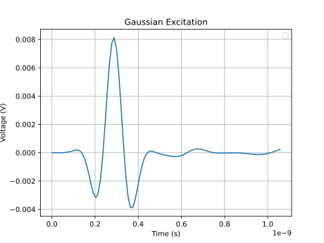
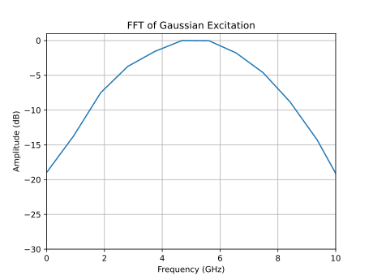

.. _signal_concept:

Signal Waveforms
==================

Both raw :ref:`concept_excitations` or high-level :ref:`concept_ports`
require associated signal waveforms. openEMS provides approximations to
a sinusoid signal, a Dirac impulse, a Heaviside step, a Gaussian pulse,
and custom excitation signals (defined by a user-supplied mathematical
expression).

Sinusoid Signal
------------------

The sinusoid signal is a CW sine wave at a fixed frequency :math:`f_0`
(i.e. an unmodulated carrier). It can be expressed as:

.. math::
   e[t] = \sin{(2\pi f_0 t)}

FDTD simulations are fundamentally a time-domain method that typically
uses a wideband signal (such as a Gaussian pulse) to obtain the
structure's wideband response. All frequencies are simultaneously
excited in a single simulation run, so the sinusoid signal is rarely
used. It's still provided, because it's occasionally useful in
steady-state analysis - such as visualizing field patterns in waveguides.

If a sinusoid excitation is used, openEMS enters the "steady-state
detection" mode that terminates the simulation when system energy
no longer changes. This is unlike a regular FDTD simulation, in
which the simulation terminates when the system energy decays to
near-zero.

.. hint::

   Sinusoids are rarely used in FDTD simulations. Start with the
   Gaussian pulse for your first simulations.

Usage
"""""""

Matlab/Octave::

    f_carrier = 10e9;

    fdtd = InitFDTD();
    fdtd = SetSinusExcite(fdtd, f_carrier)

Python::

    f_carrier = 10e9;

    fdtd = openEMS.openEMS()
    fdtd.SetSinusExcite(f_carrier)

Dirac Impulse
---------------

The Dirac impulse is implemented in the simulation by applying the
full pulse amplitude in one timestep, and applying the zero pulse
amplitude in the next timestep. It can be expressed as:

.. math::

  e[t] = 
  \begin{cases}
  0, & t \le 0 \\
  1, & t = \Delta t \\
  0, & t = 2 \Delta t \text{ (implicit)}
  \end{cases}

This signal is always two timesteps long, the simulator implicitly
maintains the t = 0 value after excitation is switched off in later
timesteps.

The timestep size :math:`\Delta t` is not controlled by the excitation,
it's determined globally by the stability criterion (*Rennings2* or *CFL*).
Thus, its actual time duration (in seconds) is meshing-dependent, so is its
bandwidth.

.. warning::
   **Bandwidth**. This signal doesn't have a well-defined bandwidth. The specified
   frequency ``f_max`` is ignored; bandwidth limitation is currently unimplemented.
   Using these signals may cause unrealistic excitation of rarely-encountered
   high-order EM wave modes in structures, creating unexpected behavior.
   The rising edge of the waveform may show overshoot and ringing due to
   numerical dispersion. Using a bandwidth-limited signal, such as the Gaussian
   pulse or a custom excitation is preferred in most applications.

   **Sampling rate of field dumps**. Due to the lack of a well-defined bandwidth,
   a sampling interval of 1 timestep is force-enabled by openEMS. If field dumps
   are enabled, the raw fields of every simulation timestep are written to disk,
   causing an extreme performance hit and inflated output file size. It can
   consume gigabytes of disk space within minutes. Limit the simulation to a
   small number of timesteps before enabling field dumps.

Usage
""""""

Matlab/Octave::

    # bandwidth limitation is not implemented, it's ignored by the simulation!
    f_max = 10e9;

    fdtd = InitFDTD();
    fdtd = SetDiracExcite(fdtd, f_max);

Python::

    # bandwidth limitation is not implemented, it's ignored by the simulation!
    f_max = 10e9

    fdtd = openEMS.openEMS()
    fdtd.SetDiracExcite(f_max)

Heaviside Step
---------------

The Heaviside step is implemented in the simulation by applying the full pulse
amplitude in the initial timestep, and keeping the same pulse amplitude in the
next timesteps. It can be expressed as:

.. math::

  e[t] = 
  \begin{cases}
  0, & t \lt 0 \\
  1, & t \ge 0 \\
  \end{cases}

This signal is always two timesteps long, the simulator implicitly
maintains the t = 0 value after excitation is switched off in later
timesteps.

The timestep size :math:`\Delta t` is not controlled by the excitation,
it's determined globally by the stability criterion (*Rennings2* or *CFL*).
Thus, its actual time duration (in seconds) is meshing-dependent, so is its
bandwidth.

.. warning::
   **Convergence**. The excitation is always at its full amplitude and never
   falls to the zero amplitude. It prevents the system energy from decaying
   to zero and the simulation never terminates. Use
   :meth:`~openEMS.openEMS.SetNumberOfTimeSteps` and
   :meth:`~openEMS.openEMS.SetMaxTime` to limit the total
   number of timesteps (in iterations) or wall-clock time
   (in seconds), so that the simulation is truncated without convergence.

   **Bandwidth**. This signal doesn't have a well-defined bandwidth. The specified
   frequency
   ``f_max`` is ignored; bandwidth limitation is currently unimplemented.
   Using these signals may cause unrealistic excitation of rarely-encountered
   high-order EM wave modes in structures, creating unexpected behavior.
   The rising edge of the waveform may show overshoot and ringing due to
   numerical dispersion. Using a bandwidth-limited signal, such as the Gaussian
   pulse or a custom excitation is preferred in most applications.

   **Sampling rate of field dumps**. Due to the lack of a well-defined bandwidth,
   a sampling interval of 1 timestep is force-enabled by openEMS. If field dumps
   are enabled, the raw fields of every simulation timestep are written to disk,
   causing an extreme performance hit and inflated output file size. It can
   consume gigabytes of disk space within minutes. Limit the simulation to a
   small number of timesteps before enabling field dumps.

Usage
""""""

Matlab/Octave::

    # bandwidth limitation is not implemented, it's ignored by the simulation!
    f_max = 10e9;

    % Limit the maximum simulation to 10000 timesteps,
    % otherwise it never terminates.
    fdtd = InitFDTD('NrTS', 10000);
    fdtd = SetStepExcite(fdtd, f_max);

Python::

    # bandwidth limitation is not implemented, it's ignored by the simulation!
    f_max = 10e9

    # Limit the maximum simulation to 10000 timesteps,
    # otherwise it never terminates.
    fdtd = openEMS.openEMS(NrTS=10000)
    fdtd.SetStepExcite(f_max)

Gaussian Pulse
-----------------

The Gaussian pulse is implemented in the simulation as a sinusoidal carrier at
the center frequency, with its amplitude modulated by a Gaussian function.
This signal produces a wideband and smooth signal without discontinuous
jumps. It has a well-distributed spectrum with a wide range of frequencies
in both sidebands around the carrier. It can be expressed as:

.. math::

   e[t] = \cos{\left[2\pi f_0 \left(t-\frac{9}{2\pi f_c}\right)\right]} \cdot
          \exp{\left[-\left(\frac{2\pi f_c t}{3}-3\right)^2\right]}

where :math:`f_0` in the carrier's central frequency, :math:`f_c` is its
20 dB cutoff frequency.

In FDTD simulations, a Gaussian pulse is normally used as it provides a
wideband and smooth signal without discontinuous jumps.
This relatively clean spectrum enables
openEMS to accurately extract the structure's frequency response in the
frequency domain.
Once the structure's frequency response is known, linear circuit analysis
tools can evaluate its behavior under other input signals, so there's
no loss of generality.

Usage
""""""

The first argument is its center frequency, the second argument is its
-20 dB bandwidth, defining the signal's spectral "spread". For a wideband
simulation, both arguments should be set to 1/2 of the simulation's upper
frequency target:

Matlab/Octave::

    # Centered around 5 GHz with a 5 GHz 20 dB bandwidth.
    # Lower sideband covers 0 - 5 GHz, upper sideband covers 5 - 10 GHz.
    f_max = 10e9;
    f0 = f_max / 2;
    f0_bw = f_max / 2;

    fdtd = InitFDTD();
    fdtd = SetGaussExcite(fdtd, f0, f0_bw);

Python::

    # Centered around 5 GHz with a 5 GHz 20 dB bandwidth.
    # Lower sideband covers 0 - 5 GHz, upper sideband covers 5 - 10 GHz.
    f_max = 10e9
    f0 = f_max / 2
    f0_bw = f_max / 2

    fdtd = openEMS.openEMS()
    fdtd.SetGaussExcite(f0, f0_bw)

Custom Signal
---------------

The custom signal is implemented in the simulation by accepting a user-defined
symbolic expression.

The argument ``f_str`` is a string that contains the expression with
an independent variable ``t``, representing time. It's parsed by the ``fparser``
library, so the string should be a legal ``fparser`` expression with proper syntax.
A complete set of built-in functions (including trigonometry functions such as
``sin(x)``, as well as conditional functions such as
``if(cond, eval_when_true, eval_when_false)``) are available, making it expressive
if tricky.
Two special constants ``pi`` and ``e`` are pre-defined and recognized as well
by openEMS, even though they don't appear in the ``fparser`` documentation.

.. seealso::

   See the fparser project documentation [2]_ for syntax.

In Python, the signal's frequency and bandwidth is specified by two parameters:
``f0`` and ``f_max``. ``f0`` is the base frequency of the excitation signal, which
is set to the excitation signal's center (or carrier) frequency. It's meant to
define the "frequency of interest" of the simulation. The argument ``f_max``
is the maximum frequency content of the signal, such as the signal's 20 dB
cutoff frequency like the Gaussian pulse. In principle,
the openEMS simulator uses both parameters to calculate the sampling rate of
field values.

However, as of now, the handling of this calculation is inconsistent.
In Matlab/Octave, only one argument ``f0`` is exposed,
``f_max`` always takes the same value as ``f0``. Furthermore, many broadband
signals don't have a well-defined center frequency. As a simplified rule,
in both Matlab/Octave and Python, it's
recommended to set both ``f0`` and ``f_max`` to the same value, which is
twice of a signal's bandwidth (i.e. its Nyquist rate).

.. hint::

   **Field dump sampling rate.** To improve simulation speed, when field dumps are
   enabled, openEMS's sampling frequency is set to the Nyquist rate based on the
   signal's highest frequency component. Conceptually, sampling is performed as
   infrequently as possible, just sufficient to reconstruct the signal's spectrum
   up to ``f_0``.
   
   **Impulse and step visualization**. However, if field dumps are enabled to
   visualize the propagation of wavefronts of an impulse or step signal, this
   sampling rate can be too low (even if the signals are bandwidth-limited).
   It's necessary to use :meth:`~openEMS.openEMS.SetOverSampling` to force
   openEMS to dump the fields more often.

Usage
""""""

Matlab/Octave::

    % Limit the maximum simulation to 10000 timesteps,
    % otherwise the excitation waveform would exhaust system memory.
    fdtd = InitFDTD('NrTS', 10000);

    % Define signal waveform as a ramped sinusoid.
    f0 = 500e6;
    T = 1 / f0;
    f_str = '(1 - exp(-1 * (t / T^2)) * sin(2 * pi * f0 * t)';
    f_str = strrep(f_str, "T", num2str(T));
    f_str = strrep(f_str, "f0", num2str(f0));

    fdtd = SetCustomExcite(fdtd, f0 * 2, f_str);

    % If visualization of field dumps is needed, use a much higher
    % cutoff frequency to force openEMS to dump the fields more often.
    fdtd = SetOverSampling(fdtd, 50);

Python::

    # Limit the maximum simulation to 10000 timesteps,
    # otherwise the excitation waveform would exhaust system memory.
    fdtd = openEMS.openEMS(NrTS=10000)

    # Define signal waveform as a ramped sinusoid.
    f0 = 500e6;
    T = 1 / f0;
    f_str = '(1 - exp(-1 * (t / T^2)) * sin(2 * pi * f0 * t)'
    f_str = f_str.replace("T", str(T))
    f_str = f_str.replace("f0", str(f0))

    # API bug workaround: SetCustomExcite() only accepts bytes, not a Python string.
    f_bytes = f_str.encode("UTF-8")

    fdtd.SetCustomExcite(f_bytes, f0 * 2, f0 * 2)

    # If visualization of field dumps is needed, use a much higher
    # cutoff frequency to force openEMS to dump the fields more often.
    fdtd.SetOverSampling(50)

.. warning::
   Custom excitation signals values are precalculated before running the simulation.
   A maximum timestep limit ``NrTS`` must be set when using a custom excitation
   signal. Otherwise, starting the simulation with a default, unlimited signal length
   would exhaust system memory and crash the system.

Example: Step Excitation with Finite Rise Time (Gaussian filter)
"""""""""""""""""""""""""""""""""""""""""""""""""""""""""""""""""

The following code defines a bandwidth-limited step function with finite
rise time, which approximates switching signals in practical circuits
well. It's constructed by filtering the ideal Heaviside
step function with a Gaussian filter. The vertical line in the step function
is smoothed out and becomes an S-curve. Analytically it's given by the
expression:

.. math::

   e[t] = \frac{1}{2} + \frac{1}{2} \mathrm{erf}\left(\frac{t - t_\mathrm{shift}}{\sigma}\right)

where :math:`\mathrm{erf}(x)` is the Gaussian error function.
The parameter :math:`\sigma` is calculated based on the desired 10%-90%
signal rise time. The waveform is then time-shifted by :math:`t_\mathrm{shift}`,
so it begins at a near-zero value at zero time, such as 1% of its peak
amplitude.

This waveform is useful for modeling transient switching signals in practical
circuits, such as digital logic circuits, pulse generators, or Time-Domain
Reflectometry (TDR). It avoids the potential simulation artifacts of the
2-timestep Heaviside step function, such as the unrealistic excitation of
high-order EM wave modes.

It's originally proposed and implemented by Ted Yapo. The code has been rewritten
for clarity. For technical details, see [1]_.

.. hint::
   Using circuit analysis tools such as ``scikit-rf``, it's possible to
   calculate the equivalent TDR responses based on the frequency response
   (S-parameters) obtained in an existing simulation (with a conventional
   Gaussian pulse), see :ref:`skrf_tdr`.  This approach is recommended for new
   users, as it fits into the existing RF/microwave circuit design workflow,
   and thus easier.

   A custom excitation is not required, it's reserved for advanced
   use cases. For example, it allows running a native TDR analysis with the DC
   term, which may improve model quality. It also allows one to study
   early reflections without completing a full simulation.

Matlab/Octave::

    % This technique is originally published by:
    %
    %   Ted Yapo, in "A Note on Gaussian Steps in openEMS."
    %   https://cdn.hackaday.io/files/1656277086185568/gaussian_step_v11.pdf
    %
    % Code reimplemented here for clarity. Copying and distribution of this file,
    % with or without modification, are permitted in any medium without royalty.
    % This file is offered as-is, without any warranty.
    function [excitation_str, f_nyquist] = CalcGaussianStep(tr_10_90, tolerance, cutoff_db)
        % Calculate parameter sigma to get a Gaussian step with wanted rise time.
        sigma = tr_10_90 / (2 * erfinv(0.8));
    
        % calculate the maximum frequency content at cutoff
        f_max = sqrt((cutoff_db / 20 * log(10)) / (pi ** 2 * sigma ** 2));
        f_nyquist = f_max * 2;
    
        % The raw Gaussian step function has y = 0.5 at the origin,
        % we need to time-shift it based on the wanted tolerance
        % (e.g. y = 0.01 at the origin).
        shift = sigma * erfinv((1 - tolerance - 0.5) * 2);
    
        variables = struct(
            % erf() approximation 7.1.25 from Abramowitz and Stegun. The original
            % helper function t(x) is renamed to b(x), since t is used by openEMS
            % as the time variable.
            %
            % This approximation is only valid for t >= 0, we use the fparser's
            % "if()" function to evaluate erf(t) and -erf(-t) for non-negative
            % and negative inputs.
            % See: https://personal.math.ubc.ca/~cbm/aands/page_299.htm
            "erf_t", [
    	        "if(x >= 0," ...
                    " (1 - (a1 * b_pos + a2 * b_pos^2 + a3 * b_pos^3) * e^(-t^2))," ...
                    " -(1 - (a1 * b_neg + a2 * b_neg^2 + a3 * b_neg^3) * e^(-t^2)))"
    	    ],
            "b_pos", "(1 / (1 + p * t))",
            "b_neg", "(1 / (1 + p * -t))",
            "p",     "0.47047",
            "a1",    "0.3480242",
            "a2",    "-0.0958798",
            "a3",    "0.7478556",
    
            % input value t to erf_t
            "t",     "((t - shift) / sigma)",
    
            % calculate parameter sigma to get a Gaussian step with wanted rise time
            "sigma", num2str(sigma),
    
            % shift the center of the Gaussian step from the origin
            "shift", num2str(shift)
        );
    
        excitation_str = "0.5 + 0.5 * (erf_t)";
    
        % Generate a string representation of the Gaussian error function
        % with all variables substituted.
        fields = fieldnames(variables);
        for i = 1:numel(fields)
            excitation_str = strrep(excitation_str, fields{i}, variables.(fields{i}));
        end
    end

    % Limit the maximum simulation to 10000 timesteps,
    % otherwise the excitation waveform would exhaust system memory.
    fdtd = InitFDTD('NrTS', 10000);

    % Step excitation with 1 nanosecond 10%-90% risetime.
    % at t = 0, e[t] is at 1% of the final value,
    % calculate the maximum frequency content (20 dB down)
    [f_str, f_nyquist] = CalcGaussianStep(1e-9, 0.01, 20);

    fdtd = SetCustomExcite(fdtd, f_nyquist, f_str);

    % If visualization of field dumps is needed, use a much higher
    % cutoff frequency to force openEMS to dump the fields more often.
    fdtd = SetOverSampling(fdtd, 50);

Python::

    import math
    from scipy.special import erfinv

    # This technique is originally published by:
    #
    #   Ted Yapo, in "A Note on Gaussian Steps in openEMS."
    #   https://cdn.hackaday.io/files/1656277086185568/gaussian_step_v11.pdf
    #
    # Code reimplemented here for clarity. Copying and distribution of this file,
    # with or without modification, are permitted in any medium without royalty.
    # This file is offered as-is, without any warranty.
    def CalcGaussianStep(tr_10_90, tolerance=0.01, cutoff_db=20):
        # Calculate parameter sigma to get a Gaussian step with wanted rise time.
        sigma = tr_10_90 / (2 * erfinv(0.8))
    
        # calculate the maximum frequency content at cutoff
        f_max = math.sqrt((cutoff_db / 20 * math.log(10)) / (math.pi ** 2 * sigma ** 2))
        f_nyquist = f_max * 2
    
        # The raw Gaussian step function has y = 0.5 at the origin,
        # we need to time-shift it based on the wanted tolerance
        # (e.g. y = 0.01 at the origin).
        shift = sigma * erfinv((1 - tolerance - 0.5) * 2)
    
        variables = {
            # erf() approximation 7.1.25 from Abramowitz and Stegun. The original
            # helper function t(x) is renamed to b(x), since t is used by openEMS
            # as the time variable.
            #
            # This approximation is only valid for t >= 0, we use the fparser's
            # "if()" function to evaluate erf(t) and -erf(-t) for non-negative
            # and negative inputs.
            # See: https://personal.math.ubc.ca/~cbm/aands/page_299.htm
            "erf_t": "if(t >= 0,"
                     " (1 - (a1 * b_pos + a2 * b_pos^2 + a3 * b_pos^3) * e^(-t^2)),"
                     " -(1 - (a1 * b_neg + a2 * b_neg^2 + a3 * b_neg^3) * e^(-t^2)))",
            "b_pos": "(1 / (1 + p * t))",
            "b_neg": "(1 / (1 + p * -t))",
            "p":     "0.47047",
            "a1":    "0.3480242",
            "a2":    "-0.0958798",
            "a3":    "0.7478556",
    
            # input value t to erf_t
            "t":     "((t - shift) / sigma)",
    
            # calculate parameter sigma to get a Gaussian step with wanted rise time
            "sigma": sigma,
    
            # shift the center of the Gaussian step from the origin
            "shift": shift
        }
    
        excitation_str = "0.5 + 0.5 * (erf_t)"
    
        # Generate a string representation of the Gaussian error function
        # with all variables substituted.
        for key in variables.keys():
            excitation_str = excitation_str.replace(key, str(variables[key]))
    
        # API bug workaround: SetCustomExcite() only accepts bytes, not a Python string.
        excitation_str = excitation_str.encode("UTF-8")

        return excitation_str, f_nyquist

    # Limit the maximum simulation to 10000 timesteps,
    # otherwise the excitation waveform would exhaust system memory.
    fdtd = openEMS.openEMS(NrTS=10000)

    # Step excitation with 1 nanosecond 10%-90% risetime.
    # By default, at t = 0, e[t] is at 1% of the final value.
    # By default, calculate the maximum frequency content (20 dB down)
    f_str, f_nyquist = CalcGaussianStep(1e-9)

    fdtd.SetCustomExcite(f_bytes, f_nyquist, f_nyquist)

    # If visualization of field dumps is needed, use a much higher
    # cutoff frequency to force openEMS to dump the fields more often.
    fdtd.SetOverSampling(50)

Bibliography
--------------

.. [1] fparser, `fparser project documentation
   <http://warp.povusers.org/FunctionParser/fparser.html#literals>`_.

.. [2] Ted Yapo, `A Note on Gaussian Steps in openEMS.
   <https://cdn.hackaday.io/files/1656277086185568/gaussian_step_v11.pdf>`_
